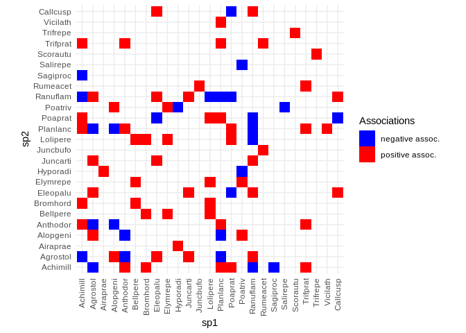
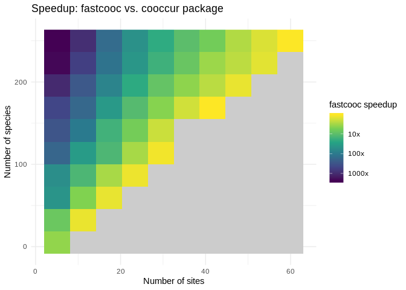

›
fastcooc: Fast pairwise computation of species associations
===========================================================

<!-- 
rmarkdown::render('./README.Rmd', output_format = "github_document")
-->
This small package provides an implementation of the procedure presented by Veech (2013) to build association networks from presence/absence data (also named co-occurrence networks). It is aimed to be much faster than the implementation in the package *cooccur* for situations with a high number of species, and low number of sites.

The speed of the implementation relies on pre-computing P-values and storing them in a lookup table. A fast compiled function then loops through all pairs of species, computes their co-occurrence and total abundances, then looks up the P-value in the precomputed table.

Depending on your number of sites and number of species, pre-computing this table can take a while, but this needs only to be done once as long as the number of sites in the analysis does not change.

A typical workflow looks like this:

``` r
# Load a community matrix from the vegan package
library(vegan)
data(dune)
dune_pa <- dune > 0 # Transform to presence/absence data

# Compute associations. The community matrix should have sites as rows and 
# species as columns. 
Nsites <- nrow(dune_pa)
pval_table <- precompute_pvalues(Nsites, ntries = 9999)
coocs <- fastcooc(dune_pa, pval_array = pval_table)
# fastcooc returns a data.frame with three columns: the two species, and 
# the P-value (P-values close to zero mean a negative link, those close 
# to one mean a positive link)

# Display pairwise species associations
library(ggplot2)
ggplot(coocs) + 
  geom_raster(aes(x = sp1, y = sp2, 
                  fill = ifelse(pval < 0.5, "negative assoc.", 
                                "positive assoc."))) + 
  scale_fill_manual(values = c('blue', 'red'), name = "Associations") + 
  coord_fixed() + 
  theme_minimal() + 
  theme(axis.text.x = element_text(angle = 90, vjust = .5, hjust = 1))
```



Here is the speedup brought by fastcooc compared to the coccur package (not that this is for a 'cold start', where the P-values lookup table is being computed at the beginning of the benchmark):



Installation
============

Install using the package devtools:

``` r
devtools::install_github('alexgenin/fastcooc')
```

Notes
=====

-   This package has been tested againts the *coocurr* package to check that it produces good results. However, results can still be slightly different because it uses a randomization-based procedure to compute P-values instead of an analytical approach. Typically, expect 0.01-1% of all possible links to be different with default parameters.

-   This package does not handle NAs in data, but does handle species that are completely absent or always present (those for which P-values cannot be computed), by assuming they cannot form significant associations.

-   This package does not compute any form of association strength (odd ratio, variance ratio, standardized effect size, etc.), and just reports P-values, which is the only information needed to build unweighted association networks.

-   There is no documentation yet (apart from this page).

Further readings and references
===============================

This package implements a procedure equivalent to what is presented in Veech (2013), but this is in fact a much older and classic approach (see Arita, 2016). A recommended read for the ecologist interested in frequentist co-ocurrence approaches is Sanderson and Pimm (2015).

Arita, H. T. 2016. Species co-occurrence analysis: pairwise versus matrix-level approaches. Global Ecology and Biogeography.

Veech, J. A. 2013. A probabilistic model for analysing species co-occurrence: Probabilistic model. Global Ecology and Biogeography 22:252–260.

Sanderson, J. G., and S. L. Pimm. 2015. Patterns in nature: the analysis of species co-occurrences. The University of Chicago Press, Chicago London.
