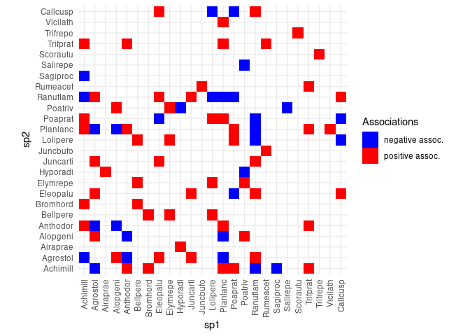
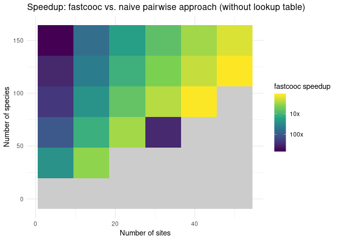
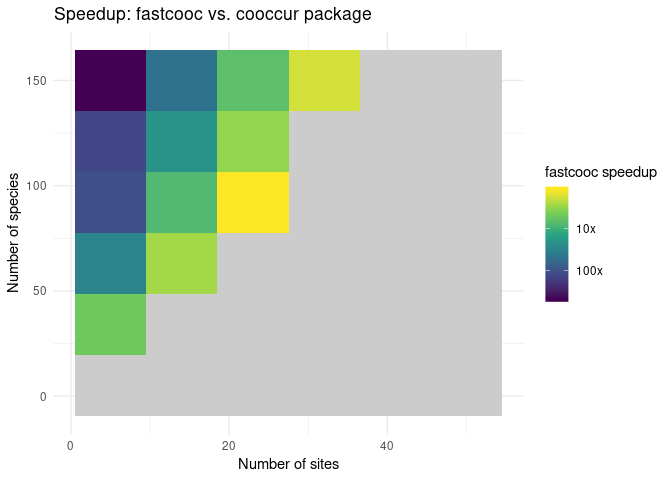
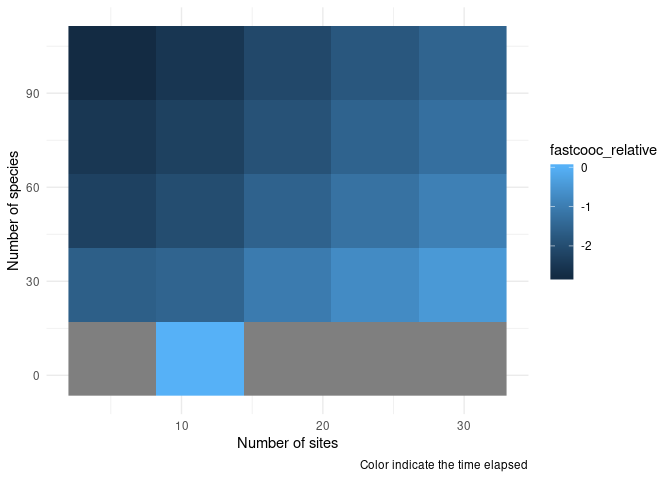

# fastcooc: Fast pairwise computation of species associations

<!-- 
rmarkdown::render('./README.Rmd', output_format = "github_document")
-->

    ##   
    ─  installing *source* package ‘fastcooc’ ...
    ## 
      
       ** using staged installation
    ## 
      
       ** libs
    ## 
      
       g++ -std=gnu++11  -I"/usr/include/R/" -DNDEBUG  -I"/usr/lib/R/library/Rcpp/include" -I"/usr/lib/R/library/RcppArmadillo/include" -D_FORTIFY_SOURCE=2 -O3 -fopenmp -g -march=native -mtune=native -std=c++11 -Wall -DARMA_NO_DEBUG -fpic  -march=x86-64 -mtune=generic -O2 -pipe -fstack-protector-strong -fno-plt  -UNDEBUG -Wall -pedantic -g -O0 -O3 -fopenmp -g -march=native -mtune=native -std=c++11 -Wall -DARMA_NO_DEBUG -c RcppExports.cpp -o RcppExports.o 
    ## 
      
       g++ -std=gnu++11  -I"/usr/include/R/" -DNDEBUG  -I"/usr/lib/R/library/Rcpp/include" -I"/usr/lib/R/library/RcppArmadillo/include" -D_FORTIFY_SOURCE=2 -O3 -fopenmp -g -march=native -mtune=native -std=c++11 -Wall -DARMA_NO_DEBUG -fpic  -march=x86-64 -mtune=generic -O2 -pipe -fstack-protector-strong -fno-plt  -UNDEBUG -Wall -pedantic -g -O0 -O3 -fopenmp -g -march=native -mtune=native -std=c++11 -Wall -DARMA_NO_DEBUG -c fastcooc.cpp -o fastcooc.o 
    ## 
      
       g++ -std=gnu++11 -shared -L/usr/lib64/R/lib -Wl,-O1,--sort-common,--as-needed,-z,relro,-z,now -o fastcooc.so RcppExports.o fastcooc.o -L/usr/lib64/R/lib -lR
    ## 
      
       installing to /tmp/RtmpohRKE8/devtools_install_205f2ae37344/00LOCK-fastcooc/00new/fastcooc/libs
    ## 
      
       ** checking absolute paths in shared objects and dynamic libraries
    ## 
      
    ─  DONE (fastcooc)
    ## 

This small package provides an implementation of the procedure presented
by Veech (2013) to build association networks from presence/absence data
(also named co-occurrence networks). It is aimed to be much faster than
the implementation in the package *cooccur* for situations with a high
number of species, and low number of sites.

The speed of the implementation relies on pre-computing P-values and
storing them in a lookup table. A fast compiled function then loops
through all pairs of species, computes their co-occurrence and total
abundances, then looks up the P-value in the precomputed table.

Depending on your number of sites and number of species, pre-computing
this table can take a while, but this needs only to be done once and can
be repeated on different datasets as long as the number of sites in the
analysis does not change.

A typical workflow looks like this:

``` r
# Load a community matrix from the vegan package
library(vegan)
data(dune)
dune_pa <- dune > 0 # Transform to presence/absence data

# Compute associations
Nsites <- nrow(dune_pa)
pval_table <- precompute_pvalues(Nsites, ntries = 9999)
coocs <- fastcooc(dune_pa, pval_array = pval_table)

# Display pairwise species associations
library(ggplot2)
ggplot(coocs) + 
  geom_raster(aes(x = sp1, y = sp2, 
                  fill = ifelse(pval < 0.5, "negative assoc.", 
                                "positive assoc."))) + 
  scale_fill_manual(values = c('blue', 'red'), name = "Associations") + 
  coord_fixed() + 
  theme_minimal() + 
  theme(axis.text.x = element_text(angle = 90, vjust = .5, hjust = 1))
```

<!-- -->

Here are some graphs to help you choose:

``` r
naive_cooc <- function(sites, trim_threshold = 0.05) { 
  pmat <- matrix(NA_real_, ncol(sites), ncol(sites))
  for (spi in seq.int(nrow(pmat))) { 
    for (spj in seq.int(nrow(pmat))) { 
      if ( sd(sites[ ,spi]) != 0 && 
           sd(sites[ ,spj]) != 0 ) { 
        pmat[spi, spj] <- coocvec(sites[ ,spi], sites[ ,spj], ntries = 999)[4]
      } else { 
        pmat[spi, spj] <- 0.5
      }
    }
  }
  
  spnames <- seq.int(ncol(pmat))
  cooc_results <- data.frame(expand.grid(sp1 = spnames, 
                                         sp2 = spnames), 
                             pval = as.vector(pmat))
  cooc_results <- subset(cooc_results, 
                          pmin(pval, 1 - pval) < (trim_threshold/2))

  cooc_results
}
```

``` r
make_one_benchmark <- function(nsp, nsites) { 
  bigmat <- matrix(rnorm(nsites*nsp), nrow = nsites, ncol = nsp) > 0
  
  a <- system.time({ 
      result <- fastcooc(bigmat, long_form = TRUE, trim_threshold = 0.05, 
                         ntries = 99) %>% 
      subset(sp1 < sp2)
  })
  
  b <- system.time({ 
    cooccurdf <- print(cooccur::cooccur(t(bigmat), prob = "hyper")) %>% 
                   (function(df) df[ c('sp1', 'sp2')]) %>% 
                   as.matrix() 
  })
  
  d <- system.time({ 
      naive_cooc(bigmat)
    })
  
  all_inters_fc <- sort(paste(result[ ,'sp1'], result[ ,'sp2'], sep = '-'))
  all_inters_co <- sort(paste(cooccurdf[ ,'sp1'], cooccurdf[ ,'sp2'], sep = "-"))
  
  n_in_common <- length(intersect(all_inters_co, all_inters_fc))
  n_diff <- max(length(all_inters_co), length(all_inters_fc)) - n_in_common
  ntot <- nsp*(nsp-1)/2
  
  data.frame(n_in_common = n_in_common, 
             n_diff = n_diff, 
             ntot = ntot, 
             nsp = nsp, 
             nsites = nsites, 
             fastcooc = a['elapsed'], 
             cooccur  = b['elapsed'], 
             without_lut = d['elapsed'])
}

benchmarks <- expand.grid(nsp    = seq(5, 250, l = 3), 
                          nsites = seq(5, 20,  l = 3))

bench_results <- plyr::ddply(benchmarks, ~ nsp + nsites, with, 
                             make_one_benchmark(nsp, nsites))
```

    ## 
      |                                                                       
      |                                                                 |   0%
      |                                                                       
      |====                                                             |   7%
      |                                                                       
      |=========                                                        |  13%
      |                                                                       
      |=============                                                    |  20%
      |                                                                       
      |=================                                                |  27%
      |                                                                       
      |======================                                           |  33%
      |                                                                       
      |                                                                 |   0%
      |                                                                       
      |===================================                              |  55%
      |                                                                       
      |=========================================                        |  64%
      |                                                                       
      |===============================================                  |  73%
      |                                                                       
      |=====================================================            |  82%
      |                                                                       
      |===========================================================      |  91%
      |                                                                       
      |=================================================================| 100%
    ## Call:
    ## cooccur::cooccur(mat = t(bigmat), prob = "hyper")
    ## 
    ## Of 10 species pair combinations, 4 pairs (40 %) were removed from the analysis because expected co-occurrence was < 1 and 6 pairs were analyzed
    ## 
    ## Cooccurrence Table:
    ## [1] sp1          sp2          sp1_inc      sp2_inc      obs_cooccur 
    ## [6] prob_cooccur exp_cooccur  p_lt         p_gt        
    ## <0 rows> (or 0-length row.names)

    ## Warning in matrix(rnorm(nsites * nsp), nrow = nsites, ncol = nsp): data
    ## length [62] is not a sub-multiple or multiple of the number of rows [12]

    ## 
      |                                                                       
      |                                                                 |   0%
      |                                                                       
      |====                                                             |   7%
      |                                                                       
      |=========                                                        |  13%
      |                                                                       
      |=============                                                    |  20%
      |                                                                       
      |=================                                                |  27%
      |                                                                       
      |======================                                           |  33%
      |                                                                       
      |                                                                 |   0%
      |                                                                       
      |==========================                                       |  40%
      |                                                                       
      |==============================                                   |  47%
      |                                                                       
      |===================================                              |  53%
      |                                                                       
      |=======================================                          |  60%
      |                                                                       
      |===========================================                      |  67%
      |                                                                       
      |================================================                 |  73%
      |                                                                       
      |====================================================             |  80%
      |                                                                       
      |========================================================         |  87%
      |                                                                       
      |=============================================================    |  93%
      |                                                                       
      |=================================================================| 100%
    ## Call:
    ## cooccur::cooccur(mat = t(bigmat), prob = "hyper")
    ## 
    ## Of 10 species pair combinations, 0 pairs (0 %) were removed from the analysis because expected co-occurrence was < 1 and 10 pairs were analyzed
    ## 
    ## Cooccurrence Table:
    ##   sp1 sp2 sp1_inc sp2_inc obs_cooccur prob_cooccur exp_cooccur   p_lt p_gt
    ## 1   1   2       8       6           2        0.333         4.0 0.0303    1
    ## 8   3   4       5       8           1        0.278         3.3 0.0101    1
    ## 
      |                                                                       
      |                                                                 |   0%
      |                                                                       
      |====                                                             |   7%
      |                                                                       
      |=========                                                        |  13%
      |                                                                       
      |=============                                                    |  20%
      |                                                                       
      |=================                                                |  27%
      |                                                                       
      |======================                                           |  33%
      |                                                                       
      |                                                                 |   0%
      |                                                                       
      |==========================                                       |  40%
      |                                                                       
      |==============================                                   |  47%
      |                                                                       
      |===================================                              |  53%
      |                                                                       
      |=======================================                          |  60%
      |                                                                       
      |===========================================                      |  67%
      |                                                                       
      |================================================                 |  73%
      |                                                                       
      |====================================================             |  80%
      |                                                                       
      |========================================================         |  87%
      |                                                                       
      |=============================================================    |  93%
      |                                                                       
      |=================================================================| 100%
    ## Call:
    ## cooccur::cooccur(mat = t(bigmat), prob = "hyper")
    ## 
    ## Of 10 species pair combinations, 0 pairs (0 %) were removed from the analysis because expected co-occurrence was < 1 and 10 pairs were analyzed
    ## 
    ## Cooccurrence Table:
    ##   sp1 sp2 sp1_inc sp2_inc obs_cooccur prob_cooccur exp_cooccur    p_lt
    ## 6   2   4      11       9           8        0.248           5 0.99967
    ##      p_gt
    ## 6 0.00917

    ## Warning in matrix(rnorm(nsites * nsp), nrow = nsites, ncol = nsp): data
    ## length [637] is not a sub-multiple or multiple of the number of rows [5]

    ## 
      |                                                                       
      |                                                                 |   0%
      |                                                                       
      |                                                                 |   1%
      |                                                                       
      |=                                                                |   1%
      |                                                                       
      |=                                                                |   2%
      |                                                                       
      |                                                                 |   0%
      |                                                                       
      |==                                                               |   2%
      |                                                                       
      |==                                                               |   3%
      |                                                                       
      |==                                                               |   4%
      |                                                                       
      |===                                                              |   4%
      |                                                                       
      |===                                                              |   5%
      |                                                                       
      |====                                                             |   5%
      |                                                                       
      |====                                                             |   6%
      |                                                                       
      |====                                                             |   7%
      |                                                                       
      |=====                                                            |   7%
      |                                                                       
      |=====                                                            |   8%
      |                                                                       
      |======                                                           |   8%
      |                                                                       
      |======                                                           |   9%
      |                                                                       
      |======                                                           |  10%
      |                                                                       
      |=======                                                          |  10%
      |                                                                       
      |=======                                                          |  11%
      |                                                                       
      |=======                                                          |  12%
      |                                                                       
      |========                                                         |  12%
      |                                                                       
      |========                                                         |  13%
      |                                                                       
      |=========                                                        |  13%
      |                                                                       
      |=========                                                        |  14%
      |                                                                       
      |=========                                                        |  15%
      |                                                                       
      |==========                                                       |  15%
      |                                                                       
      |==========                                                       |  16%
      |                                                                       
      |===========                                                      |  16%
      |                                                                       
      |===========                                                      |  17%
      |                                                                       
      |===========                                                      |  18%
      |                                                                       
      |============                                                     |  18%
      |                                                                       
      |============                                                     |  19%
      |                                                                       
      |=============                                                    |  19%
      |                                                                       
      |=============                                                    |  20%
      |                                                                       
      |=============                                                    |  21%
      |                                                                       
      |==============                                                   |  21%
      |                                                                       
      |==============                                                   |  22%
      |                                                                       
      |===============                                                  |  22%
      |                                                                       
      |===============                                                  |  23%
      |                                                                       
      |===============                                                  |  24%
      |                                                                       
      |================                                                 |  24%
      |                                                                       
      |================                                                 |  25%
      |                                                                       
      |=================                                                |  25%
      |                                                                       
      |=================                                                |  26%
      |                                                                       
      |=================                                                |  27%
      |                                                                       
      |==================                                               |  27%
      |                                                                       
      |==================                                               |  28%
      |                                                                       
      |===================                                              |  28%
      |                                                                       
      |===================                                              |  29%
      |                                                                       
      |===================                                              |  30%
      |                                                                       
      |====================                                             |  30%
      |                                                                       
      |====================                                             |  31%
      |                                                                       
      |====================                                             |  32%
      |                                                                       
      |=====================                                            |  32%
      |                                                                       
      |=====================                                            |  33%
      |                                                                       
      |======================                                           |  33%
      |                                                                       
      |======================                                           |  34%
      |                                                                       
      |======================                                           |  35%
      |                                                                       
      |=======================                                          |  35%
      |                                                                       
      |=======================                                          |  36%
      |                                                                       
      |========================                                         |  36%
      |                                                                       
      |========================                                         |  37%
      |                                                                       
      |========================                                         |  38%
      |                                                                       
      |=========================                                        |  38%
      |                                                                       
      |=========================                                        |  39%
      |                                                                       
      |==========================                                       |  39%
      |                                                                       
      |==========================                                       |  40%
      |                                                                       
      |==========================                                       |  41%
      |                                                                       
      |===========================                                      |  41%
      |                                                                       
      |===========================                                      |  42%
      |                                                                       
      |============================                                     |  42%
      |                                                                       
      |============================                                     |  43%
      |                                                                       
      |============================                                     |  44%
      |                                                                       
      |=============================                                    |  44%
      |                                                                       
      |=============================                                    |  45%
      |                                                                       
      |==============================                                   |  45%
      |                                                                       
      |==============================                                   |  46%
      |                                                                       
      |==============================                                   |  47%
      |                                                                       
      |===============================                                  |  47%
      |                                                                       
      |===============================                                  |  48%
      |                                                                       
      |================================                                 |  48%
      |                                                                       
      |================================                                 |  49%
      |                                                                       
      |================================                                 |  50%
      |                                                                       
      |=================================                                |  50%
      |                                                                       
      |=================================                                |  51%
      |                                                                       
      |=================================                                |  52%
      |                                                                       
      |==================================                               |  52%
      |                                                                       
      |==================================                               |  53%
      |                                                                       
      |===================================                              |  53%
      |                                                                       
      |===================================                              |  54%
      |                                                                       
      |===================================                              |  55%
      |                                                                       
      |====================================                             |  55%
      |                                                                       
      |====================================                             |  56%
      |                                                                       
      |=====================================                            |  56%
      |                                                                       
      |=====================================                            |  57%
      |                                                                       
      |=====================================                            |  58%
      |                                                                       
      |======================================                           |  58%
      |                                                                       
      |======================================                           |  59%
      |                                                                       
      |=======================================                          |  59%
      |                                                                       
      |=======================================                          |  60%
      |                                                                       
      |=======================================                          |  61%
      |                                                                       
      |========================================                         |  61%
      |                                                                       
      |========================================                         |  62%
      |                                                                       
      |=========================================                        |  62%
      |                                                                       
      |=========================================                        |  63%
      |                                                                       
      |=========================================                        |  64%
      |                                                                       
      |==========================================                       |  64%
      |                                                                       
      |==========================================                       |  65%
      |                                                                       
      |===========================================                      |  65%
      |                                                                       
      |===========================================                      |  66%
      |                                                                       
      |===========================================                      |  67%
      |                                                                       
      |============================================                     |  67%
      |                                                                       
      |============================================                     |  68%
      |                                                                       
      |=============================================                    |  68%
      |                                                                       
      |=============================================                    |  69%
      |                                                                       
      |=============================================                    |  70%
      |                                                                       
      |==============================================                   |  70%
      |                                                                       
      |==============================================                   |  71%
      |                                                                       
      |==============================================                   |  72%
      |                                                                       
      |===============================================                  |  72%
      |                                                                       
      |===============================================                  |  73%
      |                                                                       
      |================================================                 |  73%
      |                                                                       
      |================================================                 |  74%
      |                                                                       
      |================================================                 |  75%
      |                                                                       
      |=================================================                |  75%
      |                                                                       
      |=================================================                |  76%
      |                                                                       
      |==================================================               |  76%
      |                                                                       
      |==================================================               |  77%
      |                                                                       
      |==================================================               |  78%
      |                                                                       
      |===================================================              |  78%
      |                                                                       
      |===================================================              |  79%
      |                                                                       
      |====================================================             |  79%
      |                                                                       
      |====================================================             |  80%
      |                                                                       
      |====================================================             |  81%
      |                                                                       
      |=====================================================            |  81%
      |                                                                       
      |=====================================================            |  82%
      |                                                                       
      |======================================================           |  82%
      |                                                                       
      |======================================================           |  83%
      |                                                                       
      |======================================================           |  84%
      |                                                                       
      |=======================================================          |  84%
      |                                                                       
      |=======================================================          |  85%
      |                                                                       
      |========================================================         |  85%
      |                                                                       
      |========================================================         |  86%
      |                                                                       
      |========================================================         |  87%
      |                                                                       
      |=========================================================        |  87%
      |                                                                       
      |=========================================================        |  88%
      |                                                                       
      |==========================================================       |  88%
      |                                                                       
      |==========================================================       |  89%
      |                                                                       
      |==========================================================       |  90%
      |                                                                       
      |===========================================================      |  90%
      |                                                                       
      |===========================================================      |  91%
      |                                                                       
      |===========================================================      |  92%
      |                                                                       
      |============================================================     |  92%
      |                                                                       
      |============================================================     |  93%
      |                                                                       
      |=============================================================    |  93%
      |                                                                       
      |=============================================================    |  94%
      |                                                                       
      |=============================================================    |  95%
      |                                                                       
      |==============================================================   |  95%
      |                                                                       
      |==============================================================   |  96%
      |                                                                       
      |===============================================================  |  96%
      |                                                                       
      |===============================================================  |  97%
      |                                                                       
      |===============================================================  |  98%
      |                                                                       
      |================================================================ |  98%
      |                                                                       
      |================================================================ |  99%
      |                                                                       
      |=================================================================|  99%
      |                                                                       
      |=================================================================| 100%
    ## Call:
    ## cooccur::cooccur(mat = t(bigmat), prob = "hyper")
    ## 
    ## Of 8001 species pair combinations, 2880 pairs (36 %) were removed from the analysis because expected co-occurrence was < 1 and 5121 pairs were analyzed
    ## 
    ## Cooccurrence Table:
    ## [1] sp1          sp2          sp1_inc      sp2_inc      obs_cooccur 
    ## [6] prob_cooccur exp_cooccur  p_lt         p_gt        
    ## <0 rows> (or 0-length row.names)

    ## Warning in matrix(rnorm(nsites * nsp), nrow = nsites, ncol = nsp): data
    ## length [1593] is not a sub-multiple or multiple of the number of rows [12]

    ## 
      |                                                                       
      |                                                                 |   0%
      |                                                                       
      |                                                                 |   1%
      |                                                                       
      |=                                                                |   1%
      |                                                                       
      |=                                                                |   2%
      |                                                                       
      |                                                                 |   0%
      |                                                                       
      |=                                                                |   2%
      |                                                                       
      |==                                                               |   2%
      |                                                                       
      |==                                                               |   3%
      |                                                                       
      |==                                                               |   4%
      |                                                                       
      |===                                                              |   4%
      |                                                                       
      |===                                                              |   5%
      |                                                                       
      |====                                                             |   5%
      |                                                                       
      |====                                                             |   6%
      |                                                                       
      |====                                                             |   7%
      |                                                                       
      |=====                                                            |   7%
      |                                                                       
      |=====                                                            |   8%
      |                                                                       
      |======                                                           |   8%
      |                                                                       
      |======                                                           |   9%
      |                                                                       
      |======                                                           |  10%
      |                                                                       
      |=======                                                          |  10%
      |                                                                       
      |=======                                                          |  11%
      |                                                                       
      |=======                                                          |  12%
      |                                                                       
      |========                                                         |  12%
      |                                                                       
      |========                                                         |  13%
      |                                                                       
      |=========                                                        |  13%
      |                                                                       
      |=========                                                        |  14%
      |                                                                       
      |=========                                                        |  15%
      |                                                                       
      |==========                                                       |  15%
      |                                                                       
      |==========                                                       |  16%
      |                                                                       
      |===========                                                      |  16%
      |                                                                       
      |===========                                                      |  17%
      |                                                                       
      |===========                                                      |  18%
      |                                                                       
      |============                                                     |  18%
      |                                                                       
      |============                                                     |  19%
      |                                                                       
      |=============                                                    |  19%
      |                                                                       
      |=============                                                    |  20%
      |                                                                       
      |=============                                                    |  21%
      |                                                                       
      |==============                                                   |  21%
      |                                                                       
      |==============                                                   |  22%
      |                                                                       
      |===============                                                  |  22%
      |                                                                       
      |===============                                                  |  23%
      |                                                                       
      |===============                                                  |  24%
      |                                                                       
      |================                                                 |  24%
      |                                                                       
      |================                                                 |  25%
      |                                                                       
      |=================                                                |  25%
      |                                                                       
      |=================                                                |  26%
      |                                                                       
      |=================                                                |  27%
      |                                                                       
      |==================                                               |  27%
      |                                                                       
      |==================                                               |  28%
      |                                                                       
      |===================                                              |  28%
      |                                                                       
      |===================                                              |  29%
      |                                                                       
      |===================                                              |  30%
      |                                                                       
      |====================                                             |  30%
      |                                                                       
      |====================                                             |  31%
      |                                                                       
      |====================                                             |  32%
      |                                                                       
      |=====================                                            |  32%
      |                                                                       
      |=====================                                            |  33%
      |                                                                       
      |======================                                           |  33%
      |                                                                       
      |======================                                           |  34%
      |                                                                       
      |======================                                           |  35%
      |                                                                       
      |=======================                                          |  35%
      |                                                                       
      |=======================                                          |  36%
      |                                                                       
      |========================                                         |  36%
      |                                                                       
      |========================                                         |  37%
      |                                                                       
      |========================                                         |  38%
      |                                                                       
      |=========================                                        |  38%
      |                                                                       
      |=========================                                        |  39%
      |                                                                       
      |==========================                                       |  39%
      |                                                                       
      |==========================                                       |  40%
      |                                                                       
      |==========================                                       |  41%
      |                                                                       
      |===========================                                      |  41%
      |                                                                       
      |===========================                                      |  42%
      |                                                                       
      |============================                                     |  42%
      |                                                                       
      |============================                                     |  43%
      |                                                                       
      |============================                                     |  44%
      |                                                                       
      |=============================                                    |  44%
      |                                                                       
      |=============================                                    |  45%
      |                                                                       
      |==============================                                   |  45%
      |                                                                       
      |==============================                                   |  46%
      |                                                                       
      |==============================                                   |  47%
      |                                                                       
      |===============================                                  |  47%
      |                                                                       
      |===============================                                  |  48%
      |                                                                       
      |================================                                 |  48%
      |                                                                       
      |================================                                 |  49%
      |                                                                       
      |================================                                 |  50%
      |                                                                       
      |=================================                                |  50%
      |                                                                       
      |=================================                                |  51%
      |                                                                       
      |=================================                                |  52%
      |                                                                       
      |==================================                               |  52%
      |                                                                       
      |==================================                               |  53%
      |                                                                       
      |===================================                              |  53%
      |                                                                       
      |===================================                              |  54%
      |                                                                       
      |===================================                              |  55%
      |                                                                       
      |====================================                             |  55%
      |                                                                       
      |====================================                             |  56%
      |                                                                       
      |=====================================                            |  56%
      |                                                                       
      |=====================================                            |  57%
      |                                                                       
      |=====================================                            |  58%
      |                                                                       
      |======================================                           |  58%
      |                                                                       
      |======================================                           |  59%
      |                                                                       
      |=======================================                          |  59%
      |                                                                       
      |=======================================                          |  60%
      |                                                                       
      |=======================================                          |  61%
      |                                                                       
      |========================================                         |  61%
      |                                                                       
      |========================================                         |  62%
      |                                                                       
      |=========================================                        |  62%
      |                                                                       
      |=========================================                        |  63%
      |                                                                       
      |=========================================                        |  64%
      |                                                                       
      |==========================================                       |  64%
      |                                                                       
      |==========================================                       |  65%
      |                                                                       
      |===========================================                      |  65%
      |                                                                       
      |===========================================                      |  66%
      |                                                                       
      |===========================================                      |  67%
      |                                                                       
      |============================================                     |  67%
      |                                                                       
      |============================================                     |  68%
      |                                                                       
      |=============================================                    |  68%
      |                                                                       
      |=============================================                    |  69%
      |                                                                       
      |=============================================                    |  70%
      |                                                                       
      |==============================================                   |  70%
      |                                                                       
      |==============================================                   |  71%
      |                                                                       
      |==============================================                   |  72%
      |                                                                       
      |===============================================                  |  72%
      |                                                                       
      |===============================================                  |  73%
      |                                                                       
      |================================================                 |  73%
      |                                                                       
      |================================================                 |  74%
      |                                                                       
      |================================================                 |  75%
      |                                                                       
      |=================================================                |  75%
      |                                                                       
      |=================================================                |  76%
      |                                                                       
      |==================================================               |  76%
      |                                                                       
      |==================================================               |  77%
      |                                                                       
      |==================================================               |  78%
      |                                                                       
      |===================================================              |  78%
      |                                                                       
      |===================================================              |  79%
      |                                                                       
      |====================================================             |  79%
      |                                                                       
      |====================================================             |  80%
      |                                                                       
      |====================================================             |  81%
      |                                                                       
      |=====================================================            |  81%
      |                                                                       
      |=====================================================            |  82%
      |                                                                       
      |======================================================           |  82%
      |                                                                       
      |======================================================           |  83%
      |                                                                       
      |======================================================           |  84%
      |                                                                       
      |=======================================================          |  84%
      |                                                                       
      |=======================================================          |  85%
      |                                                                       
      |========================================================         |  85%
      |                                                                       
      |========================================================         |  86%
      |                                                                       
      |========================================================         |  87%
      |                                                                       
      |=========================================================        |  87%
      |                                                                       
      |=========================================================        |  88%
      |                                                                       
      |==========================================================       |  88%
      |                                                                       
      |==========================================================       |  89%
      |                                                                       
      |==========================================================       |  90%
      |                                                                       
      |===========================================================      |  90%
      |                                                                       
      |===========================================================      |  91%
      |                                                                       
      |===========================================================      |  92%
      |                                                                       
      |============================================================     |  92%
      |                                                                       
      |============================================================     |  93%
      |                                                                       
      |=============================================================    |  93%
      |                                                                       
      |=============================================================    |  94%
      |                                                                       
      |=============================================================    |  95%
      |                                                                       
      |==============================================================   |  95%
      |                                                                       
      |==============================================================   |  96%
      |                                                                       
      |===============================================================  |  96%
      |                                                                       
      |===============================================================  |  97%
      |                                                                       
      |===============================================================  |  98%
      |                                                                       
      |================================================================ |  98%
      |                                                                       
      |================================================================ |  99%
      |                                                                       
      |=================================================================|  99%
      |                                                                       
      |=================================================================| 100%
    ## Call:
    ## cooccur::cooccur(mat = t(bigmat), prob = "hyper")
    ## 
    ## Of 8001 species pair combinations, 36 pairs (0.45 %) were removed from the analysis because expected co-occurrence was < 1 and 7965 pairs were analyzed
    ## 
    ## Cooccurrence Table:
    ##      sp1 sp2 sp1_inc sp2_inc obs_cooccur prob_cooccur exp_cooccur    p_lt
    ## 14     1  15       7       5           1        0.243         2.9 0.04545
    ## 33     1  34       7       5           5        0.243         2.9 1.00000
    ## 35     1  36       7       6           6        0.292         3.5 1.00000
    ## 69     1  70       7       5           1        0.243         2.9 0.04545
    ## 99     1 100       7       7           2        0.340         4.1 0.02652
    ## 148    2  24       5       7           1        0.243         2.9 0.04545
    ## 162    2  38       5       5           4        0.174         2.1 0.99874
    ## 165    2  41       5       8           1        0.278         3.3 0.01010
    ## 172    2  48       5       7           1        0.243         2.9 0.04545
    ## 178    2  54       5       9           2        0.312         3.8 0.04545
    ## 179    2  55       5       7           1        0.243         2.9 0.04545
    ## 219    2  95       5       4           4        0.139         1.7 1.00000
    ## 258    3  10       6       7           1        0.292         3.5 0.00758
    ## 389    4  18       7       7           6        0.340         4.1 0.99874
    ## 398    4  27       7       5           1        0.243         2.9 0.04545
    ## 468    4  97       7       7           6        0.340         4.1 0.99874
    ## 507    5  14       6       4           0        0.167         2.0 0.03030
    ## 509    5  16       6       4           4        0.167         2.0 1.00000
    ## 510    5  17       6       8           2        0.333         4.0 0.03030
    ## 536    5  43       6       4           4        0.167         2.0 1.00000
    ## 539    5  46       6       6           1        0.250         3.0 0.04004
    ## 578    5  85       6       8           2        0.333         4.0 0.03030
    ## 612    5 119       6       4           0        0.167         2.0 0.03030
    ## 627    6  13       6       4           4        0.167         2.0 1.00000
    ## 675    6  61       6       6           1        0.250         3.0 0.04004
    ## 855    7 121       4       7           0        0.194         2.3 0.01010
    ## 873    8  20       6       6           5        0.250         3.0 0.99892
    ## 895    8  42       6       6           5        0.250         3.0 0.99892
    ## 919    8  66       6       6           5        0.250         3.0 0.99892
    ## 936    8  83       6       4           4        0.167         2.0 1.00000
    ## 956    8 103       6       6           1        0.250         3.0 0.04004
    ## 1007   9  36       8       6           6        0.333         4.0 1.00000
    ## 1106  10  18       7       7           2        0.340         4.1 0.02652
    ## 1109  10  21       7       9           7        0.438         5.2 1.00000
    ## 1132  10  44       7       5           5        0.243         2.9 1.00000
    ## 1158  10  70       7       5           1        0.243         2.9 0.04545
    ## 1166  10  78       7       7           2        0.340         4.1 0.02652
    ## 1182  10  94       7       7           2        0.340         4.1 0.02652
    ## 1203  10 115       7       7           6        0.340         4.1 0.99874
    ## 1236  11  32       6       5           0        0.208         2.5 0.00758
    ## 1243  11  39       6       6           1        0.250         3.0 0.04004
    ## 1314  11 110       6       6           5        0.250         3.0 0.99892
    ## 1386  12  69       3       8           0        0.167         2.0 0.01818
    ## 1414  12 100       3       7           0        0.146         1.8 0.04545
    ## 1486  13  61       4       6           0        0.167         2.0 0.03030
    ## 1528  13 103       4       6           0        0.167         2.0 0.03030
    ## 1588  14  50       4       6           4        0.167         2.0 1.00000
    ## 1636  14  98       4       3           3        0.083         1.0 1.00000
    ## 1661  14 123       4       3           3        0.083         1.0 1.00000
    ## 1697  15  47       5       3           3        0.104         1.2 1.00000
    ## 1710  15  60       5       7           5        0.243         2.9 1.00000
    ## 1720  15  70       5       5           4        0.174         2.1 0.99874
    ## 1807  16  46       4       6           0        0.167         2.0 0.03030
    ## 1815  16  54       4       9           1        0.250         3.0 0.01818
    ## 1882  16 121       4       7           0        0.194         2.3 0.01010
    ## 1908  17  37       8       6           6        0.333         4.0 1.00000
    ## 1917  17  46       8       6           6        0.333         4.0 1.00000
    ## 1925  17  54       8       9           8        0.500         6.0 1.00000
    ## 1943  17  72       8       6           6        0.333         4.0 1.00000
    ## 1945  17  74       8       3           0        0.167         2.0 0.01818
    ## 1959  17  88       8       6           2        0.333         4.0 0.03030
    ## 2058  18  78       7       7           6        0.340         4.1 0.99874
    ## 2074  18  94       7       7           6        0.340         4.1 0.99874
    ## 2095  18 115       7       7           2        0.340         4.1 0.02652
    ## 2205  19 117       5       5           4        0.174         2.1 0.99874
    ## 2262  20  67       6       6           5        0.250         3.0 0.99892
    ## 2287  20  92       6       8           2        0.333         4.0 0.03030
    ## 2298  20 103       6       6           1        0.250         3.0 0.04004
    ## 2304  20 109       6       6           5        0.250         3.0 0.99892
    ## 2306  20 111       6       4           0        0.167         2.0 0.03030
    ## 2321  20 126       6       8           2        0.333         4.0 0.03030
    ## 2446  22  40       7       7           6        0.340         4.1 0.99874
    ## 2519  22 113       7       4           0        0.194         2.3 0.01010
    ## 2527  22 121       7       7           2        0.340         4.1 0.02652
    ## 2562  23  52       5       5           0        0.174         2.1 0.02652
    ## 2570  23  60       5       7           1        0.243         2.9 0.04545
    ## 2597  23  87       5       7           1        0.243         2.9 0.04545
    ## 2636  23 126       5       8           1        0.278         3.3 0.01010
    ## 2648  24  35       7       7           6        0.340         4.1 0.99874
    ## 2654  24  41       7       8           7        0.389         4.7 1.00000
    ## 2666  24  53       7       5           1        0.243         2.9 0.04545
    ## 2668  24  55       7       7           6        0.340         4.1 0.99874
    ## 2697  24  84       7       6           1        0.292         3.5 0.00758
    ## 2707  24  94       7       7           6        0.340         4.1 0.99874
    ## 2743  25  28       6       6           1        0.250         3.0 0.04004
    ## 2809  25  94       6       7           6        0.292         3.5 1.00000
    ## 2810  25  95       6       4           0        0.167         2.0 0.03030
    ## 2820  25 105       6       8           2        0.333         4.0 0.03030
    ## 2850  26  34       7       5           1        0.243         2.9 0.04545
    ## 2878  26  62       7       3           0        0.146         1.8 0.04545
    ## 2909  26  93       7       3           0        0.146         1.8 0.04545
    ## 2956  27  40       5       7           1        0.243         2.9 0.04545
    ## 2998  27  82       5       7           5        0.243         2.9 1.00000
    ## 3013  27  97       5       7           1        0.243         2.9 0.04545
    ## 3073  28  58       6       4           4        0.167         2.0 1.00000
    ## 3101  28  86       6       6           1        0.250         3.0 0.04004
    ## 3109  28  94       6       7           1        0.292         3.5 0.00758
    ## 3122  28 107       6       6           1        0.250         3.0 0.04004
    ## 3143  29  30       6       7           6        0.292         3.5 1.00000
    ## 3226  29 113       6       4           0        0.167         2.0 0.03030
    ## 3231  29 118       6       4           4        0.167         2.0 1.00000
    ## 3270  30  60       7       7           6        0.340         4.1 0.99874
    ## 3284  30  74       7       3           0        0.146         1.8 0.04545
    ## 3297  30  87       7       7           6        0.340         4.1 0.99874
    ## 3307  30  97       7       7           6        0.340         4.1 0.99874
    ## 3365  31  59       4       4           4        0.111         1.3 1.00000
    ## 3369  31  63       4       6           0        0.167         2.0 0.03030
    ## 3390  31  84       4       6           4        0.167         2.0 1.00000
    ## 3436  32  35       5       7           1        0.243         2.9 0.04545
    ## 3445  32  44       5       5           4        0.174         2.1 0.99874
    ## 3478  32  77       5       5           4        0.174         2.1 0.99874
    ## 3522  32 121       5       7           1        0.243         2.9 0.04545
    ## 3591  33  96       7       7           7        0.340         4.1 1.00000
    ## 3596  33 101       7       7           6        0.340         4.1 0.99874
    ## 3620  33 125       7       7           6        0.340         4.1 0.99874
    ## 3679  34  91       5       5           4        0.174         2.1 0.99874
    ## 3688  34 100       5       7           1        0.243         2.9 0.04545
    ## 3724  35  44       7       5           1        0.243         2.9 0.04545
    ## 3757  35  77       7       5           1        0.243         2.9 0.04545
    ## 3810  36  39       6       6           5        0.250         3.0 0.99892
    ## 3929  37  68       6       8           6        0.333         4.0 1.00000
    ## 3933  37  72       6       6           6        0.250         3.0 1.00000
    ## 3940  37  79       6       6           5        0.250         3.0 0.99892
    ## 3949  37  88       6       6           0        0.250         3.0 0.00108
    ## 3998  38  48       5       7           1        0.243         2.9 0.04545
    ## 4026  38  76       5       5           4        0.174         2.1 0.99874
    ## 4039  38  89       5       7           5        0.243         2.9 1.00000
    ## 4045  38  95       5       4           4        0.139         1.7 1.00000
    ## 4060  38 110       5       6           5        0.208         2.5 1.00000
    ## 4108  39  70       6       5           0        0.208         2.5 0.00758
    ## 4153  39 115       6       7           6        0.292         3.5 1.00000
    ## 4198  40  73       7       7           2        0.340         4.1 0.02652
    ## 4222  40  97       7       7           6        0.340         4.1 0.99874
    ## 4224  40  99       7       5           5        0.243         2.9 1.00000
    ## 4266  41  55       8       7           7        0.389         4.7 1.00000
    ## 4295  41  84       8       6           2        0.333         4.0 0.03030
    ## 4362  42  66       6       6           5        0.250         3.0 0.99892
    ## 4379  42  83       6       4           4        0.167         2.0 1.00000
    ## 4403  42 107       6       6           5        0.250         3.0 0.99892
    ## 4409  42 113       6       4           0        0.167         2.0 0.03030
    ## 4533  44  70       5       5           0        0.174         2.1 0.02652
    ## 4540  44  77       5       5           4        0.174         2.1 0.99874
    ## 4621  45  76       9       5           2        0.312         3.8 0.04545
    ## 4662  45 117       9       5           2        0.312         3.8 0.04545
    ## 4689  46  63       6       6           5        0.250         3.0 0.99892
    ## 4712  46  86       6       6           5        0.250         3.0 0.99892
    ## 4754  47  48       3       7           0        0.146         1.8 0.04545
    ## 4775  47  70       3       5           3        0.104         1.2 1.00000
    ## 4831  48  53       7       5           1        0.243         2.9 0.04545
    ## 4873  48  95       7       4           0        0.194         2.3 0.01010
    ## 4882  48 104       7       6           1        0.292         3.5 0.00758
    ## 4888  48 110       7       6           1        0.292         3.5 0.00758
    ## 4902  48 124       7       3           0        0.146         1.8 0.04545
    ## 4934  49  78       7       7           6        0.340         4.1 0.99874
    ## 4955  49  99       7       5           1        0.243         2.9 0.04545
    ## 5033  50 100       6       7           6        0.292         3.5 1.00000
    ## 5035  50 102       6       4           0        0.167         2.0 0.03030
    ## 5039  50 106       6       5           5        0.208         2.5 1.00000
    ## 5072  51  63       8       6           2        0.333         4.0 0.03030
    ## 5144  52  60       5       7           5        0.243         2.9 1.00000
    ## 5249  53  91       5       5           4        0.174         2.1 0.99874
    ## 5252  53  94       5       7           1        0.243         2.9 0.04545
    ## 5258  53 100       5       7           1        0.243         2.9 0.04545
    ## 5314  54  83       9       4           1        0.250         3.0 0.01818
    ## 5316  54  85       9       8           8        0.500         6.0 1.00000
    ## 5352  54 121       9       7           7        0.438         5.2 1.00000
    ## 5397  55  94       7       7           6        0.340         4.1 0.99874
    ## 5510  57  66       6       6           5        0.250         3.0 0.99892
    ## 5525  57  81       6       4           4        0.167         2.0 1.00000
    ## 5534  57  90       6       4           0        0.167         2.0 0.03030
    ## 5546  57 102       6       4           4        0.167         2.0 1.00000
    ## 5552  57 108       6       8           6        0.333         4.0 1.00000
    ## 5599  58  86       4       6           0        0.167         2.0 0.03030
    ## 5620  58 107       4       6           0        0.167         2.0 0.03030
    ## 5644  59  63       4       6           0        0.167         2.0 0.03030
    ## 5665  59  84       4       6           4        0.167         2.0 1.00000
    ## 5722  60  74       7       3           0        0.146         1.8 0.04545
    ## 5774  60 126       7       8           7        0.389         4.7 1.00000
    ## 5817  61 103       6       6           5        0.250         3.0 0.99892
    ## 5825  61 111       6       4           4        0.167         2.0 1.00000
    ## 5867  62  89       3       7           0        0.146         1.8 0.04545
    ## 5965  64  65       6       8           6        0.333         4.0 1.00000
    ## 6051  65  89       8       7           7        0.389         4.7 1.00000
    ## 6100  66  77       6       5           5        0.208         2.5 1.00000
    ## 6104  66  81       6       4           4        0.167         2.0 1.00000
    ## 6106  66  83       6       4           4        0.167         2.0 1.00000
    ## 6108  66  85       6       8           2        0.333         4.0 0.03030
    ## 6130  66 107       6       6           5        0.250         3.0 0.99892
    ## 6175  67  92       6       8           2        0.333         4.0 0.03030
    ## 6182  67  99       6       5           0        0.208         2.5 0.00758
    ## 6186  67 103       6       6           1        0.250         3.0 0.04004
    ## 6192  67 109       6       6           6        0.250         3.0 1.00000
    ## 6194  67 111       6       4           0        0.167         2.0 0.03030
    ## 6214  68  72       8       6           6        0.333         4.0 1.00000
    ## 6216  68  74       8       3           0        0.167         2.0 0.01818
    ## 6221  68  79       8       6           6        0.333         4.0 1.00000
    ## 6230  68  88       8       6           2        0.333         4.0 0.03030
    ## 6310  69 110       8       6           2        0.333         4.0 0.03030
    ## 6324  69 124       8       3           0        0.167         2.0 0.01818
    ## 6372  70 115       5       7           1        0.243         2.9 0.04545
    ## 6377  70 120       5       9           2        0.312         3.8 0.04545
    ## 6427  71 114       4       5           4        0.139         1.7 1.00000
    ## 6447  72  79       6       6           5        0.250         3.0 0.99892
    ## 6456  72  88       6       6           0        0.250         3.0 0.00108
    ## 6500  73  78       7       7           6        0.340         4.1 0.99874
    ## 6502  73  80       7       4           0        0.194         2.3 0.01010
    ## 6509  73  87       7       7           2        0.340         4.1 0.02652
    ## 6520  73  98       7       3           0        0.146         1.8 0.04545
    ## 6521  73  99       7       5           1        0.243         2.9 0.04545
    ## 6603  75  81       7       4           0        0.194         2.3 0.01010
    ## 6608  75  86       7       6           1        0.292         3.5 0.00758
    ## 6629  75 107       7       6           1        0.292         3.5 0.00758
    ## 6634  75 112       7       3           0        0.146         1.8 0.04545
    ## 6690  76 117       5       5           4        0.174         2.1 0.99874
    ## 6752  78  80       7       4           0        0.194         2.3 0.01010
    ## 6766  78  94       7       7           6        0.340         4.1 0.99874
    ## 6787  78 115       7       7           2        0.340         4.1 0.02652
    ## 6808  79  88       6       6           1        0.250         3.0 0.04004
    ## 6825  79 105       6       8           6        0.333         4.0 1.00000
    ## 6851  80  84       4       6           4        0.167         2.0 1.00000
    ## 6899  81  86       4       6           4        0.167         2.0 1.00000
    ## 6920  81 107       4       6           4        0.167         2.0 1.00000
    ## 6949  82  91       7       5           1        0.243         2.9 0.04545
    ## 6978  82 120       7       9           7        0.438         5.2 1.00000
    ## 7023  83 121       4       7           0        0.194         2.3 0.01010
    ## 7058  84 113       6       4           0        0.167         2.0 0.03030
    ## 7063  84 118       6       4           4        0.167         2.0 1.00000
    ## 7135  86 107       6       6           5        0.250         3.0 0.99892
    ## 7318  91 100       5       7           1        0.243         2.9 0.04545
    ## 7362  92 109       8       6           2        0.333         4.0 0.03030
    ## 7452  95 104       4       6           4        0.167         2.0 1.00000
    ## 7458  95 110       4       6           4        0.167         2.0 1.00000
    ## 7480  96 101       7       7           6        0.340         4.1 0.99874
    ## 7504  96 125       7       7           6        0.340         4.1 0.99874
    ## 7537  98  99       3       5           3        0.104         1.2 1.00000
    ## 7539  98 101       3       7           0        0.146         1.8 0.04545
    ## 7556  98 119       3       4           3        0.083         1.0 1.00000
    ## 7572  99 109       5       6           0        0.208         2.5 0.00758
    ## 7596 100 106       7       5           5        0.243         2.9 1.00000
    ## 7604 100 114       7       5           5        0.243         2.9 1.00000
    ## 7607 100 117       7       5           1        0.243         2.9 0.04545
    ## 7674 103 109       6       6           1        0.250         3.0 0.04004
    ## 7676 103 111       6       4           4        0.167         2.0 1.00000
    ## 7693 104 105       6       8           6        0.333         4.0 1.00000
    ## 7698 104 110       6       6           5        0.250         3.0 0.99892
    ## 7699 104 111       6       4           4        0.167         2.0 1.00000
    ## 7714 104 126       6       8           6        0.333         4.0 1.00000
    ## 7745 106 114       5       5           4        0.174         2.1 0.99874
    ## 7748 106 117       5       5           0        0.174         2.1 0.02652
    ## 7790 108 120       8       9           8        0.500         6.0 1.00000
    ## 7799 109 111       6       4           0        0.167         2.0 0.03030
    ## 7858 112 122       3      10           1        0.208         2.5 0.04545
    ## 7878 114 117       5       5           0        0.174         2.1 0.02652
    ## 7919 117 125       5       7           5        0.243         2.9 1.00000
    ## 7943 120 125       9       7           7        0.438         5.2 1.00000
    ##         p_gt
    ## 14   0.99874
    ## 33   0.02652
    ## 35   0.00758
    ## 69   0.99874
    ## 99   1.00000
    ## 148  0.99874
    ## 162  0.04545
    ## 165  1.00000
    ## 172  0.99874
    ## 178  1.00000
    ## 179  0.99874
    ## 219  0.01010
    ## 258  1.00000
    ## 389  0.04545
    ## 398  0.99874
    ## 468  0.04545
    ## 507  1.00000
    ## 509  0.03030
    ## 510  1.00000
    ## 536  0.03030
    ## 539  0.99892
    ## 578  1.00000
    ## 612  1.00000
    ## 627  0.03030
    ## 675  0.99892
    ## 855  1.00000
    ## 873  0.04004
    ## 895  0.04004
    ## 919  0.04004
    ## 936  0.03030
    ## 956  0.99892
    ## 1007 0.03030
    ## 1106 1.00000
    ## 1109 0.04545
    ## 1132 0.02652
    ## 1158 0.99874
    ## 1166 1.00000
    ## 1182 1.00000
    ## 1203 0.04545
    ## 1236 1.00000
    ## 1243 0.99892
    ## 1314 0.04004
    ## 1386 1.00000
    ## 1414 1.00000
    ## 1486 1.00000
    ## 1528 1.00000
    ## 1588 0.03030
    ## 1636 0.01818
    ## 1661 0.01818
    ## 1697 0.04545
    ## 1710 0.02652
    ## 1720 0.04545
    ## 1807 1.00000
    ## 1815 1.00000
    ## 1882 1.00000
    ## 1908 0.03030
    ## 1917 0.03030
    ## 1925 0.01818
    ## 1943 0.03030
    ## 1945 1.00000
    ## 1959 1.00000
    ## 2058 0.04545
    ## 2074 0.04545
    ## 2095 1.00000
    ## 2205 0.04545
    ## 2262 0.04004
    ## 2287 1.00000
    ## 2298 0.99892
    ## 2304 0.04004
    ## 2306 1.00000
    ## 2321 1.00000
    ## 2446 0.04545
    ## 2519 1.00000
    ## 2527 1.00000
    ## 2562 1.00000
    ## 2570 0.99874
    ## 2597 0.99874
    ## 2636 1.00000
    ## 2648 0.04545
    ## 2654 0.01010
    ## 2666 0.99874
    ## 2668 0.04545
    ## 2697 1.00000
    ## 2707 0.04545
    ## 2743 0.99892
    ## 2809 0.00758
    ## 2810 1.00000
    ## 2820 1.00000
    ## 2850 0.99874
    ## 2878 1.00000
    ## 2909 1.00000
    ## 2956 0.99874
    ## 2998 0.02652
    ## 3013 0.99874
    ## 3073 0.03030
    ## 3101 0.99892
    ## 3109 1.00000
    ## 3122 0.99892
    ## 3143 0.00758
    ## 3226 1.00000
    ## 3231 0.03030
    ## 3270 0.04545
    ## 3284 1.00000
    ## 3297 0.04545
    ## 3307 0.04545
    ## 3365 0.00202
    ## 3369 1.00000
    ## 3390 0.03030
    ## 3436 0.99874
    ## 3445 0.04545
    ## 3478 0.04545
    ## 3522 0.99874
    ## 3591 0.00126
    ## 3596 0.04545
    ## 3620 0.04545
    ## 3679 0.04545
    ## 3688 0.99874
    ## 3724 0.99874
    ## 3757 0.99874
    ## 3810 0.04004
    ## 3929 0.03030
    ## 3933 0.00108
    ## 3940 0.04004
    ## 3949 1.00000
    ## 3998 0.99874
    ## 4026 0.04545
    ## 4039 0.02652
    ## 4045 0.01010
    ## 4060 0.00758
    ## 4108 1.00000
    ## 4153 0.00758
    ## 4198 1.00000
    ## 4222 0.04545
    ## 4224 0.02652
    ## 4266 0.01010
    ## 4295 1.00000
    ## 4362 0.04004
    ## 4379 0.03030
    ## 4403 0.04004
    ## 4409 1.00000
    ## 4533 1.00000
    ## 4540 0.04545
    ## 4621 1.00000
    ## 4662 1.00000
    ## 4689 0.04004
    ## 4712 0.04004
    ## 4754 1.00000
    ## 4775 0.04545
    ## 4831 0.99874
    ## 4873 1.00000
    ## 4882 1.00000
    ## 4888 1.00000
    ## 4902 1.00000
    ## 4934 0.04545
    ## 4955 0.99874
    ## 5033 0.00758
    ## 5035 1.00000
    ## 5039 0.00758
    ## 5072 1.00000
    ## 5144 0.02652
    ## 5249 0.04545
    ## 5252 0.99874
    ## 5258 0.99874
    ## 5314 1.00000
    ## 5316 0.01818
    ## 5352 0.04545
    ## 5397 0.04545
    ## 5510 0.04004
    ## 5525 0.03030
    ## 5534 1.00000
    ## 5546 0.03030
    ## 5552 0.03030
    ## 5599 1.00000
    ## 5620 1.00000
    ## 5644 1.00000
    ## 5665 0.03030
    ## 5722 1.00000
    ## 5774 0.01010
    ## 5817 0.04004
    ## 5825 0.03030
    ## 5867 1.00000
    ## 5965 0.03030
    ## 6051 0.01010
    ## 6100 0.00758
    ## 6104 0.03030
    ## 6106 0.03030
    ## 6108 1.00000
    ## 6130 0.04004
    ## 6175 1.00000
    ## 6182 1.00000
    ## 6186 0.99892
    ## 6192 0.00108
    ## 6194 1.00000
    ## 6214 0.03030
    ## 6216 1.00000
    ## 6221 0.03030
    ## 6230 1.00000
    ## 6310 1.00000
    ## 6324 1.00000
    ## 6372 0.99874
    ## 6377 1.00000
    ## 6427 0.01010
    ## 6447 0.04004
    ## 6456 1.00000
    ## 6500 0.04545
    ## 6502 1.00000
    ## 6509 1.00000
    ## 6520 1.00000
    ## 6521 0.99874
    ## 6603 1.00000
    ## 6608 1.00000
    ## 6629 1.00000
    ## 6634 1.00000
    ## 6690 0.04545
    ## 6752 1.00000
    ## 6766 0.04545
    ## 6787 1.00000
    ## 6808 0.99892
    ## 6825 0.03030
    ## 6851 0.03030
    ## 6899 0.03030
    ## 6920 0.03030
    ## 6949 0.99874
    ## 6978 0.04545
    ## 7023 1.00000
    ## 7058 1.00000
    ## 7063 0.03030
    ## 7135 0.04004
    ## 7318 0.99874
    ## 7362 1.00000
    ## 7452 0.03030
    ## 7458 0.03030
    ## 7480 0.04545
    ## 7504 0.04545
    ## 7537 0.04545
    ## 7539 1.00000
    ## 7556 0.01818
    ## 7572 1.00000
    ## 7596 0.02652
    ## 7604 0.02652
    ## 7607 0.99874
    ## 7674 0.99892
    ## 7676 0.03030
    ## 7693 0.03030
    ## 7698 0.04004
    ## 7699 0.03030
    ## 7714 0.03030
    ## 7745 0.04545
    ## 7748 1.00000
    ## 7790 0.01818
    ## 7799 1.00000
    ## 7858 1.00000
    ## 7878 1.00000
    ## 7919 0.02652
    ## 7943 0.04545

    ## Warning in matrix(rnorm(nsites * nsp), nrow = nsites, ncol = nsp): data
    ## length [2550] is not a sub-multiple or multiple of the number of rows [20]

    ## 
      |                                                                       
      |                                                                 |   0%
      |                                                                       
      |                                                                 |   1%
      |                                                                       
      |=                                                                |   1%
      |                                                                       
      |=                                                                |   2%
      |                                                                       
      |                                                                 |   0%
      |                                                                       
      |=                                                                |   2%
      |                                                                       
      |==                                                               |   2%
      |                                                                       
      |==                                                               |   3%
      |                                                                       
      |==                                                               |   4%
      |                                                                       
      |===                                                              |   4%
      |                                                                       
      |===                                                              |   5%
      |                                                                       
      |====                                                             |   5%
      |                                                                       
      |====                                                             |   6%
      |                                                                       
      |====                                                             |   7%
      |                                                                       
      |=====                                                            |   7%
      |                                                                       
      |=====                                                            |   8%
      |                                                                       
      |======                                                           |   8%
      |                                                                       
      |======                                                           |   9%
      |                                                                       
      |======                                                           |  10%
      |                                                                       
      |=======                                                          |  10%
      |                                                                       
      |=======                                                          |  11%
      |                                                                       
      |=======                                                          |  12%
      |                                                                       
      |========                                                         |  12%
      |                                                                       
      |========                                                         |  13%
      |                                                                       
      |=========                                                        |  13%
      |                                                                       
      |=========                                                        |  14%
      |                                                                       
      |=========                                                        |  15%
      |                                                                       
      |==========                                                       |  15%
      |                                                                       
      |==========                                                       |  16%
      |                                                                       
      |===========                                                      |  16%
      |                                                                       
      |===========                                                      |  17%
      |                                                                       
      |===========                                                      |  18%
      |                                                                       
      |============                                                     |  18%
      |                                                                       
      |============                                                     |  19%
      |                                                                       
      |=============                                                    |  19%
      |                                                                       
      |=============                                                    |  20%
      |                                                                       
      |=============                                                    |  21%
      |                                                                       
      |==============                                                   |  21%
      |                                                                       
      |==============                                                   |  22%
      |                                                                       
      |===============                                                  |  22%
      |                                                                       
      |===============                                                  |  23%
      |                                                                       
      |===============                                                  |  24%
      |                                                                       
      |================                                                 |  24%
      |                                                                       
      |================                                                 |  25%
      |                                                                       
      |=================                                                |  25%
      |                                                                       
      |=================                                                |  26%
      |                                                                       
      |=================                                                |  27%
      |                                                                       
      |==================                                               |  27%
      |                                                                       
      |==================                                               |  28%
      |                                                                       
      |===================                                              |  28%
      |                                                                       
      |===================                                              |  29%
      |                                                                       
      |===================                                              |  30%
      |                                                                       
      |====================                                             |  30%
      |                                                                       
      |====================                                             |  31%
      |                                                                       
      |====================                                             |  32%
      |                                                                       
      |=====================                                            |  32%
      |                                                                       
      |=====================                                            |  33%
      |                                                                       
      |======================                                           |  33%
      |                                                                       
      |======================                                           |  34%
      |                                                                       
      |======================                                           |  35%
      |                                                                       
      |=======================                                          |  35%
      |                                                                       
      |=======================                                          |  36%
      |                                                                       
      |========================                                         |  36%
      |                                                                       
      |========================                                         |  37%
      |                                                                       
      |========================                                         |  38%
      |                                                                       
      |=========================                                        |  38%
      |                                                                       
      |=========================                                        |  39%
      |                                                                       
      |==========================                                       |  39%
      |                                                                       
      |==========================                                       |  40%
      |                                                                       
      |==========================                                       |  41%
      |                                                                       
      |===========================                                      |  41%
      |                                                                       
      |===========================                                      |  42%
      |                                                                       
      |============================                                     |  42%
      |                                                                       
      |============================                                     |  43%
      |                                                                       
      |============================                                     |  44%
      |                                                                       
      |=============================                                    |  44%
      |                                                                       
      |=============================                                    |  45%
      |                                                                       
      |==============================                                   |  45%
      |                                                                       
      |==============================                                   |  46%
      |                                                                       
      |==============================                                   |  47%
      |                                                                       
      |===============================                                  |  47%
      |                                                                       
      |===============================                                  |  48%
      |                                                                       
      |================================                                 |  48%
      |                                                                       
      |================================                                 |  49%
      |                                                                       
      |================================                                 |  50%
      |                                                                       
      |=================================                                |  50%
      |                                                                       
      |=================================                                |  51%
      |                                                                       
      |=================================                                |  52%
      |                                                                       
      |==================================                               |  52%
      |                                                                       
      |==================================                               |  53%
      |                                                                       
      |===================================                              |  53%
      |                                                                       
      |===================================                              |  54%
      |                                                                       
      |===================================                              |  55%
      |                                                                       
      |====================================                             |  55%
      |                                                                       
      |====================================                             |  56%
      |                                                                       
      |=====================================                            |  56%
      |                                                                       
      |=====================================                            |  57%
      |                                                                       
      |=====================================                            |  58%
      |                                                                       
      |======================================                           |  58%
      |                                                                       
      |======================================                           |  59%
      |                                                                       
      |=======================================                          |  59%
      |                                                                       
      |=======================================                          |  60%
      |                                                                       
      |=======================================                          |  61%
      |                                                                       
      |========================================                         |  61%
      |                                                                       
      |========================================                         |  62%
      |                                                                       
      |=========================================                        |  62%
      |                                                                       
      |=========================================                        |  63%
      |                                                                       
      |=========================================                        |  64%
      |                                                                       
      |==========================================                       |  64%
      |                                                                       
      |==========================================                       |  65%
      |                                                                       
      |===========================================                      |  65%
      |                                                                       
      |===========================================                      |  66%
      |                                                                       
      |===========================================                      |  67%
      |                                                                       
      |============================================                     |  67%
      |                                                                       
      |============================================                     |  68%
      |                                                                       
      |=============================================                    |  68%
      |                                                                       
      |=============================================                    |  69%
      |                                                                       
      |=============================================                    |  70%
      |                                                                       
      |==============================================                   |  70%
      |                                                                       
      |==============================================                   |  71%
      |                                                                       
      |==============================================                   |  72%
      |                                                                       
      |===============================================                  |  72%
      |                                                                       
      |===============================================                  |  73%
      |                                                                       
      |================================================                 |  73%
      |                                                                       
      |================================================                 |  74%
      |                                                                       
      |================================================                 |  75%
      |                                                                       
      |=================================================                |  75%
      |                                                                       
      |=================================================                |  76%
      |                                                                       
      |==================================================               |  76%
      |                                                                       
      |==================================================               |  77%
      |                                                                       
      |==================================================               |  78%
      |                                                                       
      |===================================================              |  78%
      |                                                                       
      |===================================================              |  79%
      |                                                                       
      |====================================================             |  79%
      |                                                                       
      |====================================================             |  80%
      |                                                                       
      |====================================================             |  81%
      |                                                                       
      |=====================================================            |  81%
      |                                                                       
      |=====================================================            |  82%
      |                                                                       
      |======================================================           |  82%
      |                                                                       
      |======================================================           |  83%
      |                                                                       
      |======================================================           |  84%
      |                                                                       
      |=======================================================          |  84%
      |                                                                       
      |=======================================================          |  85%
      |                                                                       
      |========================================================         |  85%
      |                                                                       
      |========================================================         |  86%
      |                                                                       
      |========================================================         |  87%
      |                                                                       
      |=========================================================        |  87%
      |                                                                       
      |=========================================================        |  88%
      |                                                                       
      |==========================================================       |  88%
      |                                                                       
      |==========================================================       |  89%
      |                                                                       
      |==========================================================       |  90%
      |                                                                       
      |===========================================================      |  90%
      |                                                                       
      |===========================================================      |  91%
      |                                                                       
      |===========================================================      |  92%
      |                                                                       
      |============================================================     |  92%
      |                                                                       
      |============================================================     |  93%
      |                                                                       
      |=============================================================    |  93%
      |                                                                       
      |=============================================================    |  94%
      |                                                                       
      |=============================================================    |  95%
      |                                                                       
      |==============================================================   |  95%
      |                                                                       
      |==============================================================   |  96%
      |                                                                       
      |===============================================================  |  96%
      |                                                                       
      |===============================================================  |  97%
      |                                                                       
      |===============================================================  |  98%
      |                                                                       
      |================================================================ |  98%
      |                                                                       
      |================================================================ |  99%
      |                                                                       
      |=================================================================|  99%
      |                                                                       
      |=================================================================| 100%
    ## Call:
    ## cooccur::cooccur(mat = t(bigmat), prob = "hyper")
    ## 
    ## Of 8001 species pair combinations, 0 pairs (0 %) were removed from the analysis because expected co-occurrence was < 1 and 8001 pairs were analyzed
    ## 
    ## Cooccurrence Table:
    ##      sp1 sp2 sp1_inc sp2_inc obs_cooccur prob_cooccur exp_cooccur    p_lt
    ## 44     1  45      10       9           2        0.225         4.5 0.03489
    ## 48     1  49      10      13           9        0.325         6.5 0.99845
    ## 59     1  60      10       9           7        0.225         4.5 0.99726
    ## 61     1  62      10      10           2        0.250         5.0 0.01151
    ## 69     1  70      10       9           7        0.225         4.5 0.99726
    ## 181    2  57      12      14          11        0.420         8.4 0.99928
    ## 189    2  65      12       9           3        0.270         5.4 0.03989
    ## 228    2 104      12       9           3        0.270         5.4 0.03989
    ## 239    2 115      12       9           3        0.270         5.4 0.03989
    ## 260    3  12      12      11           4        0.330         6.6 0.02489
    ## 278    3  30      12       9           3        0.270         5.4 0.03989
    ## 287    3  39      12      11           9        0.330         6.6 0.99678
    ## 301    3  53      12      11           9        0.330         6.6 0.99678
    ## 317    3  69      12      11           9        0.330         6.6 0.99678
    ## 320    3  72      12      11           9        0.330         6.6 0.99678
    ## 321    3  73      12       6           6        0.180         3.6 1.00000
    ## 346    3  98      12      11           4        0.330         6.6 0.02489
    ## 400    4  29       7      10           6        0.175         3.5 0.99845
    ## 429    4  58       7      10           1        0.175         3.5 0.02864
    ## 484    4 113       7      15           3        0.262         5.2 0.03070
    ## 490    4 119       7       8           6        0.140         2.8 0.99990
    ## 512    5  19      10      11           8        0.275         5.5 0.99726
    ## 519    5  26      10      12           3        0.300         6.0 0.00988
    ## 539    5  46      10      12           9        0.300         6.0 0.99964
    ## 581    5  88      10       9           7        0.225         4.5 0.99726
    ## 673    6  59      14       9           4        0.315         6.3 0.03793
    ## 680    6  66      14       8           3        0.280         5.6 0.01806
    ## 693    6  79      14      11          10        0.385         7.7 0.99783
    ## 758    7  24      12      14          11        0.420         8.4 0.99928
    ## 858    7 124      12      11           9        0.330         6.6 0.99678
    ## 912    8  59      10       9           2        0.225         4.5 0.03489
    ## 921    8  68      10      13           4        0.325         6.5 0.02864
    ## 923    8  70      10       9           7        0.225         4.5 0.99726
    ## 943    8  90      10      12           3        0.300         6.0 0.00988
    ## 947    8  94      10      13           4        0.325         6.5 0.02864
    ## 991    9  20      11      12           4        0.330         6.6 0.02489
    ## 1017   9  46      11      12           4        0.330         6.6 0.02489
    ## 1065   9  94      11      13          10        0.358         7.2 0.99954
    ## 1076   9 105      11       8           2        0.220         4.4 0.03989
    ## 1080   9 109      11      12           4        0.330         6.6 0.02489
    ## 1137  10  49       7      13           7        0.227         4.5 1.00000
    ## 1155  10  67       7      12           7        0.210         4.2 1.00000
    ## 1162  10  74       7       7           5        0.122         2.4 0.99881
    ## 1307  11 103       8      11           2        0.220         4.4 0.03989
    ## 1363  12  44      11      12           4        0.330         6.6 0.02489
    ## 1374  12  55      11      10           8        0.275         5.5 0.99726
    ## 1392  12  73      11       6           1        0.165         3.3 0.03793
    ## 1410  12  91      11       9           8        0.248         5.0 0.99967
    ## 1483  13  50       9       5           5        0.112         2.2 1.00000
    ## 1582  14  36      10      10           2        0.250         5.0 0.01151
    ## 1586  14  40      10       9           2        0.225         4.5 0.03489
    ## 1620  14  74      10       7           1        0.175         3.5 0.02864
    ## 1660  14 114      10      14           4        0.350         7.0 0.00542
    ## 1671  14 125      10       9           2        0.225         4.5 0.03489
    ## 1796  16  27      10       5           0        0.125         2.5 0.01625
    ## 1797  16  28      10      15           5        0.375         7.5 0.01625
    ## 1804  16  35      10       9           7        0.225         4.5 0.99726
    ## 1829  16  60      10       9           2        0.225         4.5 0.03489
    ## 1880  16 111      10       9           2        0.225         4.5 0.03489
    ## 1896  16 127      10       9           2        0.225         4.5 0.03489
    ## 1906  17  27      16       5           2        0.200         4.0 0.03199
    ## 1954  17  75      16      10          10        0.400         8.0 1.00000
    ## 1995  17 116      16      10          10        0.400         8.0 1.00000
    ## 2018  18  30      10       9           7        0.225         4.5 0.99726
    ## 2020  18  32      10       8           7        0.200         4.0 0.99964
    ## 2053  18  65      10       9           7        0.225         4.5 0.99726
    ## 2083  18  95      10      11           3        0.275         5.5 0.03489
    ## 2091  18 103      10      11           3        0.275         5.5 0.03489
    ## 2105  18 117      10      11           8        0.275         5.5 0.99726
    ## 2126  19  30      11       9           8        0.248         5.0 0.99967
    ## 2130  19  34      11      10           8        0.275         5.5 0.99726
    ## 2162  19  66      11       8           2        0.220         4.4 0.03989
    ## 2171  19  75      11      10           3        0.275         5.5 0.03489
    ## 2177  19  81      11      10           3        0.275         5.5 0.03489
    ## 2178  19  82      11      10           3        0.275         5.5 0.03489
    ## 2205  19 109      11      12           9        0.330         6.6 0.99678
    ## 2215  19 119      11       8           1        0.220         4.4 0.00322
    ## 2312  20 109      12      12          10        0.360         7.2 0.99923
    ## 2314  20 111      12       9           2        0.270         5.4 0.00322
    ## 2345  21  36       8      10           8        0.200         4.0 1.00000
    ## 2366  21  57       8      14           3        0.280         5.6 0.01806
    ## 2423  21 114       8      14           8        0.280         5.6 1.00000
    ## 2433  21 124       8      11           2        0.220         4.4 0.03989
    ## 2491  22  77       6       9           5        0.135         2.7 0.99783
    ## 2526  22 112       6      12           6        0.180         3.6 1.00000
    ## 2531  22 117       6      11           1        0.165         3.3 0.03793
    ## 2568  23  50      10       5           5        0.125         2.5 1.00000
    ## 2611  23  93      10       5           0        0.125         2.5 0.01625
    ## 2613  23  95      10      11           3        0.275         5.5 0.03489
    ## 2626  23 108      10      10           2        0.250         5.0 0.01151
    ## 2639  23 121      10      11           3        0.275         5.5 0.03489
    ## 2675  24  54      14      11           5        0.385         7.7 0.01192
    ## 2678  24  57      14      14          12        0.490         9.8 0.99781
    ## 2746  24 125      14       9           4        0.315         6.3 0.03793
    ## 2754  25  31      10      10           2        0.250         5.0 0.01151
    ## 2824  25 101      10       9           2        0.225         4.5 0.03489
    ## 2896  26  72      12      11           4        0.330         6.6 0.02489
    ## 2912  26  88      12       9           3        0.270         5.4 0.03989
    ## 2913  26  89      12      13          11        0.390         7.8 0.99990
    ## 2963  27  39       5      11           5        0.138         2.8 1.00000
    ## 2984  27  60       5       9           5        0.112         2.2 1.00000
    ## 3051  27 127       5       9           5        0.112         2.2 1.00000
    ## 3081  28  58      15      10          10        0.375         7.5 1.00000
    ## 3109  28  86      15      16          14        0.600        12.0 0.99897
    ## 3134  28 111      15       9           9        0.338         6.8 1.00000
    ## 3150  28 127      15       9           9        0.338         6.8 1.00000
    ## 3176  29  55      10      10           2        0.250         5.0 0.01151
    ## 3222  29 101      10       9           2        0.225         4.5 0.03489
    ## 3224  29 103      10      11           8        0.275         5.5 0.99726
    ## 3252  30  34       9      10           7        0.225         4.5 0.99726
    ## 3255  30  37       9       8           1        0.180         3.6 0.02489
    ## 3284  30  66       9       8           1        0.180         3.6 0.02489
    ## 3301  30  83       9      10           2        0.225         4.5 0.03489
    ## 3308  30  90       9      12           3        0.270         5.4 0.03989
    ## 3320  30 102       9      14           4        0.315         6.3 0.03793
    ## 3337  30 119       9       8           0        0.180         3.6 0.00131
    ## 3361  31  47      10      11           8        0.275         5.5 0.99726
    ## 3368  31  54      10      11           8        0.275         5.5 0.99726
    ## 3373  31  59      10       9           7        0.225         4.5 0.99726
    ## 3375  31  61      10       6           0        0.150         3.0 0.00542
    ## 3385  31  71      10       7           6        0.175         3.5 0.99845
    ## 3397  31  83      10      10           2        0.250         5.0 0.01151
    ## 3468  32  59       8       9           6        0.180         3.6 0.99678
    ## 3474  32  65       8       9           7        0.180         3.6 0.99993
    ## 3510  32 101       8       9           6        0.180         3.6 0.99678
    ## 3530  32 121       8      11           2        0.220         4.4 0.03989
    ## 3536  32 127       8       9           1        0.180         3.6 0.02489
    ## 3550  33  47      10      11           8        0.275         5.5 0.99726
    ## 3577  33  74      10       7           1        0.175         3.5 0.02864
    ## 3607  33 104      10       9           2        0.225         4.5 0.03489
    ## 3613  33 110      10      10           2        0.250         5.0 0.01151
    ## 3670  34  74      10       7           6        0.175         3.5 0.99845
    ## 3678  34  82      10      10           2        0.250         5.0 0.01151
    ## 3681  34  85      10      11           8        0.275         5.5 0.99726
    ## 3694  34  98      10      11           8        0.275         5.5 0.99726
    ## 3706  34 110      10      10           8        0.250         5.0 0.99945
    ## 3715  34 119      10       8           1        0.200         4.0 0.00988
    ## 3717  34 121      10      11           8        0.275         5.5 0.99726
    ## 3720  34 124      10      11           3        0.275         5.5 0.03489
    ## 3721  34 125      10       9           7        0.225         4.5 0.99726
    ## 3732  35  44       9      12           9        0.270         5.4 1.00000
    ## 3820  36  41      10       9           2        0.225         4.5 0.03489
    ## 3836  36  57      10      14           4        0.350         7.0 0.00542
    ## 3858  36  79      10      11           8        0.275         5.5 0.99726
    ## 3859  36  80      10      11           8        0.275         5.5 0.99726
    ## 3893  36 114      10      14          10        0.350         7.0 1.00000
    ## 3928  37  59       8       9           1        0.180         3.6 0.02489
    ## 4015  38  57       7      14           7        0.245         4.9 1.00000
    ## 4036  38  78       7      10           6        0.175         3.5 0.99845
    ## 4089  39  43      11      12          10        0.330         6.6 0.99993
    ## 4106  39  60      11       9           8        0.248         5.0 0.99967
    ## 4136  39  90      11      12           4        0.330         6.6 0.02489
    ## 4152  39 106      11      15           6        0.413         8.2 0.02980
    ## 4175  40  42       9       8           1        0.180         3.6 0.02489
    ## 4176  40  43       9      12           9        0.270         5.4 1.00000
    ## 4305  41  86       9      16           5        0.360         7.2 0.02601
    ## 4316  41  97       9       9           7        0.202         4.1 0.99940
    ## 4334  41 115       9       9           1        0.202         4.1 0.00917
    ## 4347  42  43       8      12           2        0.240         4.8 0.01544
    ## 4349  42  45       8       9           1        0.180         3.6 0.02489
    ## 4370  42  66       8       8           6        0.160         3.2 0.99923
    ## 4380  42  76       8      11           2        0.220         4.4 0.03989
    ## 4381  42  77       8       9           6        0.180         3.6 0.99678
    ## 4405  42 101       8       9           1        0.180         3.6 0.02489
    ## 4419  42 115       8       9           6        0.180         3.6 0.99678
    ## 4448  43  60      12       9           8        0.270         5.4 0.99869
    ## 4454  43  66      12       8           2        0.240         4.8 0.01544
    ## 4457  43  69      12      11           9        0.330         6.6 0.99678
    ## 4463  43  75      12      10           3        0.300         6.0 0.00988
    ## 4504  43 116      12      10           3        0.300         6.0 0.00988
    ## 4526  44  55      12      10           3        0.300         6.0 0.00988
    ## 4540  44  69      12      11           9        0.330         6.6 0.99678
    ## 4578  44 107      12      12           4        0.360         7.2 0.00393
    ## 4594  44 123      12       9           8        0.270         5.4 0.99869
    ## 4609  45  56       9      12           3        0.270         5.4 0.03989
    ## 4636  45  83       9      10           2        0.225         4.5 0.03489
    ## 4639  45  86       9      16           5        0.360         7.2 0.02601
    ## 4671  45 118       9       8           6        0.180         3.6 0.99678
    ## 4695  46  61      12       6           1        0.180         3.6 0.01806
    ## 4722  46  88      12       9           8        0.270         5.4 0.99869
    ## 4758  46 124      12      11           9        0.330         6.6 0.99678
    ## 4763  47  49      11      13           4        0.358         7.2 0.00426
    ## 4788  47  74      11       7           1        0.192         3.8 0.01238
    ## 4814  47 100      11       6           1        0.165         3.3 0.03793
    ## 4830  47 116      11      10           8        0.275         5.5 0.99726
    ## 4851  48  58       8      10           1        0.200         4.0 0.00988
    ## 4852  48  59       8       9           6        0.180         3.6 0.99678
    ## 4858  48  65       8       9           6        0.180         3.6 0.99678
    ## 4945  49  74      13       7           7        0.227         4.5 1.00000
    ## 4949  49  78      13      10          10        0.325         6.5 1.00000
    ## 4971  49 100      13       6           6        0.195         3.9 1.00000
    ## 5111  51  87       8       8           6        0.160         3.2 0.99923
    ## 5119  51  95       8      11           2        0.220         4.4 0.03989
    ## 5138  51 114       8      14           3        0.280         5.6 0.01806
    ## 5145  51 121       8      11           2        0.220         4.4 0.03989
    ## 5149  51 125       8       9           1        0.180         3.6 0.02489
    ## 5196  52  97       5       9           0        0.112         2.2 0.02980
    ## 5229  53  56      11      12           9        0.330         6.6 0.99678
    ## 5329  54  83      11      10           2        0.275         5.5 0.00274
    ## 5354  54 108      11      10           8        0.275         5.5 0.99726
    ## 5369  54 123      11       9           2        0.248         5.0 0.01238
    ## 5398  55  80      10      11           3        0.275         5.5 0.03489
    ## 5425  55 107      10      12           9        0.300         6.0 0.99964
    ## 5465  56  76      12      11           4        0.330         6.6 0.02489
    ## 5475  56  86      12      16          12        0.480         9.6 1.00000
    ## 5539  57  80      14      11           5        0.385         7.7 0.01192
    ## 5563  57 104      14       9           4        0.315         6.3 0.03793
    ## 5577  57 118      14       8           3        0.280         5.6 0.01806
    ## 5608  58  80      10      11           3        0.275         5.5 0.03489
    ## 5614  58  86      10      16          10        0.400         8.0 1.00000
    ## 5641  58 113      10      15          10        0.375         7.5 1.00000
    ## 5661  59  65       9       9           7        0.202         4.1 0.99940
    ## 5812  61  83       6      10           6        0.150         3.0 1.00000
    ## 5863  62  69      10      11           8        0.275         5.5 0.99726
    ## 5944  63  86       5      16           2        0.200         4.0 0.03199
    ## 5955  63  97       5       9           5        0.112         2.2 1.00000
    ## 5969  63 111       5       9           0        0.112         2.2 0.02980
    ## 6003  64  82      15      10           5        0.375         7.5 0.01625
    ## 6119  66  75       8      10           7        0.200         4.0 0.99964
    ## 6161  66 117       8      11           2        0.220         4.4 0.03989
    ## 6174  67  70      12       9           3        0.270         5.4 0.03989
    ## 6180  67  76      12      11           9        0.330         6.6 0.99678
    ## 6201  67  97      12       9           8        0.270         5.4 0.99869
    ## 6203  67  99      12       9           3        0.270         5.4 0.03989
    ## 6215  67 111      12       9           3        0.270         5.4 0.03989
    ## 6257  68  94      13      13          11        0.423         8.5 0.99881
    ## 6302  69  81      11      10           8        0.275         5.5 0.99726
    ## 6327  69 106      11      15           6        0.413         8.2 0.02980
    ## 6368  70  90       9      12           3        0.270         5.4 0.03989
    ## 6417  71  83       7      10           1        0.175         3.5 0.02864
    ## 6456  71 122       7      13           2        0.227         4.5 0.02232
    ## 6505  72 116      11      10           3        0.275         5.5 0.03489
    ## 6511  72 122      11      13           4        0.358         7.2 0.00426
    ## 6581  74  85       7      11           7        0.192         3.8 1.00000
    ## 6610  74 114       7      14           7        0.245         4.9 1.00000
    ## 6627  75  79      10      11           3        0.275         5.5 0.03489
    ## 6644  75  96      10       9           7        0.225         4.5 0.99726
    ## 6647  75  99      10       9           7        0.225         4.5 0.99726
    ## 6651  75 103      10      11           8        0.275         5.5 0.99726
    ## 6665  75 117      10      11           3        0.275         5.5 0.03489
    ## 6671  75 123      10       9           2        0.225         4.5 0.03489
    ## 6677  76  78      11      10           8        0.275         5.5 0.99726
    ## 6732  77  83       9      10           7        0.225         4.5 0.99726
    ## 6750  77 101       9       9           1        0.202         4.1 0.00917
    ## 6754  77 105       9       8           1        0.180         3.6 0.02489
    ## 6794  78  96      10       9           7        0.225         4.5 0.99726
    ## 6837  79  91      11       9           2        0.248         5.0 0.01238
    ## 6855  79 109      11      12           9        0.330         6.6 0.99678
    ## 6885  80  92      11       9           2        0.248         5.0 0.01238
    ## 6900  80 107      11      12           4        0.330         6.6 0.02489
    ## 6902  80 109      11      12           9        0.330         6.6 0.99678
    ## 6911  80 118      11       8           7        0.220         4.4 0.99869
    ## 6958  81 119      10       8           7        0.200         4.0 0.99964
    ## 6996  82 112      10      12           3        0.300         6.0 0.00988
    ## 7043  83 115      10       9           7        0.225         4.5 0.99726
    ## 7057  84  86       9      16           5        0.360         7.2 0.02601
    ## 7061  84  90       9      12           8        0.270         5.4 0.99869
    ## 7062  84  91       9       9           0        0.202         4.1 0.00033
    ## 7063  84  92       9       9           7        0.202         4.1 0.99940
    ## 7091  84 120       9      10           2        0.225         4.5 0.03489
    ## 7103  85  90      11      12           4        0.330         6.6 0.02489
    ## 7134  85 121      11      11           9        0.303         6.1 0.99940
    ## 7151  86  97      16       9           5        0.360         7.2 0.02601
    ## 7167  86 113      16      15          14        0.600        12.0 0.99897
    ## 7191  87  97       8       9           7        0.180         3.6 0.99993
    ## 7219  87 125       8       9           1        0.180         3.6 0.02489
    ## 7287  89 116      13      10           9        0.325         6.5 0.99845
    ## 7323  90 115      12       9           8        0.270         5.4 0.99869
    ## 7335  90 127      12       9           3        0.270         5.4 0.03989
    ## 7353  91 109       9      12           3        0.270         5.4 0.03989
    ## 7356  91 112       9      12           3        0.270         5.4 0.03989
    ## 7397  92 118       9       8           1        0.180         3.6 0.02489
    ## 7421  93 108       5      10           5        0.125         2.5 1.00000
    ## 7438  93 125       5       9           0        0.112         2.2 0.02980
    ## 7487  95 109      11      12           9        0.330         6.6 0.99678
    ## 7489  95 111      11       9           2        0.248         5.0 0.01238
    ## 7492  95 114      11      14          10        0.385         7.7 0.99783
    ## 7522  96 113       9      15           9        0.338         6.8 1.00000
    ## 7529  96 120       9      10           7        0.225         4.5 0.99726
    ## 7578  98 110      11      10           8        0.275         5.5 0.99726
    ## 7587  98 119      11       8           2        0.220         4.4 0.03989
    ## 7592  98 124      11      11           3        0.303         6.1 0.00917
    ## 7629 100 106       6      15           2        0.225         4.5 0.01393
    ## 7664 101 115       9       9           1        0.202         4.1 0.00917
    ## 7715 103 117      11      11           3        0.303         6.1 0.00917
    ## 7807 107 123      12       9           3        0.270         5.4 0.03989
    ## 7826 108 123      10       9           2        0.225         4.5 0.03489
    ## 7832 109 111      12       9           3        0.270         5.4 0.03989
    ## 7835 109 114      12      14          11        0.420         8.4 0.99928
    ## 7862 110 124      10      11           3        0.275         5.5 0.03489
    ## 7903 113 120      15      10          10        0.375         7.5 1.00000
    ## 7933 115 125       9       9           7        0.202         4.1 0.99940
    ## 7974 120 121      10      11           8        0.275         5.5 0.99726
    ## 7986 121 127      11       9           8        0.248         5.0 0.99967
    ##         p_gt
    ## 44   0.99726
    ## 48   0.02864
    ## 59   0.03489
    ## 61   0.99945
    ## 69   0.03489
    ## 181  0.01806
    ## 189  0.99678
    ## 228  0.99678
    ## 239  0.99678
    ## 260  0.99869
    ## 278  0.99678
    ## 287  0.03989
    ## 301  0.03989
    ## 317  0.03989
    ## 320  0.03989
    ## 321  0.02384
    ## 346  0.99869
    ## 400  0.02864
    ## 429  0.99845
    ## 484  0.99865
    ## 490  0.00444
    ## 512  0.03489
    ## 519  0.99964
    ## 539  0.00988
    ## 581  0.03489
    ## 673  0.99783
    ## 680  0.99928
    ## 693  0.03793
    ## 758  0.01806
    ## 858  0.03989
    ## 912  0.99726
    ## 921  0.99845
    ## 923  0.03489
    ## 943  0.99964
    ## 947  0.99845
    ## 991  0.99869
    ## 1017 0.99869
    ## 1065 0.01238
    ## 1076 0.99678
    ## 1080 0.99869
    ## 1137 0.02214
    ## 1155 0.01022
    ## 1162 0.02232
    ## 1307 0.99678
    ## 1363 0.99869
    ## 1374 0.03489
    ## 1392 0.99783
    ## 1410 0.00917
    ## 1483 0.00813
    ## 1582 0.99945
    ## 1586 0.99726
    ## 1620 0.99845
    ## 1660 1.00000
    ## 1671 0.99726
    ## 1796 1.00000
    ## 1797 1.00000
    ## 1804 0.03489
    ## 1829 0.99726
    ## 1880 0.99726
    ## 1896 0.99726
    ## 1906 0.99897
    ## 1954 0.04334
    ## 1995 0.04334
    ## 2018 0.03489
    ## 2020 0.00988
    ## 2053 0.03489
    ## 2083 0.99726
    ## 2091 0.99726
    ## 2105 0.03489
    ## 2126 0.00917
    ## 2130 0.03489
    ## 2162 0.99678
    ## 2171 0.99726
    ## 2177 0.99726
    ## 2178 0.99726
    ## 2205 0.03989
    ## 2215 0.99993
    ## 2312 0.01544
    ## 2314 0.99993
    ## 2345 0.00036
    ## 2366 0.99928
    ## 2423 0.02384
    ## 2433 0.99678
    ## 2491 0.03793
    ## 2526 0.02384
    ## 2531 0.99783
    ## 2568 0.01625
    ## 2611 1.00000
    ## 2613 0.99726
    ## 2626 0.99945
    ## 2639 0.99726
    ## 2675 1.00000
    ## 2678 0.03741
    ## 2746 0.99783
    ## 2754 0.99945
    ## 2824 0.99726
    ## 2896 0.99869
    ## 2912 0.99678
    ## 2913 0.00444
    ## 2963 0.02980
    ## 2984 0.00813
    ## 3051 0.00813
    ## 3081 0.01625
    ## 3109 0.03199
    ## 3134 0.02980
    ## 3150 0.02980
    ## 3176 0.99945
    ## 3222 0.99726
    ## 3224 0.03489
    ## 3252 0.03489
    ## 3255 0.99869
    ## 3284 0.99869
    ## 3301 0.99726
    ## 3308 0.99678
    ## 3320 0.99783
    ## 3337 1.00000
    ## 3361 0.03489
    ## 3368 0.03489
    ## 3373 0.03489
    ## 3375 1.00000
    ## 3385 0.02864
    ## 3397 0.99945
    ## 3468 0.03989
    ## 3474 0.00322
    ## 3510 0.03989
    ## 3530 0.99678
    ## 3536 0.99869
    ## 3550 0.03489
    ## 3577 0.99845
    ## 3607 0.99726
    ## 3613 0.99945
    ## 3670 0.02864
    ## 3678 0.99945
    ## 3681 0.03489
    ## 3694 0.03489
    ## 3706 0.01151
    ## 3715 0.99964
    ## 3717 0.03489
    ## 3720 0.99726
    ## 3721 0.03489
    ## 3732 0.00131
    ## 3820 0.99726
    ## 3836 1.00000
    ## 3858 0.03489
    ## 3859 0.03489
    ## 3893 0.00542
    ## 3928 0.99869
    ## 4015 0.04427
    ## 4036 0.02864
    ## 4089 0.00322
    ## 4106 0.00917
    ## 4136 0.99869
    ## 4152 1.00000
    ## 4175 0.99869
    ## 4176 0.00131
    ## 4305 1.00000
    ## 4316 0.01238
    ## 4334 0.99967
    ## 4347 0.99923
    ## 4349 0.99869
    ## 4370 0.01544
    ## 4380 0.99678
    ## 4381 0.03989
    ## 4405 0.99869
    ## 4419 0.03989
    ## 4448 0.02489
    ## 4454 0.99923
    ## 4457 0.03989
    ## 4463 0.99964
    ## 4504 0.99964
    ## 4526 0.99964
    ## 4540 0.03989
    ## 4578 1.00000
    ## 4594 0.02489
    ## 4609 0.99678
    ## 4636 0.99726
    ## 4639 1.00000
    ## 4671 0.03989
    ## 4695 0.99928
    ## 4722 0.02489
    ## 4758 0.03989
    ## 4763 1.00000
    ## 4788 0.99954
    ## 4814 0.99783
    ## 4830 0.03489
    ## 4851 0.99964
    ## 4852 0.03989
    ## 4858 0.03989
    ## 4945 0.02214
    ## 4949 0.00155
    ## 4971 0.04427
    ## 5111 0.01544
    ## 5119 0.99678
    ## 5138 0.99928
    ## 5145 0.99678
    ## 5149 0.99869
    ## 5196 1.00000
    ## 5229 0.03989
    ## 5329 0.99994
    ## 5354 0.03489
    ## 5369 0.99940
    ## 5398 0.99726
    ## 5425 0.00988
    ## 5465 0.99869
    ## 5475 0.01445
    ## 5539 1.00000
    ## 5563 0.99783
    ## 5577 0.99928
    ## 5608 0.99726
    ## 5614 0.04334
    ## 5641 0.01625
    ## 5661 0.01238
    ## 5812 0.00542
    ## 5863 0.03489
    ## 5944 0.99897
    ## 5955 0.00813
    ## 5969 1.00000
    ## 6003 1.00000
    ## 6119 0.00988
    ## 6161 0.99678
    ## 6174 0.99678
    ## 6180 0.03989
    ## 6201 0.02489
    ## 6203 0.99678
    ## 6215 0.99678
    ## 6257 0.02232
    ## 6302 0.03489
    ## 6327 1.00000
    ## 6368 0.99678
    ## 6417 0.99845
    ## 6456 0.99881
    ## 6505 0.99726
    ## 6511 1.00000
    ## 6581 0.00426
    ## 6610 0.04427
    ## 6627 0.99726
    ## 6644 0.03489
    ## 6647 0.03489
    ## 6651 0.03489
    ## 6665 0.99726
    ## 6671 0.99726
    ## 6677 0.03489
    ## 6732 0.03489
    ## 6750 0.99967
    ## 6754 0.99869
    ## 6794 0.03489
    ## 6837 0.99940
    ## 6855 0.03989
    ## 6885 0.99940
    ## 6900 0.99869
    ## 6902 0.03989
    ## 6911 0.02489
    ## 6958 0.00988
    ## 6996 0.99964
    ## 7043 0.03489
    ## 7057 1.00000
    ## 7061 0.02489
    ## 7062 1.00000
    ## 7063 0.01238
    ## 7091 0.99726
    ## 7103 0.99869
    ## 7134 0.01238
    ## 7151 1.00000
    ## 7167 0.03199
    ## 7191 0.00322
    ## 7219 0.99869
    ## 7287 0.02864
    ## 7323 0.02489
    ## 7335 0.99678
    ## 7353 0.99678
    ## 7356 0.99678
    ## 7397 0.99869
    ## 7421 0.01625
    ## 7438 1.00000
    ## 7487 0.03989
    ## 7489 0.99940
    ## 7492 0.03793
    ## 7522 0.02980
    ## 7529 0.03489
    ## 7578 0.03489
    ## 7587 0.99678
    ## 7592 0.99967
    ## 7629 0.99961
    ## 7664 0.99967
    ## 7715 0.99967
    ## 7807 0.99678
    ## 7826 0.99726
    ## 7832 0.99678
    ## 7835 0.01806
    ## 7862 0.99726
    ## 7903 0.01625
    ## 7933 0.01238
    ## 7974 0.03489
    ## 7986 0.00917
    ## 
      |                                                                       
      |                                                                 |   0%
      |                                                                       
      |                                                                 |   1%
      |                                                                       
      |=                                                                |   1%
      |                                                                       
      |                                                                 |   0%
      |                                                                       
      |=                                                                |   1%
      |                                                                       
      |=                                                                |   2%
      |                                                                       
      |==                                                               |   2%
      |                                                                       
      |==                                                               |   3%
      |                                                                       
      |==                                                               |   4%
      |                                                                       
      |===                                                              |   4%
      |                                                                       
      |===                                                              |   5%
      |                                                                       
      |====                                                             |   5%
      |                                                                       
      |====                                                             |   6%
      |                                                                       
      |====                                                             |   7%
      |                                                                       
      |=====                                                            |   7%
      |                                                                       
      |=====                                                            |   8%
      |                                                                       
      |======                                                           |   8%
      |                                                                       
      |======                                                           |   9%
      |                                                                       
      |======                                                           |  10%
      |                                                                       
      |=======                                                          |  10%
      |                                                                       
      |=======                                                          |  11%
      |                                                                       
      |=======                                                          |  12%
      |                                                                       
      |========                                                         |  12%
      |                                                                       
      |========                                                         |  13%
      |                                                                       
      |=========                                                        |  13%
      |                                                                       
      |=========                                                        |  14%
      |                                                                       
      |=========                                                        |  15%
      |                                                                       
      |==========                                                       |  15%
      |                                                                       
      |==========                                                       |  16%
      |                                                                       
      |===========                                                      |  16%
      |                                                                       
      |===========                                                      |  17%
      |                                                                       
      |===========                                                      |  18%
      |                                                                       
      |============                                                     |  18%
      |                                                                       
      |============                                                     |  19%
      |                                                                       
      |=============                                                    |  19%
      |                                                                       
      |=============                                                    |  20%
      |                                                                       
      |=============                                                    |  21%
      |                                                                       
      |==============                                                   |  21%
      |                                                                       
      |==============                                                   |  22%
      |                                                                       
      |===============                                                  |  22%
      |                                                                       
      |===============                                                  |  23%
      |                                                                       
      |===============                                                  |  24%
      |                                                                       
      |================                                                 |  24%
      |                                                                       
      |================                                                 |  25%
      |                                                                       
      |=================                                                |  25%
      |                                                                       
      |=================                                                |  26%
      |                                                                       
      |=================                                                |  27%
      |                                                                       
      |==================                                               |  27%
      |                                                                       
      |==================                                               |  28%
      |                                                                       
      |===================                                              |  28%
      |                                                                       
      |===================                                              |  29%
      |                                                                       
      |===================                                              |  30%
      |                                                                       
      |====================                                             |  30%
      |                                                                       
      |====================                                             |  31%
      |                                                                       
      |====================                                             |  32%
      |                                                                       
      |=====================                                            |  32%
      |                                                                       
      |=====================                                            |  33%
      |                                                                       
      |======================                                           |  33%
      |                                                                       
      |======================                                           |  34%
      |                                                                       
      |======================                                           |  35%
      |                                                                       
      |=======================                                          |  35%
      |                                                                       
      |=======================                                          |  36%
      |                                                                       
      |========================                                         |  36%
      |                                                                       
      |========================                                         |  37%
      |                                                                       
      |========================                                         |  38%
      |                                                                       
      |=========================                                        |  38%
      |                                                                       
      |=========================                                        |  39%
      |                                                                       
      |==========================                                       |  39%
      |                                                                       
      |==========================                                       |  40%
      |                                                                       
      |==========================                                       |  41%
      |                                                                       
      |===========================                                      |  41%
      |                                                                       
      |===========================                                      |  42%
      |                                                                       
      |============================                                     |  42%
      |                                                                       
      |============================                                     |  43%
      |                                                                       
      |============================                                     |  44%
      |                                                                       
      |=============================                                    |  44%
      |                                                                       
      |=============================                                    |  45%
      |                                                                       
      |==============================                                   |  45%
      |                                                                       
      |==============================                                   |  46%
      |                                                                       
      |==============================                                   |  47%
      |                                                                       
      |===============================                                  |  47%
      |                                                                       
      |===============================                                  |  48%
      |                                                                       
      |================================                                 |  48%
      |                                                                       
      |================================                                 |  49%
      |                                                                       
      |================================                                 |  50%
      |                                                                       
      |=================================                                |  50%
      |                                                                       
      |=================================                                |  51%
      |                                                                       
      |=================================                                |  52%
      |                                                                       
      |==================================                               |  52%
      |                                                                       
      |==================================                               |  53%
      |                                                                       
      |===================================                              |  53%
      |                                                                       
      |===================================                              |  54%
      |                                                                       
      |===================================                              |  55%
      |                                                                       
      |====================================                             |  55%
      |                                                                       
      |====================================                             |  56%
      |                                                                       
      |=====================================                            |  56%
      |                                                                       
      |=====================================                            |  57%
      |                                                                       
      |=====================================                            |  58%
      |                                                                       
      |======================================                           |  58%
      |                                                                       
      |======================================                           |  59%
      |                                                                       
      |=======================================                          |  59%
      |                                                                       
      |=======================================                          |  60%
      |                                                                       
      |=======================================                          |  61%
      |                                                                       
      |========================================                         |  61%
      |                                                                       
      |========================================                         |  62%
      |                                                                       
      |=========================================                        |  62%
      |                                                                       
      |=========================================                        |  63%
      |                                                                       
      |=========================================                        |  64%
      |                                                                       
      |==========================================                       |  64%
      |                                                                       
      |==========================================                       |  65%
      |                                                                       
      |===========================================                      |  65%
      |                                                                       
      |===========================================                      |  66%
      |                                                                       
      |===========================================                      |  67%
      |                                                                       
      |============================================                     |  67%
      |                                                                       
      |============================================                     |  68%
      |                                                                       
      |=============================================                    |  68%
      |                                                                       
      |=============================================                    |  69%
      |                                                                       
      |=============================================                    |  70%
      |                                                                       
      |==============================================                   |  70%
      |                                                                       
      |==============================================                   |  71%
      |                                                                       
      |==============================================                   |  72%
      |                                                                       
      |===============================================                  |  72%
      |                                                                       
      |===============================================                  |  73%
      |                                                                       
      |================================================                 |  73%
      |                                                                       
      |================================================                 |  74%
      |                                                                       
      |================================================                 |  75%
      |                                                                       
      |=================================================                |  75%
      |                                                                       
      |=================================================                |  76%
      |                                                                       
      |==================================================               |  76%
      |                                                                       
      |==================================================               |  77%
      |                                                                       
      |==================================================               |  78%
      |                                                                       
      |===================================================              |  78%
      |                                                                       
      |===================================================              |  79%
      |                                                                       
      |====================================================             |  79%
      |                                                                       
      |====================================================             |  80%
      |                                                                       
      |====================================================             |  81%
      |                                                                       
      |=====================================================            |  81%
      |                                                                       
      |=====================================================            |  82%
      |                                                                       
      |======================================================           |  82%
      |                                                                       
      |======================================================           |  83%
      |                                                                       
      |======================================================           |  84%
      |                                                                       
      |=======================================================          |  84%
      |                                                                       
      |=======================================================          |  85%
      |                                                                       
      |========================================================         |  85%
      |                                                                       
      |========================================================         |  86%
      |                                                                       
      |========================================================         |  87%
      |                                                                       
      |=========================================================        |  87%
      |                                                                       
      |=========================================================        |  88%
      |                                                                       
      |==========================================================       |  88%
      |                                                                       
      |==========================================================       |  89%
      |                                                                       
      |==========================================================       |  90%
      |                                                                       
      |===========================================================      |  90%
      |                                                                       
      |===========================================================      |  91%
      |                                                                       
      |===========================================================      |  92%
      |                                                                       
      |============================================================     |  92%
      |                                                                       
      |============================================================     |  93%
      |                                                                       
      |=============================================================    |  93%
      |                                                                       
      |=============================================================    |  94%
      |                                                                       
      |=============================================================    |  95%
      |                                                                       
      |==============================================================   |  95%
      |                                                                       
      |==============================================================   |  96%
      |                                                                       
      |===============================================================  |  96%
      |                                                                       
      |===============================================================  |  97%
      |                                                                       
      |===============================================================  |  98%
      |                                                                       
      |================================================================ |  98%
      |                                                                       
      |================================================================ |  99%
      |                                                                       
      |=================================================================|  99%
      |                                                                       
      |=================================================================| 100%
    ## Call:
    ## cooccur::cooccur(mat = t(bigmat), prob = "hyper")
    ## 
    ## Of 31125 species pair combinations, 14114 pairs (45.35 %) were removed from the analysis because expected co-occurrence was < 1 and 17011 pairs were analyzed
    ## 
    ## Cooccurrence Table:
    ## [1] sp1          sp2          sp1_inc      sp2_inc      obs_cooccur 
    ## [6] prob_cooccur exp_cooccur  p_lt         p_gt        
    ## <0 rows> (or 0-length row.names)

    ## Warning in matrix(rnorm(nsites * nsp), nrow = nsites, ncol = nsp): data
    ## length [3125] is not a sub-multiple or multiple of the number of rows [12]

    ## 
      |                                                                       
      |                                                                 |   0%
      |                                                                       
      |                                                                 |   1%
      |                                                                       
      |=                                                                |   1%
      |                                                                       
      |                                                                 |   0%
      |                                                                       
      |=                                                                |   1%
      |                                                                       
      |=                                                                |   2%
      |                                                                       
      |==                                                               |   2%
      |                                                                       
      |==                                                               |   3%
      |                                                                       
      |==                                                               |   4%
      |                                                                       
      |===                                                              |   4%
      |                                                                       
      |===                                                              |   5%
      |                                                                       
      |====                                                             |   5%
      |                                                                       
      |====                                                             |   6%
      |                                                                       
      |====                                                             |   7%
      |                                                                       
      |=====                                                            |   7%
      |                                                                       
      |=====                                                            |   8%
      |                                                                       
      |======                                                           |   8%
      |                                                                       
      |======                                                           |   9%
      |                                                                       
      |======                                                           |  10%
      |                                                                       
      |=======                                                          |  10%
      |                                                                       
      |=======                                                          |  11%
      |                                                                       
      |=======                                                          |  12%
      |                                                                       
      |========                                                         |  12%
      |                                                                       
      |========                                                         |  13%
      |                                                                       
      |=========                                                        |  13%
      |                                                                       
      |=========                                                        |  14%
      |                                                                       
      |=========                                                        |  15%
      |                                                                       
      |==========                                                       |  15%
      |                                                                       
      |==========                                                       |  16%
      |                                                                       
      |===========                                                      |  16%
      |                                                                       
      |===========                                                      |  17%
      |                                                                       
      |===========                                                      |  18%
      |                                                                       
      |============                                                     |  18%
      |                                                                       
      |============                                                     |  19%
      |                                                                       
      |=============                                                    |  19%
      |                                                                       
      |=============                                                    |  20%
      |                                                                       
      |=============                                                    |  21%
      |                                                                       
      |==============                                                   |  21%
      |                                                                       
      |==============                                                   |  22%
      |                                                                       
      |===============                                                  |  22%
      |                                                                       
      |===============                                                  |  23%
      |                                                                       
      |===============                                                  |  24%
      |                                                                       
      |================                                                 |  24%
      |                                                                       
      |================                                                 |  25%
      |                                                                       
      |=================                                                |  25%
      |                                                                       
      |=================                                                |  26%
      |                                                                       
      |=================                                                |  27%
      |                                                                       
      |==================                                               |  27%
      |                                                                       
      |==================                                               |  28%
      |                                                                       
      |===================                                              |  28%
      |                                                                       
      |===================                                              |  29%
      |                                                                       
      |===================                                              |  30%
      |                                                                       
      |====================                                             |  30%
      |                                                                       
      |====================                                             |  31%
      |                                                                       
      |====================                                             |  32%
      |                                                                       
      |=====================                                            |  32%
      |                                                                       
      |=====================                                            |  33%
      |                                                                       
      |======================                                           |  33%
      |                                                                       
      |======================                                           |  34%
      |                                                                       
      |======================                                           |  35%
      |                                                                       
      |=======================                                          |  35%
      |                                                                       
      |=======================                                          |  36%
      |                                                                       
      |========================                                         |  36%
      |                                                                       
      |========================                                         |  37%
      |                                                                       
      |========================                                         |  38%
      |                                                                       
      |=========================                                        |  38%
      |                                                                       
      |=========================                                        |  39%
      |                                                                       
      |==========================                                       |  39%
      |                                                                       
      |==========================                                       |  40%
      |                                                                       
      |==========================                                       |  41%
      |                                                                       
      |===========================                                      |  41%
      |                                                                       
      |===========================                                      |  42%
      |                                                                       
      |============================                                     |  42%
      |                                                                       
      |============================                                     |  43%
      |                                                                       
      |============================                                     |  44%
      |                                                                       
      |=============================                                    |  44%
      |                                                                       
      |=============================                                    |  45%
      |                                                                       
      |==============================                                   |  45%
      |                                                                       
      |==============================                                   |  46%
      |                                                                       
      |==============================                                   |  47%
      |                                                                       
      |===============================                                  |  47%
      |                                                                       
      |===============================                                  |  48%
      |                                                                       
      |================================                                 |  48%
      |                                                                       
      |================================                                 |  49%
      |                                                                       
      |================================                                 |  50%
      |                                                                       
      |=================================                                |  50%
      |                                                                       
      |=================================                                |  51%
      |                                                                       
      |=================================                                |  52%
      |                                                                       
      |==================================                               |  52%
      |                                                                       
      |==================================                               |  53%
      |                                                                       
      |===================================                              |  53%
      |                                                                       
      |===================================                              |  54%
      |                                                                       
      |===================================                              |  55%
      |                                                                       
      |====================================                             |  55%
      |                                                                       
      |====================================                             |  56%
      |                                                                       
      |=====================================                            |  56%
      |                                                                       
      |=====================================                            |  57%
      |                                                                       
      |=====================================                            |  58%
      |                                                                       
      |======================================                           |  58%
      |                                                                       
      |======================================                           |  59%
      |                                                                       
      |=======================================                          |  59%
      |                                                                       
      |=======================================                          |  60%
      |                                                                       
      |=======================================                          |  61%
      |                                                                       
      |========================================                         |  61%
      |                                                                       
      |========================================                         |  62%
      |                                                                       
      |=========================================                        |  62%
      |                                                                       
      |=========================================                        |  63%
      |                                                                       
      |=========================================                        |  64%
      |                                                                       
      |==========================================                       |  64%
      |                                                                       
      |==========================================                       |  65%
      |                                                                       
      |===========================================                      |  65%
      |                                                                       
      |===========================================                      |  66%
      |                                                                       
      |===========================================                      |  67%
      |                                                                       
      |============================================                     |  67%
      |                                                                       
      |============================================                     |  68%
      |                                                                       
      |=============================================                    |  68%
      |                                                                       
      |=============================================                    |  69%
      |                                                                       
      |=============================================                    |  70%
      |                                                                       
      |==============================================                   |  70%
      |                                                                       
      |==============================================                   |  71%
      |                                                                       
      |==============================================                   |  72%
      |                                                                       
      |===============================================                  |  72%
      |                                                                       
      |===============================================                  |  73%
      |                                                                       
      |================================================                 |  73%
      |                                                                       
      |================================================                 |  74%
      |                                                                       
      |================================================                 |  75%
      |                                                                       
      |=================================================                |  75%
      |                                                                       
      |=================================================                |  76%
      |                                                                       
      |==================================================               |  76%
      |                                                                       
      |==================================================               |  77%
      |                                                                       
      |==================================================               |  78%
      |                                                                       
      |===================================================              |  78%
      |                                                                       
      |===================================================              |  79%
      |                                                                       
      |====================================================             |  79%
      |                                                                       
      |====================================================             |  80%
      |                                                                       
      |====================================================             |  81%
      |                                                                       
      |=====================================================            |  81%
      |                                                                       
      |=====================================================            |  82%
      |                                                                       
      |======================================================           |  82%
      |                                                                       
      |======================================================           |  83%
      |                                                                       
      |======================================================           |  84%
      |                                                                       
      |=======================================================          |  84%
      |                                                                       
      |=======================================================          |  85%
      |                                                                       
      |========================================================         |  85%
      |                                                                       
      |========================================================         |  86%
      |                                                                       
      |========================================================         |  87%
      |                                                                       
      |=========================================================        |  87%
      |                                                                       
      |=========================================================        |  88%
      |                                                                       
      |==========================================================       |  88%
      |                                                                       
      |==========================================================       |  89%
      |                                                                       
      |==========================================================       |  90%
      |                                                                       
      |===========================================================      |  90%
      |                                                                       
      |===========================================================      |  91%
      |                                                                       
      |===========================================================      |  92%
      |                                                                       
      |============================================================     |  92%
      |                                                                       
      |============================================================     |  93%
      |                                                                       
      |=============================================================    |  93%
      |                                                                       
      |=============================================================    |  94%
      |                                                                       
      |=============================================================    |  95%
      |                                                                       
      |==============================================================   |  95%
      |                                                                       
      |==============================================================   |  96%
      |                                                                       
      |===============================================================  |  96%
      |                                                                       
      |===============================================================  |  97%
      |                                                                       
      |===============================================================  |  98%
      |                                                                       
      |================================================================ |  98%
      |                                                                       
      |================================================================ |  99%
      |                                                                       
      |=================================================================|  99%
      |                                                                       
      |=================================================================| 100%
    ## Call:
    ## cooccur::cooccur(mat = t(bigmat), prob = "hyper")
    ## 
    ## Of 31125 species pair combinations, 752 pairs (2.42 %) were removed from the analysis because expected co-occurrence was < 1 and 30373 pairs were analyzed
    ## 
    ## Cooccurrence Table:
    ##       sp1 sp2 sp1_inc sp2_inc obs_cooccur prob_cooccur exp_cooccur    p_lt
    ## 36      1  37       9       5           2        0.312         3.8 0.04545
    ## 39      1  40       9       8           8        0.500         6.0 1.00000
    ## 132     1 134       9       7           7        0.438         5.2 1.00000
    ## 148     1 150       9      10           9        0.625         7.5 1.00000
    ## 159     1 161       9       5           2        0.312         3.8 0.04545
    ## 272     2  26       6       6           1        0.250         3.0 0.04004
    ## 280     2  34       6       6           5        0.250         3.0 0.99892
    ## 287     2  42       6       6           1        0.250         3.0 0.04004
    ## 302     2  57       6       4           0        0.167         2.0 0.03030
    ## 305     2  60       6       4           4        0.167         2.0 1.00000
    ## 316     2  71       6       5           5        0.208         2.5 1.00000
    ## 330     2  85       6       6           1        0.250         3.0 0.04004
    ## 378     2 133       6       6           5        0.250         3.0 0.99892
    ## 424     2 179       6       6           5        0.250         3.0 0.99892
    ## 457     2 212       6       8           6        0.333         4.0 1.00000
    ## 487     2 242       6       4           0        0.167         2.0 0.03030
    ## 536     3  45       6       6           5        0.250         3.0 0.99892
    ## 568     3  77       6       6           5        0.250         3.0 0.99892
    ## 603     3 112       6       6           1        0.250         3.0 0.04004
    ## 675     3 184       6       6           5        0.250         3.0 0.99892
    ## 695     3 204       6       6           5        0.250         3.0 0.99892
    ## 699     3 208       6       8           6        0.333         4.0 1.00000
    ## 711     3 220       6       6           1        0.250         3.0 0.04004
    ## 713     3 222       6       5           5        0.208         2.5 1.00000
    ## 725     3 234       6       6           5        0.250         3.0 0.99892
    ## 758     4  21       8       3           0        0.167         2.0 0.01818
    ## 860     4 124       8       6           2        0.333         4.0 0.03030
    ## 917     4 181       8       6           2        0.333         4.0 0.03030
    ## 950     4 214       8       7           7        0.389         4.7 1.00000
    ## 1068    5  88       8       6           6        0.333         4.0 1.00000
    ## 1132    5 152       8       6           6        0.333         4.0 1.00000
    ## 1291    6  70       4       6           0        0.167         2.0 0.03030
    ## 1300    6  79       4       6           4        0.167         2.0 1.00000
    ## 1515    7  55       8       6           6        0.333         4.0 1.00000
    ## 1526    7  66       8       6           6        0.333         4.0 1.00000
    ## 1543    7  83       8       6           2        0.333         4.0 0.03030
    ## 1661    7 201       8       5           1        0.278         3.3 0.01010
    ## 1664    7 204       8       6           6        0.333         4.0 1.00000
    ## 1670    7 210       8       6           6        0.333         4.0 1.00000
    ## 1679    7 219       8       7           7        0.389         4.7 1.00000
    ## 1765    8  66       5       6           5        0.208         2.5 1.00000
    ## 1796    8  97       5       7           5        0.243         2.9 1.00000
    ## 1820    8 121       5       7           0        0.243         2.9 0.00126
    ## 1835    8 137       5       5           4        0.174         2.1 0.99874
    ## 1855    8 157       5       5           4        0.174         2.1 0.99874
    ## 1899    8 201       5       5           0        0.174         2.1 0.02652
    ## 1929    8 231       5       7           1        0.243         2.9 0.04545
    ## 2005    9  99       2       9           0        0.125         1.5 0.04545
    ## 2108   10  17       7       5           1        0.243         2.9 0.04545
    ## 2113   10  22       7       8           7        0.389         4.7 1.00000
    ## 2164   10  74       7       5           1        0.243         2.9 0.04545
    ## 2166   10  76       7       5           1        0.243         2.9 0.04545
    ## 2215   10 125       7       7           2        0.340         4.1 0.02652
    ## 2219   10 129       7       7           6        0.340         4.1 0.99874
    ## 2268   10 178       7       3           0        0.146         1.8 0.04545
    ## 2272   10 182       7       7           6        0.340         4.1 0.99874
    ## 2315   10 225       7       5           1        0.243         2.9 0.04545
    ## 2356   11  27       5       7           5        0.243         2.9 1.00000
    ## 2397   11  70       5       6           0        0.208         2.5 0.00758
    ## 2411   11  84       5       7           1        0.243         2.9 0.04545
    ## 2414   11  87       5       8           1        0.278         3.3 0.01010
    ## 2424   11  97       5       7           5        0.243         2.9 1.00000
    ## 2438   11 111       5       7           5        0.243         2.9 1.00000
    ## 2455   11 128       5       6           5        0.208         2.5 1.00000
    ## 2462   11 136       5       7           5        0.243         2.9 1.00000
    ## 2475   11 149       5       5           0        0.174         2.1 0.02652
    ## 2485   11 159       5       6           5        0.208         2.5 1.00000
    ## 2577   12  15       8       6           6        0.333         4.0 1.00000
    ## 2590   12  28       8       5           1        0.278         3.3 0.01010
    ## 2740   12 179       8       6           2        0.333         4.0 0.03030
    ## 2781   12 220       8       6           6        0.333         4.0 1.00000
    ## 2790   12 229       8       6           6        0.333         4.0 1.00000
    ## 2812   13  14       6       4           4        0.167         2.0 1.00000
    ## 2874   13  77       6       6           5        0.250         3.0 0.99892
    ## 2880   13  83       6       6           5        0.250         3.0 0.99892
    ## 2952   13 155       6       8           2        0.333         4.0 0.03030
    ## 2962   13 165       6       8           6        0.333         4.0 1.00000
    ## 3031   13 234       6       6           5        0.250         3.0 0.99892
    ## 3279   15  16       6       4           4        0.167         2.0 1.00000
    ## 3321   15  59       6       6           5        0.250         3.0 0.99892
    ## 3344   15  82       6       4           0        0.167         2.0 0.03030
    ## 3410   15 148       6       4           0        0.167         2.0 0.03030
    ## 3429   15 167       6       5           5        0.208         2.5 1.00000
    ## 3461   15 199       6       6           5        0.250         3.0 0.99892
    ## 3482   15 220       6       6           5        0.250         3.0 0.99892
    ## 3491   15 229       6       6           5        0.250         3.0 0.99892
    ## 3550   16  55       4       6           4        0.167         2.0 1.00000
    ## 3577   16  83       4       6           0        0.167         2.0 0.03030
    ## 3630   16 137       4       5           4        0.139         1.7 1.00000
    ## 3647   16 154       4       7           0        0.194         2.3 0.01010
    ## 3650   16 157       4       5           4        0.139         1.7 1.00000
    ## 3660   16 167       4       5           4        0.139         1.7 1.00000
    ## 3713   16 220       4       6           4        0.167         2.0 1.00000
    ## 3745   17  21       5       3           3        0.104         1.2 1.00000
    ## 3798   17  76       5       5           5        0.174         2.1 1.00000
    ## 3855   17 134       5       7           5        0.243         2.9 1.00000
    ## 3882   17 161       5       5           0        0.174         2.1 0.02652
    ## 3899   17 178       5       3           3        0.104         1.2 1.00000
    ## 3956   17 235       5       7           1        0.243         2.9 0.04545
    ## 3960   17 240       5       6           5        0.208         2.5 1.00000
    ## 3965   17 245       5       9           2        0.312         3.8 0.04545
    ## 4047   18  97       9       7           7        0.438         5.2 1.00000
    ## 4084   18 134       9       7           7        0.438         5.2 1.00000
    ## 4111   18 161       9       5           2        0.312         3.8 0.04545
    ## 4114   18 164       9       3           0        0.188         2.2 0.00455
    ## 4126   18 176       9       8           8        0.500         6.0 1.00000
    ## 4141   18 191       9       5           2        0.312         3.8 0.04545
    ## 4166   18 216       9       5           2        0.312         3.8 0.04545
    ## 4187   18 237       9       8           8        0.500         6.0 1.00000
    ## 4198   18 248       9       2           0        0.125         1.5 0.04545
    ## 4205   19  24       6       6           1        0.250         3.0 0.04004
    ## 4222   19  42       6       6           1        0.250         3.0 0.04004
    ## 4272   19  92       6       6           1        0.250         3.0 0.04004
    ## 4333   19 153       6       6           0        0.250         3.0 0.00108
    ## 4361   19 181       6       6           1        0.250         3.0 0.04004
    ## 4514   20 108       3       5           3        0.104         1.2 1.00000
    ## 4565   20 165       3       8           0        0.167         2.0 0.01818
    ## 4585   20 186       3       7           0        0.146         1.8 0.04545
    ## 4616   20 218       3       8           0        0.167         2.0 0.01818
    ## 4630   20 233       3       5           3        0.104         1.2 1.00000
    ## 4695   21  76       3       5           3        0.104         1.2 1.00000
    ## 4825   21 214       3       7           0        0.146         1.8 0.04545
    ## 4838   21 228       3       8           0        0.167         2.0 0.01818
    ## 4892   22  59       8       6           2        0.333         4.0 0.03030
    ## 4912   22  79       8       6           6        0.333         4.0 1.00000
    ## 4934   22 101       8       6           6        0.333         4.0 1.00000
    ## 4962   22 129       8       7           7        0.389         4.7 1.00000
    ## 5015   22 182       8       7           7        0.389         4.7 1.00000
    ## 5058   22 225       8       5           1        0.278         3.3 0.01010
    ## 5087   23  27       7       7           2        0.340         4.1 0.02652
    ## 5092   23  32       7       7           7        0.340         4.1 1.00000
    ## 5161   23 102       7       4           0        0.194         2.3 0.01010
    ## 5222   23 163       7       5           5        0.243         2.9 1.00000
    ## 5285   23 226       7       7           6        0.340         4.1 0.99874
    ## 5314   24  29       6       6           1        0.250         3.0 0.04004
    ## 5326   24  42       6       6           5        0.250         3.0 0.99892
    ## 5353   24  69       6       6           1        0.250         3.0 0.04004
    ## 5354   24  70       6       6           5        0.250         3.0 0.99892
    ## 5406   24 122       6       6           1        0.250         3.0 0.04004
    ## 5437   24 153       6       6           5        0.250         3.0 0.99892
    ## 5477   24 193       6       8           2        0.333         4.0 0.03030
    ## 5516   24 232       6       6           5        0.250         3.0 0.99892
    ## 5530   24 246       6       4           4        0.167         2.0 1.00000
    ## 5620   25 112       8       6           6        0.333         4.0 1.00000
    ## 5674   25 166       8       6           2        0.333         4.0 0.03030
    ## 5771   26  39       6       4           0        0.167         2.0 0.03030
    ## 5773   26  42       6       6           5        0.250         3.0 0.99892
    ## 5788   26  57       6       4           4        0.167         2.0 1.00000
    ## 5793   26  62       6       8           2        0.333         4.0 0.03030
    ## 5816   26  85       6       6           6        0.250         3.0 1.00000
    ## 5873   26 142       6       6           5        0.250         3.0 0.99892
    ## 5897   26 166       6       6           5        0.250         3.0 0.99892
    ## 5912   26 181       6       6           5        0.250         3.0 0.99892
    ## 5963   26 232       6       6           5        0.250         3.0 0.99892
    ## 5982   27  28       7       5           1        0.243         2.9 0.04545
    ## 5986   27  32       7       7           2        0.340         4.1 0.02652
    ## 6025   27  72       7       3           0        0.146         1.8 0.04545
    ## 6037   27  84       7       7           2        0.340         4.1 0.02652
    ## 6064   27 111       7       7           6        0.340         4.1 0.99874
    ## 6069   27 116       7       3           0        0.146         1.8 0.04545
    ## 6089   27 136       7       7           6        0.340         4.1 0.99874
    ## 6116   27 163       7       5           1        0.243         2.9 0.04545
    ## 6179   27 226       7       7           2        0.340         4.1 0.02652
    ## 6245   28  72       5       3           3        0.104         1.2 1.00000
    ## 6278   28 105       5       5           0        0.174         2.1 0.02652
    ## 6317   28 145       5       7           1        0.243         2.9 0.04545
    ## 6344   28 172       5       7           5        0.243         2.9 1.00000
    ## 6367   28 195       5       5           4        0.174         2.1 0.99874
    ## 6374   28 202       5       8           1        0.278         3.3 0.01010
    ## 6419   28 249       5       5           0        0.174         2.1 0.02652
    ## 6459   29  69       6       6           5        0.250         3.0 0.99892
    ## 6512   29 122       6       6           6        0.250         3.0 1.00000
    ## 6595   29 205       6       4           0        0.167         2.0 0.03030
    ## 6598   29 208       6       8           6        0.333         4.0 1.00000
    ## 6608   29 218       6       8           2        0.333         4.0 0.03030
    ## 6620   29 230       6       6           5        0.250         3.0 0.99892
    ## 6636   29 246       6       4           0        0.167         2.0 0.03030
    ## 6754   30 145       7       7           2        0.340         4.1 0.02652
    ## 6765   30 156       7       7           6        0.340         4.1 0.99874
    ## 6771   30 162       7       5           5        0.243         2.9 1.00000
    ## 6784   30 175       7       4           0        0.194         2.3 0.01010
    ## 6789   30 180       7       7           6        0.340         4.1 0.99874
    ## 6804   30 195       7       5           5        0.243         2.9 1.00000
    ## 6858   30 249       7       5           1        0.243         2.9 0.04545
    ## 6870   31  43       7       5           1        0.243         2.9 0.04545
    ## 6998   31 171       7       7           6        0.340         4.1 0.99874
    ## 7011   31 184       7       6           6        0.292         3.5 1.00000
    ## 7146   32 102       7       4           0        0.194         2.3 0.01010
    ## 7207   32 163       7       5           5        0.243         2.9 1.00000
    ## 7270   32 226       7       7           6        0.340         4.1 0.99874
    ## 7337   33  77       8       6           6        0.333         4.0 1.00000
    ## 7372   33 112       8       6           2        0.333         4.0 0.03030
    ## 7444   33 184       8       6           6        0.333         4.0 1.00000
    ## 7475   33 215       8       7           7        0.389         4.7 1.00000
    ## 7477   33 217       8       8           8        0.444         5.3 1.00000
    ## 7494   33 234       8       6           6        0.333         4.0 1.00000
    ## 7514   34  38       6       8           2        0.333         4.0 0.03030
    ## 7540   34  65       6       5           5        0.208         2.5 1.00000
    ## 7643   34 168       6       6           5        0.250         3.0 0.99892
    ## 7664   34 189       6       6           1        0.250         3.0 0.04004
    ## 7687   34 212       6       8           6        0.333         4.0 1.00000
    ## 7688   34 213       6       8           2        0.333         4.0 0.03030
    ## 7717   34 242       6       4           0        0.167         2.0 0.03030
    ## 7741   35  52       5       5           0        0.174         2.1 0.02652
    ## 7796   35 108       5       5           0        0.174         2.1 0.02652
    ## 7838   35 151       5       5           4        0.174         2.1 0.99874
    ## 7874   35 187       5       3           3        0.104         1.2 1.00000
    ## 7875   35 188       5       7           5        0.243         2.9 1.00000
    ## 7913   35 226       5       7           5        0.243         2.9 1.00000
    ## 7953   36  55       4       6           0        0.167         2.0 0.03030
    ## 8122   36 226       4       7           0        0.194         2.3 0.01010
    ## 8240   37 136       5       7           5        0.243         2.9 1.00000
    ## 8255   37 151       5       5           4        0.174         2.1 0.99874
    ## 8311   37 207       5       5           4        0.174         2.1 0.99874
    ## 8351   37 249       5       5           4        0.174         2.1 0.99874
    ## 8378   38  65       8       5           1        0.278         3.3 0.01010
    ## 8379   38  66       8       6           2        0.333         4.0 0.03030
    ## 8437   38 124       8       6           2        0.333         4.0 0.03030
    ## 8523   38 210       8       6           2        0.333         4.0 0.03030
    ## 8527   38 214       8       7           7        0.389         4.7 1.00000
    ## 8607   39  85       4       6           0        0.167         2.0 0.03030
    ## 8677   39 156       4       7           0        0.194         2.3 0.01010
    ## 8702   39 181       4       6           0        0.167         2.0 0.03030
    ## 8797   40  69       8       6           6        0.333         4.0 1.00000
    ## 9021   42  85       6       6           5        0.250         3.0 0.99892
    ## 9056   42 120       6       6           5        0.250         3.0 0.99892
    ## 9078   42 142       6       6           5        0.250         3.0 0.99892
    ## 9089   42 153       6       6           5        0.250         3.0 0.99892
    ## 9106   42 170       6       6           5        0.250         3.0 0.99892
    ## 9133   42 197       6       6           5        0.250         3.0 0.99892
    ## 9148   42 212       6       8           2        0.333         4.0 0.03030
    ## 9168   42 232       6       6           5        0.250         3.0 0.99892
    ## 9178   42 242       6       4           4        0.167         2.0 1.00000
    ## 9207   43  65       5       5           4        0.174         2.1 0.99874
    ## 9222   43  80       5       9           2        0.312         3.8 0.04545
    ## 9248   43 106       5       7           1        0.243         2.9 0.04545
    ## 9301   43 160       5       5           4        0.174         2.1 0.99874
    ## 9312   43 171       5       7           1        0.243         2.9 0.04545
    ## 9332   43 191       5       5           0        0.174         2.1 0.02652
    ## 9396   44  51       6       4           4        0.167         2.0 1.00000
    ## 9404   44  59       6       6           1        0.250         3.0 0.04004
    ## 9414   44  69       6       6           5        0.250         3.0 0.99892
    ## 9453   44 108       6       5           5        0.208         2.5 1.00000
    ## 9487   44 142       6       6           1        0.250         3.0 0.04004
    ## 9521   44 176       6       8           2        0.333         4.0 0.03030
    ## 9549   44 204       6       6           5        0.250         3.0 0.99892
    ## 9554   44 209       6       4           0        0.167         2.0 0.03030
    ## 9577   44 232       6       6           1        0.250         3.0 0.04004
    ## 9644   45  94       6       8           6        0.333         4.0 1.00000
    ## 9727   45 177       6       8           2        0.333         4.0 0.03030
    ## 9734   45 184       6       6           5        0.250         3.0 0.99892
    ## 9738   45 188       6       7           1        0.292         3.5 0.00758
    ## 9749   45 199       6       6           1        0.250         3.0 0.04004
    ## 9876   46 123       4       6           4        0.167         2.0 1.00000
    ## 9943   46 191       4       5           4        0.139         1.7 1.00000
    ## 9952   46 200       4       6           4        0.167         2.0 1.00000
    ## 9955   46 203       4       6           4        0.167         2.0 1.00000
    ## 9984   46 232       4       6           0        0.167         2.0 0.03030
    ## 10008  47  55       8       6           6        0.333         4.0 1.00000
    ## 10020  47  67       8       8           8        0.444         5.3 1.00000
    ## 10054  47 101       8       6           2        0.333         4.0 0.03030
    ## 10057  47 104       8       6           2        0.333         4.0 0.03030
    ## 10081  47 128       8       6           2        0.333         4.0 0.03030
    ## 10112  47 159       8       6           2        0.333         4.0 0.03030
    ## 10126  47 173       8       7           7        0.389         4.7 1.00000
    ## 10243  48  88       6       6           5        0.250         3.0 0.99892
    ## 10310  48 155       6       8           6        0.333         4.0 1.00000
    ## 10348  48 193       6       8           6        0.333         4.0 1.00000
    ## 10349  48 194       6       6           5        0.250         3.0 0.99892
    ## 10351  48 196       6       4           4        0.167         2.0 1.00000
    ## 10355  48 200       6       6           5        0.250         3.0 0.99892
    ## 10366  48 211       6       4           4        0.167         2.0 1.00000
    ## 10408  49  52       7       5           5        0.243         2.9 1.00000
    ## 10410  49  54       7       7           2        0.340         4.1 0.02652
    ## 10419  49  63       7       4           0        0.194         2.3 0.01010
    ## 10451  49  95       7       5           0        0.243         2.9 0.00126
    ## 10454  49  98       7       7           2        0.340         4.1 0.02652
    ## 10503  49 147       7       5           5        0.243         2.9 1.00000
    ## 10536  49 180       7       7           6        0.340         4.1 0.99874
    ## 10621  50  65       7       5           1        0.243         2.9 0.04545
    ## 10664  50 108       7       5           5        0.243         2.9 1.00000
    ## 10665  50 109       7       7           6        0.340         4.1 0.99874
    ## 10670  50 114       7       8           7        0.389         4.7 1.00000
    ## 10700  50 144       7       8           7        0.389         4.7 1.00000
    ## 10739  50 183       7       9           7        0.438         5.2 1.00000
    ## 10742  50 186       7       7           2        0.340         4.1 0.02652
    ## 10791  50 235       7       7           6        0.340         4.1 0.99874
    ## 10799  50 243       7       5           1        0.243         2.9 0.04545
    ## 10823  51  69       4       6           4        0.167         2.0 1.00000
    ## 10835  51  81       4       5           4        0.139         1.7 1.00000
    ## 10898  51 145       4       7           0        0.194         2.3 0.01010
    ## 11003  52  54       5       7           1        0.243         2.9 0.04545
    ## 11043  52  95       5       5           0        0.174         2.1 0.02652
    ## 11046  52  98       5       7           1        0.243         2.9 0.04545
    ## 11125  52 178       5       3           3        0.104         1.2 1.00000
    ## 11141  52 194       5       6           0        0.208         2.5 0.00758
    ## 11148  52 201       5       5           4        0.174         2.1 0.99874
    ## 11170  52 223       5       7           1        0.243         2.9 0.04545
    ## 11173  52 226       5       7           1        0.243         2.9 0.04545
    ## 11203  53  61       9       2           0        0.125         1.5 0.04545
    ## 11232  53  90       9       8           8        0.500         6.0 1.00000
    ## 11235  53  93       9      10           9        0.625         7.5 1.00000
    ## 11293  53 151       9       5           2        0.312         3.8 0.04545
    ## 11340  53 198       9       7           7        0.438         5.2 1.00000
    ## 11426  54  88       7       6           6        0.292         3.5 1.00000
    ## 11433  54  95       7       5           5        0.243         2.9 1.00000
    ## 11436  54  98       7       7           7        0.340         4.1 1.00000
    ## 11512  54 174       7       7           6        0.340         4.1 0.99874
    ## 11561  54 223       7       7           6        0.340         4.1 0.99874
    ## 11600  55  67       6       8           6        0.333         4.0 1.00000
    ## 11616  55  83       6       6           1        0.250         3.0 0.04004
    ## 11648  55 115       6       4           0        0.167         2.0 0.03030
    ## 11709  55 176       6       8           2        0.333         4.0 0.03030
    ## 11738  55 205       6       4           0        0.167         2.0 0.03030
    ## 11749  55 216       6       5           5        0.208         2.5 1.00000
    ## 11760  55 227       6       5           5        0.208         2.5 1.00000
    ## 11813  56  86       6       4           0        0.167         2.0 0.03030
    ## 11830  56 103       6       5           5        0.208         2.5 1.00000
    ## 11852  56 125       6       7           6        0.292         3.5 1.00000
    ## 11858  56 131       6       6           1        0.250         3.0 0.04004
    ## 11912  56 185       6       6           1        0.250         3.0 0.04004
    ## 11923  56 196       6       4           4        0.167         2.0 1.00000
    ## 11956  56 229       6       6           1        0.250         3.0 0.04004
    ## 12004  57  85       4       6           4        0.167         2.0 1.00000
    ## 12097  57 179       4       6           0        0.167         2.0 0.03030
    ## 12162  57 245       4       9           1        0.250         3.0 0.01818
    ## 12180  58  72       7       3           0        0.146         1.8 0.04545
    ## 12237  58 129       7       7           6        0.340         4.1 0.99874
    ## 12250  58 142       7       6           1        0.292         3.5 0.00758
    ## 12255  58 147       7       5           5        0.243         2.9 1.00000
    ## 12323  58 215       7       7           6        0.340         4.1 0.99874
    ## 12400  59 101       6       6           1        0.250         3.0 0.04004
    ## 12406  59 107       6       4           0        0.167         2.0 0.03030
    ## 12428  59 129       6       7           1        0.292         3.5 0.00758
    ## 12441  59 142       6       6           5        0.250         3.0 0.99892
    ## 12498  59 199       6       6           5        0.250         3.0 0.99892
    ## 12531  59 232       6       6           5        0.250         3.0 0.99892
    ## 12536  59 237       6       8           6        0.333         4.0 1.00000
    ## 12546  59 247       6       4           0        0.167         2.0 0.03030
    ## 12554  60  66       4       6           4        0.167         2.0 1.00000
    ## 12559  60  71       4       5           4        0.139         1.7 1.00000
    ## 12666  60 179       4       6           4        0.167         2.0 1.00000
    ## 12697  60 210       4       6           4        0.167         2.0 1.00000
    ## 12716  60 229       4       6           0        0.167         2.0 0.03030
    ## 12717  60 230       4       6           4        0.167         2.0 1.00000
    ## 12859  62  64       8       6           2        0.333         4.0 0.03030
    ## 12880  62  85       8       6           2        0.333         4.0 0.03030
    ## 12989  62 194       8       6           6        0.333         4.0 1.00000
    ## 13046  63  64       4       6           0        0.167         2.0 0.03030
    ## 13077  63  95       4       5           4        0.139         1.7 1.00000
    ## 13102  63 120       4       6           0        0.167         2.0 0.03030
    ## 13151  63 170       4       6           0        0.167         2.0 0.03030
    ## 13175  63 194       4       6           4        0.167         2.0 1.00000
    ## 13178  63 197       4       6           0        0.167         2.0 0.03030
    ## 13243  64  78       6       4           4        0.167         2.0 1.00000
    ## 13248  64  83       6       6           5        0.250         3.0 0.99892
    ## 13296  64 131       6       6           1        0.250         3.0 0.04004
    ## 13350  64 185       6       6           1        0.250         3.0 0.04004
    ## 13359  64 194       6       6           1        0.250         3.0 0.04004
    ## 13421  65  71       5       5           4        0.174         2.1 0.99874
    ## 13430  65  80       5       9           2        0.312         3.8 0.04545
    ## 13456  65 106       5       7           1        0.243         2.9 0.04545
    ## 13563  65 214       5       7           1        0.243         2.9 0.04545
    ## 13584  65 235       5       7           1        0.243         2.9 0.04545
    ## 13585  65 236       5       7           5        0.243         2.9 1.00000
    ## 13652  66 121       6       7           1        0.292         3.5 0.00758
    ## 13721  66 190       6       8           2        0.333         4.0 0.03030
    ## 13732  66 201       6       5           0        0.208         2.5 0.00758
    ## 13741  66 210       6       6           5        0.250         3.0 0.99892
    ## 13752  66 221       6       8           6        0.333         4.0 1.00000
    ## 13761  66 230       6       6           5        0.250         3.0 0.99892
    ## 13778  66 247       6       4           0        0.167         2.0 0.03030
    ## 13815  67 101       8       6           2        0.333         4.0 0.03030
    ## 13818  67 104       8       6           2        0.333         4.0 0.03030
    ## 13842  67 128       8       6           2        0.333         4.0 0.03030
    ## 13873  67 159       8       6           2        0.333         4.0 0.03030
    ## 13887  67 173       8       7           7        0.389         4.7 1.00000
    ## 14015  68 119      10       3           1        0.208         2.5 0.04545
    ## 14135  68 239      10       2           0        0.139         1.7 0.01515
    ## 14181  69 104       6       6           5        0.250         3.0 0.99892
    ## 14199  69 122       6       6           5        0.250         3.0 0.99892
    ## 14286  69 209       6       4           0        0.167         2.0 0.03030
    ## 14295  69 218       6       8           2        0.333         4.0 0.03030
    ## 14323  69 246       6       4           0        0.167         2.0 0.03030
    ## 14336  70  79       6       6           1        0.250         3.0 0.04004
    ## 14344  70  87       6       8           6        0.333         4.0 1.00000
    ## 14349  70  92       6       6           5        0.250         3.0 0.99892
    ## 14383  70 126       6       6           5        0.250         3.0 0.99892
    ## 14385  70 128       6       6           1        0.250         3.0 0.04004
    ## 14406  70 149       6       5           5        0.208         2.5 1.00000
    ## 14416  70 159       6       6           1        0.250         3.0 0.04004
    ## 14447  70 190       6       8           6        0.333         4.0 1.00000
    ## 14450  70 193       6       8           2        0.333         4.0 0.03030
    ## 14501  70 244       6       8           6        0.333         4.0 1.00000
    ## 14516  71  80       5       9           2        0.312         3.8 0.04545
    ## 14614  71 179       5       6           5        0.208         2.5 1.00000
    ## 14660  71 225       5       5           4        0.174         2.1 0.99874
    ## 14848  72 250       3      10           1        0.208         2.5 0.04545
    ## 14901  73 126       8       6           6        0.333         4.0 1.00000
    ## 14921  73 146       8       6           2        0.333         4.0 0.03030
    ## 14958  73 183       8       9           8        0.500         6.0 1.00000
    ## 15005  73 230       8       6           2        0.333         4.0 0.03030
    ## 15121  74 171       5       7           5        0.243         2.9 1.00000
    ## 15132  74 182       5       7           1        0.243         2.9 0.04545
    ## 15174  74 224       5       3           3        0.104         1.2 1.00000
    ## 15190  74 241       5       3           3        0.104         1.2 1.00000
    ## 15202  75  79       4       6           4        0.167         2.0 1.00000
    ## 15207  75  84       4       7           0        0.194         2.3 0.01010
    ## 15247  75 124       4       6           4        0.167         2.0 1.00000
    ## 15427  76 134       5       7           5        0.243         2.9 1.00000
    ## 15454  76 161       5       5           0        0.174         2.1 0.02652
    ## 15471  76 178       5       3           3        0.104         1.2 1.00000
    ## 15528  76 235       5       7           1        0.243         2.9 0.04545
    ## 15532  76 240       5       6           5        0.208         2.5 1.00000
    ## 15537  76 245       5       9           2        0.312         3.8 0.04545
    ## 15576  77 112       6       6           1        0.250         3.0 0.04004
    ## 15592  77 128       6       6           1        0.250         3.0 0.04004
    ## 15619  77 155       6       8           2        0.333         4.0 0.03030
    ## 15623  77 159       6       6           1        0.250         3.0 0.04004
    ## 15645  77 181       6       6           1        0.250         3.0 0.04004
    ## 15648  77 184       6       6           5        0.250         3.0 0.99892
    ## 15656  77 192       6       8           6        0.333         4.0 1.00000
    ## 15681  77 217       6       8           6        0.333         4.0 1.00000
    ## 15698  77 234       6       6           6        0.250         3.0 1.00000
    ## 15764  78 128       4       6           0        0.167         2.0 0.03030
    ## 15766  78 131       4       6           0        0.167         2.0 0.03030
    ## 15771  78 136       4       7           0        0.194         2.3 0.01010
    ## 15794  78 159       4       6           0        0.167         2.0 0.03030
    ## 15820  78 185       4       6           0        0.167         2.0 0.03030
    ## 15860  78 225       4       5           4        0.139         1.7 1.00000
    ## 15870  78 235       4       7           0        0.194         2.3 0.01010
    ## 15905  79 101       6       6           5        0.250         3.0 0.99892
    ## 15928  79 124       6       6           5        0.250         3.0 0.99892
    ## 15942  79 138       6       4           4        0.167         2.0 1.00000
    ## 15986  79 182       6       7           6        0.292         3.5 1.00000
    ## 16013  79 209       6       4           0        0.167         2.0 0.03030
    ## 16080  80 106       9       7           7        0.438         5.2 1.00000
    ## 16087  80 113       9       5           2        0.312         3.8 0.04545
    ## 16239  81  96       5       9           2        0.312         3.8 0.04545
    ## 16246  81 103       5       5           4        0.174         2.1 0.99874
    ## 16287  81 145       5       7           1        0.243         2.9 0.04545
    ## 16432  82 124       4       6           4        0.167         2.0 1.00000
    ## 16521  82 214       4       7           0        0.194         2.3 0.01010
    ## 16536  82 229       4       6           0        0.167         2.0 0.03030
    ## 16603  83 131       6       6           1        0.250         3.0 0.04004
    ## 16629  83 157       6       5           0        0.208         2.5 0.00758
    ## 16637  83 165       6       8           6        0.333         4.0 1.00000
    ## 16657  83 185       6       6           1        0.250         3.0 0.04004
    ## 16658  83 186       6       7           6        0.292         3.5 1.00000
    ## 16677  83 205       6       4           4        0.167         2.0 1.00000
    ## 16749  84 111       7       7           2        0.340         4.1 0.02652
    ## 16774  84 136       7       7           2        0.340         4.1 0.02652
    ## 16792  84 154       7       7           6        0.340         4.1 0.99874
    ## 16795  84 157       7       5           1        0.243         2.9 0.04545
    ## 16945  85 142       6       6           5        0.250         3.0 0.99892
    ## 16969  85 166       6       6           5        0.250         3.0 0.99892
    ## 16984  85 181       6       6           5        0.250         3.0 0.99892
    ## 17035  85 232       6       6           5        0.250         3.0 0.99892
    ## 17086  86 119       4       3           3        0.083         1.0 1.00000
    ## 17092  86 125       4       7           0        0.194         2.3 0.01010
    ## 17097  86 131       4       6           4        0.167         2.0 1.00000
    ## 17151  86 185       4       6           4        0.167         2.0 1.00000
    ## 17255  87 128       8       6           2        0.333         4.0 0.03030
    ## 17258  87 131       8       6           2        0.333         4.0 0.03030
    ## 17286  87 159       8       6           2        0.333         4.0 0.03030
    ## 17312  87 185       8       6           2        0.333         4.0 0.03030
    ## 17387  88  98       6       7           6        0.292         3.5 1.00000
    ## 17441  88 152       6       6           5        0.250         3.0 0.99892
    ## 17455  88 166       6       6           5        0.250         3.0 0.99892
    ## 17463  88 174       6       7           6        0.292         3.5 1.00000
    ## 17517  88 228       6       8           2        0.333         4.0 0.03030
    ## 17542  89  92       7       6           6        0.292         3.5 1.00000
    ## 17555  89 105       7       5           1        0.243         2.9 0.04545
    ## 17597  89 147       7       5           1        0.243         2.9 0.04545
    ## 17637  89 187       7       3           0        0.146         1.8 0.04545
    ## 17653  89 203       7       6           1        0.292         3.5 0.00758
    ## 17761  90 151       8       5           1        0.278         3.3 0.01010
    ## 17850  90 240       8       6           6        0.333         4.0 1.00000
    ## 18053  92 126       6       6           5        0.250         3.0 0.99892
    ## 18071  92 144       6       8           6        0.333         4.0 1.00000
    ## 18080  92 153       6       6           5        0.250         3.0 0.99892
    ## 18126  92 199       6       6           1        0.250         3.0 0.04004
    ## 18130  92 203       6       6           1        0.250         3.0 0.04004
    ## 18131  92 204       6       6           5        0.250         3.0 0.99892
    ## 18171  92 244       6       8           6        0.333         4.0 1.00000
    ## 18267  93 183      10       9           9        0.625         7.5 1.00000
    ## 18439  94 199       8       6           2        0.333         4.0 0.03030
    ## 18475  94 235       8       7           7        0.389         4.7 1.00000
    ## 18493  95  98       5       7           5        0.243         2.9 1.00000
    ## 18541  95 147       5       5           0        0.174         2.1 0.02652
    ## 18574  95 180       5       7           1        0.243         2.9 0.04545
    ## 18649  96 103       9       5           2        0.312         3.8 0.04545
    ## 18664  96 118       9       7           7        0.438         5.2 1.00000
    ## 18771  96 225       9       5           2        0.312         3.8 0.04545
    ## 18773  96 227       9       5           2        0.312         3.8 0.04545
    ## 18809  97 110       7       5           1        0.243         2.9 0.04545
    ## 18810  97 111       7       7           6        0.340         4.1 0.99874
    ## 18820  97 121       7       7           2        0.340         4.1 0.02652
    ## 18833  97 134       7       7           6        0.340         4.1 0.99874
    ## 18839  97 140       7       7           6        0.340         4.1 0.99874
    ## 18848  97 149       7       5           1        0.243         2.9 0.04545
    ## 18860  97 161       7       5           1        0.243         2.9 0.04545
    ## 18863  97 164       7       3           0        0.146         1.8 0.04545
    ## 18936  97 237       7       8           7        0.389         4.7 1.00000
    ## 19025  98 174       7       7           6        0.340         4.1 0.99874
    ## 19074  98 223       7       7           6        0.340         4.1 0.99874
    ## 19111  99 109       9       7           7        0.438         5.2 1.00000
    ## 19115  99 113       9       5           2        0.312         3.8 0.04545
    ## 19174  99 172       9       7           7        0.438         5.2 1.00000
    ## 19261 100 109       4       7           0        0.194         2.3 0.01010
    ## 19264 100 112       4       6           0        0.167         2.0 0.03030
    ## 19405 101 107       6       4           4        0.167         2.0 1.00000
    ## 19436 101 138       6       4           4        0.167         2.0 1.00000
    ## 19471 101 173       6       7           1        0.292         3.5 0.00758
    ## 19480 101 182       6       7           6        0.292         3.5 1.00000
    ## 19538 101 240       6       6           1        0.250         3.0 0.04004
    ## 19578 102 133       4       6           4        0.167         2.0 1.00000
    ## 19696 103 106       5       7           5        0.243         2.9 1.00000
    ## 19703 103 113       5       5           0        0.174         2.1 0.02652
    ## 19715 103 125       5       7           5        0.243         2.9 1.00000
    ## 19730 103 141       5       3           3        0.104         1.2 1.00000
    ## 19734 103 145       5       7           1        0.243         2.9 0.04545
    ## 19785 103 196       5       4           4        0.139         1.7 1.00000
    ## 19787 103 198       5       7           1        0.243         2.9 0.04545
    ## 19936 104 203       6       6           1        0.250         3.0 0.04004
    ## 19943 104 210       6       6           1        0.250         3.0 0.04004
    ## 19951 104 218       6       8           2        0.333         4.0 0.03030
    ## 19995 105 117       5       3           3        0.104         1.2 1.00000
    ## 20049 105 172       5       7           1        0.243         2.9 0.04545
    ## 20051 105 174       5       7           5        0.243         2.9 1.00000
    ## 20099 105 222       5       5           0        0.174         2.1 0.02652
    ## 20101 105 224       5       3           3        0.104         1.2 1.00000
    ## 20190 106 171       7       7           6        0.340         4.1 0.99874
    ## 20217 106 198       7       7           2        0.340         4.1 0.02652
    ## 20255 106 236       7       7           2        0.340         4.1 0.02652
    ## 20400 107 240       4       6           0        0.167         2.0 0.03030
    ## 20451 108 151       5       5           0        0.174         2.1 0.02652
    ## 20486 108 186       5       7           1        0.243         2.9 0.04545
    ## 20488 108 188       5       7           1        0.243         2.9 0.04545
    ## 20579 109 140       7       7           6        0.340         4.1 0.99874
    ## 20583 109 144       7       8           7        0.389         4.7 1.00000
    ## 20611 109 172       7       7           6        0.340         4.1 0.99874
    ## 20670 109 231       7       7           2        0.340         4.1 0.02652
    ## 20690 110 111       5       7           1        0.243         2.9 0.04545
    ## 20715 110 137       5       5           0        0.174         2.1 0.02652
    ## 20718 110 140       5       7           1        0.243         2.9 0.04545
    ## 20732 110 154       5       7           5        0.243         2.9 1.00000
    ## 20842 111 127       7       4           0        0.194         2.3 0.01010
    ## 20851 111 136       7       7           6        0.340         4.1 0.99874
    ## 20855 111 140       7       7           6        0.340         4.1 0.99874
    ## 20858 111 143       7       7           6        0.340         4.1 0.99874
    ## 20864 111 149       7       5           1        0.243         2.9 0.04545
    ## 20967 112 114       6       8           6        0.333         4.0 1.00000
    ## 20973 112 120       6       6           1        0.250         3.0 0.04004
    ## 21023 112 170       6       6           1        0.250         3.0 0.04004
    ## 21037 112 184       6       6           1        0.250         3.0 0.04004
    ## 21050 112 197       6       6           1        0.250         3.0 0.04004
    ## 21070 112 217       6       8           2        0.333         4.0 0.03030
    ## 21087 112 234       6       6           1        0.250         3.0 0.04004
    ## 21122 113 133       5       6           5        0.208         2.5 1.00000
    ## 21143 113 154       5       7           5        0.243         2.9 1.00000
    ## 21189 113 200       5       6           0        0.208         2.5 0.00758
    ## 21243 114 120       8       6           2        0.333         4.0 0.03030
    ## 21249 114 126       8       6           6        0.333         4.0 1.00000
    ## 21293 114 170       8       6           2        0.333         4.0 0.03030
    ## 21306 114 183       8       9           8        0.500         6.0 1.00000
    ## 21320 114 197       8       6           2        0.333         4.0 0.03030
    ## 21366 114 243       8       5           1        0.278         3.3 0.01010
    ## 21417 115 160       4       5           4        0.139         1.7 1.00000
    ## 21460 115 203       4       6           0        0.167         2.0 0.03030
    ## 21477 115 220       4       6           0        0.167         2.0 0.03030
    ## 21522 116 136       3       7           0        0.146         1.8 0.04545
    ## 21533 116 148       3       4           3        0.083         1.0 1.00000
    ## 21548 116 163       3       5           3        0.104         1.2 1.00000
    ## 21678 117 172       3       7           0        0.146         1.8 0.04545
    ## 21731 117 228       3       8           0        0.167         2.0 0.01818
    ## 21768 118 137       7       5           1        0.243         2.9 0.04545
    ## 21777 118 146       7       6           1        0.292         3.5 0.00758
    ## 21803 118 172       7       7           2        0.340         4.1 0.02652
    ## 21850 118 219       7       7           2        0.340         4.1 0.02652
    ## 21856 118 225       7       5           1        0.243         2.9 0.04545
    ## 21862 118 231       7       7           6        0.340         4.1 0.99874
    ## 21887 119 125       3       7           0        0.146         1.8 0.04545
    ## 21924 119 165       3       8           0        0.167         2.0 0.01818
    ## 21970 119 213       3       8           0        0.167         2.0 0.01818
    ## 21989 119 233       3       5           3        0.104         1.2 1.00000
    ## 22028 120 146       6       6           5        0.250         3.0 0.99892
    ## 22052 120 170       6       6           6        0.250         3.0 1.00000
    ## 22079 120 197       6       6           6        0.250         3.0 1.00000
    ## 22125 120 243       6       5           5        0.208         2.5 1.00000
    ## 22148 121 137       7       5           1        0.243         2.9 0.04545
    ## 22168 121 157       7       5           1        0.243         2.9 0.04545
    ## 22212 121 201       7       5           5        0.243         2.9 1.00000
    ## 22242 121 231       7       7           6        0.340         4.1 0.99874
    ## 22344 122 205       6       4           0        0.167         2.0 0.03030
    ## 22347 122 208       6       8           6        0.333         4.0 1.00000
    ## 22357 122 218       6       8           2        0.333         4.0 0.03030
    ## 22369 122 230       6       6           5        0.250         3.0 0.99892
    ## 22385 122 246       6       4           0        0.167         2.0 0.03030
    ## 22414 123 148       6       4           4        0.167         2.0 1.00000
    ## 22418 123 152       6       6           5        0.250         3.0 0.99892
    ## 22424 123 158       6       4           0        0.167         2.0 0.03030
    ## 22450 123 184       6       6           5        0.250         3.0 0.99892
    ## 22457 123 191       6       5           5        0.208         2.5 1.00000
    ## 22498 123 232       6       6           1        0.250         3.0 0.04004
    ## 22550 124 158       6       4           0        0.167         2.0 0.03030
    ## 22602 124 210       6       6           5        0.250         3.0 0.99892
    ## 22606 124 214       6       7           1        0.292         3.5 0.00758
    ## 22648 125 131       7       6           1        0.292         3.5 0.00758
    ## 22702 125 185       7       6           1        0.292         3.5 0.00758
    ## 22705 125 188       7       7           6        0.340         4.1 0.99874
    ## 22742 125 225       7       5           5        0.243         2.9 1.00000
    ## 22766 125 249       7       5           1        0.243         2.9 0.04545
    ## 22790 126 149       6       5           5        0.208         2.5 1.00000
    ## 22885 126 244       6       8           6        0.333         4.0 1.00000
    ## 22892 127 128       4       6           0        0.167         2.0 0.03030
    ## 22899 127 136       4       7           0        0.194         2.3 0.01010
    ## 22922 127 159       4       6           0        0.167         2.0 0.03030
    ## 23019 128 136       6       7           6        0.292         3.5 1.00000
    ## 23042 128 159       6       6           6        0.250         3.0 1.00000
    ## 23059 128 176       6       8           6        0.333         4.0 1.00000
    ## 23075 128 192       6       8           2        0.333         4.0 0.03030
    ## 23076 128 193       6       8           6        0.333         4.0 1.00000
    ## 23087 128 204       6       6           1        0.250         3.0 0.04004
    ## 23117 128 234       6       6           1        0.250         3.0 0.04004
    ## 23166 129 162       7       5           5        0.243         2.9 1.00000
    ## 23186 129 182       7       7           6        0.340         4.1 0.99874
    ## 23229 129 225       7       5           1        0.243         2.9 0.04545
    ## 23307 130 206       2      10           0        0.139         1.7 0.01515
    ## 23387 131 185       6       6           6        0.250         3.0 1.00000
    ## 23407 131 205       6       4           0        0.167         2.0 0.03030
    ## 23451 131 249       6       5           5        0.208         2.5 1.00000
    ## 23576 133 139       6       8           2        0.333         4.0 0.03030
    ## 23612 133 175       6       4           4        0.167         2.0 1.00000
    ## 23637 133 200       6       6           1        0.250         3.0 0.04004
    ## 23714 134 161       7       5           0        0.243         2.9 0.00126
    ## 23717 134 164       7       3           0        0.146         1.8 0.04545
    ## 23744 134 191       7       5           1        0.243         2.9 0.04545
    ## 23790 134 237       7       8           7        0.389         4.7 1.00000
    ## 23809 135 141      10       3           1        0.208         2.5 0.04545
    ## 23906 135 238      10       3           1        0.208         2.5 0.04545
    ## 23941 136 159       7       6           6        0.292         3.5 1.00000
    ## 23945 136 163       7       5           1        0.243         2.9 0.04545
    ## 23955 136 173       7       7           2        0.340         4.1 0.02652
    ## 23964 136 182       7       7           6        0.340         4.1 0.99874
    ## 24007 136 225       7       5           1        0.243         2.9 0.04545
    ## 24017 136 235       7       7           6        0.340         4.1 0.99874
    ## 24049 137 154       5       7           1        0.243         2.9 0.04545
    ## 24052 137 157       5       5           4        0.174         2.1 0.99874
    ## 24062 137 167       5       5           4        0.174         2.1 0.99874
    ## 24126 137 231       5       7           1        0.243         2.9 0.04545
    ## 24189 138 184       4       6           4        0.167         2.0 1.00000
    ## 24344 139 230       8       6           2        0.333         4.0 0.03030
    ## 24392 140 168       7       6           1        0.292         3.5 0.00758
    ## 24413 140 189       7       6           6        0.292         3.5 1.00000
    ## 24435 140 211       7       4           0        0.194         2.3 0.01010
    ## 24455 140 231       7       7           2        0.340         4.1 0.02652
    ## 24476 141 143       3       7           0        0.146         1.8 0.04545
    ## 24478 141 145       3       7           0        0.146         1.8 0.04545
    ## 24528 141 198       3       7           0        0.146         1.8 0.04545
    ## 24665 142 232       6       6           5        0.250         3.0 0.99892
    ## 24689 143 149       7       5           1        0.243         2.9 0.04545
    ## 24718 143 178       7       3           0        0.146         1.8 0.04545
    ## 24747 143 207       7       5           5        0.243         2.9 1.00000
    ## 24750 143 210       7       6           6        0.292         3.5 1.00000
    ## 24762 143 222       7       5           5        0.243         2.9 1.00000
    ## 24845 144 199       8       6           2        0.333         4.0 0.03030
    ## 24907 145 156       7       7           2        0.340         4.1 0.02652
    ## 24913 145 162       7       5           1        0.243         2.9 0.04545
    ## 24946 145 195       7       5           1        0.243         2.9 0.04545
    ## 24949 145 198       7       7           6        0.340         4.1 0.99874
    ## 24953 145 202       7       8           7        0.389         4.7 1.00000
    ## 25000 145 249       7       5           5        0.243         2.9 1.00000
    ## 25025 146 170       6       6           5        0.250         3.0 0.99892
    ## 25047 146 192       6       8           6        0.333         4.0 1.00000
    ## 25052 146 197       6       6           5        0.250         3.0 0.99892
    ## 25063 146 208       6       8           6        0.333         4.0 1.00000
    ## 25085 146 230       6       6           5        0.250         3.0 0.99892
    ## 25161 147 203       5       6           5        0.208         2.5 1.00000
    ## 25173 147 215       5       7           5        0.243         2.9 1.00000
    ## 25242 148 184       4       6           4        0.167         2.0 1.00000
    ## 25298 148 241       4       3           3        0.083         1.0 1.00000
    ## 25371 149 214       5       7           5        0.243         2.9 1.00000
    ## 25380 149 223       5       7           1        0.243         2.9 0.04545
    ## 25541 151 187       5       3           3        0.104         1.2 1.00000
    ## 25561 151 207       5       5           4        0.174         2.1 0.99874
    ## 25597 151 244       5       8           1        0.278         3.3 0.01010
    ## 25608 152 158       6       4           0        0.167         2.0 0.03030
    ## 25652 152 202       6       8           6        0.333         4.0 1.00000
    ## 25678 152 228       6       8           2        0.333         4.0 0.03030
    ## 25728 153 181       6       6           5        0.250         3.0 0.99892
    ## 25800 154 157       7       5           1        0.243         2.9 0.04545
    ## 25810 154 167       7       5           1        0.243         2.9 0.04545
    ## 25863 154 220       7       6           1        0.292         3.5 0.00758
    ## 25888 154 245       7       9           7        0.438         5.2 1.00000
    ## 25932 155 194       8       6           6        0.333         4.0 1.00000
    ## 25972 155 234       8       6           2        0.333         4.0 0.03030
    ## 25994 156 162       7       5           5        0.243         2.9 1.00000
    ## 26012 156 180       7       7           6        0.340         4.1 0.99874
    ## 26014 156 182       7       7           6        0.340         4.1 0.99874
    ## 26027 156 195       7       5           5        0.243         2.9 1.00000
    ## 26030 156 198       7       7           2        0.340         4.1 0.02652
    ## 26092 157 167       5       5           4        0.174         2.1 0.99874
    ## 26111 157 186       5       7           1        0.243         2.9 0.04545
    ## 26156 157 231       5       7           1        0.243         2.9 0.04545
    ## 26225 158 210       4       6           0        0.167         2.0 0.03030
    ## 26238 158 223       4       7           0        0.194         2.3 0.01010
    ## 26247 158 232       4       6           4        0.167         2.0 1.00000
    ## 26280 159 176       6       8           6        0.333         4.0 1.00000
    ## 26296 159 192       6       8           2        0.333         4.0 0.03030
    ## 26297 159 193       6       8           6        0.333         4.0 1.00000
    ## 26308 159 204       6       6           1        0.250         3.0 0.04004
    ## 26338 159 234       6       6           1        0.250         3.0 0.04004
    ## 26385 160 191       5       5           0        0.174         2.1 0.02652
    ## 26445 161 164       5       3           3        0.104         1.2 1.00000
    ## 26472 161 191       5       5           4        0.174         2.1 0.99874
    ## 26518 161 237       5       8           1        0.278         3.3 0.01010
    ## 26549 162 182       5       7           5        0.243         2.9 1.00000
    ## 26559 162 192       5       8           1        0.278         3.3 0.01010
    ## 26562 162 195       5       5           4        0.174         2.1 0.99874
    ## 26581 162 214       5       7           1        0.243         2.9 0.04545
    ## 26605 162 238       5       3           3        0.104         1.2 1.00000
    ## 26625 163 173       5       7           5        0.243         2.9 1.00000
    ## 26653 163 201       5       5           0        0.174         2.1 0.02652
    ## 26668 163 216       5       5           4        0.174         2.1 0.99874
    ## 26678 163 226       5       7           5        0.243         2.9 1.00000
    ## 26679 163 227       5       5           4        0.174         2.1 0.99874
    ## 26685 163 233       5       5           4        0.174         2.1 0.99874
    ## 26687 163 235       5       7           1        0.243         2.9 0.04545
    ## 26694 163 243       5       5           4        0.174         2.1 0.99874
    ## 26712 164 176       3       8           0        0.167         2.0 0.01818
    ## 26725 164 191       3       5           3        0.104         1.2 1.00000
    ## 26750 164 216       3       5           3        0.104         1.2 1.00000
    ## 26770 164 237       3       8           0        0.167         2.0 0.01818
    ## 26847 165 233       8       5           1        0.278         3.3 0.01010
    ## 26926 166 228       6       8           2        0.333         4.0 0.03030
    ## 27001 167 220       5       6           5        0.208         2.5 1.00000
    ## 27050 168 189       6       6           0        0.250         3.0 0.00108
    ## 27072 168 211       6       4           4        0.167         2.0 1.00000
    ## 27166 169 224      10       3           1        0.208         2.5 0.04545
    ## 27219 170 197       6       6           6        0.250         3.0 1.00000
    ## 27265 170 243       6       5           5        0.208         2.5 1.00000
    ## 27347 171 246       7       4           0        0.194         2.3 0.01010
    ## 27398 172 219       7       7           6        0.340         4.1 0.99874
    ## 27410 172 231       7       7           2        0.340         4.1 0.02652
    ## 27438 173 182       7       7           2        0.340         4.1 0.02652
    ## 27444 173 188       7       7           6        0.340         4.1 0.99874
    ## 27457 173 201       7       5           1        0.243         2.9 0.04545
    ## 27481 173 225       7       5           5        0.243         2.9 1.00000
    ## 27482 173 226       7       7           6        0.340         4.1 0.99874
    ## 27483 173 227       7       5           5        0.243         2.9 1.00000
    ## 27491 173 235       7       7           2        0.340         4.1 0.02652
    ## 27554 174 222       7       5           1        0.243         2.9 0.04545
    ## 27683 176 204       8       6           2        0.333         4.0 0.03030
    ## 27695 176 216       8       5           1        0.278         3.3 0.01010
    ## 27736 177 184       8       6           2        0.333         4.0 0.03030
    ## 27746 177 194       8       6           6        0.333         4.0 1.00000
    ## 27898 179 209       6       4           4        0.167         2.0 1.00000
    ## 27918 179 229       6       6           1        0.250         3.0 0.04004
    ## 27945 180 186       7       7           6        0.340         4.1 0.99874
    ## 27957 180 198       7       7           2        0.340         4.1 0.02652
    ## 27978 180 219       7       7           2        0.340         4.1 0.02652
    ## 27990 180 231       7       7           6        0.340         4.1 0.99874
    ## 28020 181 192       6       8           2        0.333         4.0 0.03030
    ## 28062 181 234       6       6           1        0.250         3.0 0.04004
    ## 28121 182 225       7       5           1        0.243         2.9 0.04545
    ## 28185 183 222       9       5           2        0.312         3.8 0.04545
    ## 28206 183 243       9       5           2        0.312         3.8 0.04545
    ## 28246 184 217       6       8           6        0.333         4.0 1.00000
    ## 28263 184 234       6       6           5        0.250         3.0 0.99892
    ## 28299 185 205       6       4           0        0.167         2.0 0.03030
    ## 28343 185 249       6       5           5        0.208         2.5 1.00000
    ## 28377 186 219       7       7           2        0.340         4.1 0.02652
    ## 28389 186 231       7       7           6        0.340         4.1 0.99874
    ## 28411 187 190       3       8           0        0.167         2.0 0.01818
    ## 28428 187 207       3       5           3        0.104         1.2 1.00000
    ## 28447 187 227       3       5           3        0.104         1.2 1.00000
    ## 28461 187 244       3       8           0        0.167         2.0 0.01818
    ## 28503 188 225       7       5           5        0.243         2.9 1.00000
    ## 28504 188 226       7       7           6        0.340         4.1 0.99874
    ## 28513 188 235       7       7           2        0.340         4.1 0.02652
    ## 28550 189 211       6       4           0        0.167         2.0 0.03030
    ## 28593 190 194       8       6           2        0.333         4.0 0.03030
    ## 28609 190 210       8       6           2        0.333         4.0 0.03030
    ## 28682 191 224       5       3           3        0.104         1.2 1.00000
    ## 28690 191 232       5       6           0        0.208         2.5 0.00758
    ## 28748 192 234       8       6           6        0.333         4.0 1.00000
    ## 28752 192 238       8       3           0        0.167         2.0 0.01818
    ## 28765 193 194       8       6           6        0.333         4.0 1.00000
    ## 28838 194 211       6       4           4        0.167         2.0 1.00000
    ## 28840 194 213       6       8           2        0.333         4.0 0.03030
    ## 28884 195 202       5       8           1        0.278         3.3 0.01010
    ## 28915 195 233       5       5           4        0.174         2.1 0.99874
    ## 28934 196 200       4       6           4        0.167         2.0 1.00000
    ## 28963 196 229       4       6           0        0.167         2.0 0.03030
    ## 29028 197 243       6       5           5        0.208         2.5 1.00000
    ## 29132 199 244       6       8           2        0.333         4.0 0.03030
    ## 29135 199 247       6       4           0        0.167         2.0 0.03030
    ## 29141 200 203       6       6           5        0.250         3.0 0.99892
    ## 29156 200 218       6       8           6        0.333         4.0 1.00000
    ## 29206 201 219       5       7           1        0.243         2.9 0.04545
    ## 29210 201 223       5       7           1        0.243         2.9 0.04545
    ## 29213 201 226       5       7           1        0.243         2.9 0.04545
    ## 29214 201 227       5       5           0        0.174         2.1 0.02652
    ## 29220 201 233       5       5           0        0.174         2.1 0.02652
    ## 29298 203 218       6       8           6        0.333         4.0 1.00000
    ## 29300 203 220       6       6           5        0.250         3.0 0.99892
    ## 29334 204 208       6       8           6        0.333         4.0 1.00000
    ## 29345 204 219       6       7           6        0.292         3.5 1.00000
    ## 29499 207 244       5       8           1        0.278         3.3 0.01010
    ## 29503 207 249       5       5           4        0.174         2.1 0.99874
    ## 29515 208 219       8       7           7        0.389         4.7 1.00000
    ## 29526 208 230       8       6           6        0.333         4.0 1.00000
    ## 29534 208 238       8       3           0        0.167         2.0 0.01818
    ## 29673 212 223       8       7           7        0.389         4.7 1.00000
    ## 29692 212 242       8       4           0        0.222         2.7 0.00202
    ## 29720 213 233       8       5           1        0.278         3.3 0.01010
    ## 29746 214 223       7       7           2        0.340         4.1 0.02652
    ## 29775 215 217       7       8           7        0.389         4.7 1.00000
    ## 29819 216 227       5       5           4        0.174         2.1 0.99874
    ## 29825 216 233       5       5           4        0.174         2.1 0.99874
    ## 29857 217 234       8       6           6        0.333         4.0 1.00000
    ## 29917 219 231       7       7           2        0.340         4.1 0.02652
    ## 29924 219 238       7       3           0        0.146         1.8 0.04545
    ## 30040 223 242       7       4           0        0.194         2.3 0.01010
    ## 30060 224 236       3       7           0        0.146         1.8 0.04545
    ## 30080 225 235       5       7           1        0.243         2.9 0.04545
    ## 30094 226 227       7       5           5        0.243         2.9 1.00000
    ## 30123 227 233       5       5           4        0.174         2.1 0.99874
    ## 30150 228 240       8       6           2        0.333         4.0 0.03030
    ## 30151 228 241       8       3           0        0.167         2.0 0.01818
    ## 30197 230 246       6       4           0        0.167         2.0 0.03030
    ## 30198 230 247       6       4           0        0.167         2.0 0.03030
    ## 30270 235 236       7       7           2        0.340         4.1 0.02652
    ## 30277 235 243       7       5           1        0.243         2.9 0.04545
    ##          p_gt
    ## 36    1.00000
    ## 39    0.01818
    ## 132   0.04545
    ## 148   0.04545
    ## 159   1.00000
    ## 272   0.99892
    ## 280   0.04004
    ## 287   0.99892
    ## 302   1.00000
    ## 305   0.03030
    ## 316   0.00758
    ## 330   0.99892
    ## 378   0.04004
    ## 424   0.04004
    ## 457   0.03030
    ## 487   1.00000
    ## 536   0.04004
    ## 568   0.04004
    ## 603   0.99892
    ## 675   0.04004
    ## 695   0.04004
    ## 699   0.03030
    ## 711   0.99892
    ## 713   0.00758
    ## 725   0.04004
    ## 758   1.00000
    ## 860   1.00000
    ## 917   1.00000
    ## 950   0.01010
    ## 1068  0.03030
    ## 1132  0.03030
    ## 1291  1.00000
    ## 1300  0.03030
    ## 1515  0.03030
    ## 1526  0.03030
    ## 1543  1.00000
    ## 1661  1.00000
    ## 1664  0.03030
    ## 1670  0.03030
    ## 1679  0.01010
    ## 1765  0.00758
    ## 1796  0.02652
    ## 1820  1.00000
    ## 1835  0.04545
    ## 1855  0.04545
    ## 1899  1.00000
    ## 1929  0.99874
    ## 2005  1.00000
    ## 2108  0.99874
    ## 2113  0.01010
    ## 2164  0.99874
    ## 2166  0.99874
    ## 2215  1.00000
    ## 2219  0.04545
    ## 2268  1.00000
    ## 2272  0.04545
    ## 2315  0.99874
    ## 2356  0.02652
    ## 2397  1.00000
    ## 2411  0.99874
    ## 2414  1.00000
    ## 2424  0.02652
    ## 2438  0.02652
    ## 2455  0.00758
    ## 2462  0.02652
    ## 2475  1.00000
    ## 2485  0.00758
    ## 2577  0.03030
    ## 2590  1.00000
    ## 2740  1.00000
    ## 2781  0.03030
    ## 2790  0.03030
    ## 2812  0.03030
    ## 2874  0.04004
    ## 2880  0.04004
    ## 2952  1.00000
    ## 2962  0.03030
    ## 3031  0.04004
    ## 3279  0.03030
    ## 3321  0.04004
    ## 3344  1.00000
    ## 3410  1.00000
    ## 3429  0.00758
    ## 3461  0.04004
    ## 3482  0.04004
    ## 3491  0.04004
    ## 3550  0.03030
    ## 3577  1.00000
    ## 3630  0.01010
    ## 3647  1.00000
    ## 3650  0.01010
    ## 3660  0.01010
    ## 3713  0.03030
    ## 3745  0.04545
    ## 3798  0.00126
    ## 3855  0.02652
    ## 3882  1.00000
    ## 3899  0.04545
    ## 3956  0.99874
    ## 3960  0.00758
    ## 3965  1.00000
    ## 4047  0.04545
    ## 4084  0.04545
    ## 4111  1.00000
    ## 4114  1.00000
    ## 4126  0.01818
    ## 4141  1.00000
    ## 4166  1.00000
    ## 4187  0.01818
    ## 4198  1.00000
    ## 4205  0.99892
    ## 4222  0.99892
    ## 4272  0.99892
    ## 4333  1.00000
    ## 4361  0.99892
    ## 4514  0.04545
    ## 4565  1.00000
    ## 4585  1.00000
    ## 4616  1.00000
    ## 4630  0.04545
    ## 4695  0.04545
    ## 4825  1.00000
    ## 4838  1.00000
    ## 4892  1.00000
    ## 4912  0.03030
    ## 4934  0.03030
    ## 4962  0.01010
    ## 5015  0.01010
    ## 5058  1.00000
    ## 5087  1.00000
    ## 5092  0.00126
    ## 5161  1.00000
    ## 5222  0.02652
    ## 5285  0.04545
    ## 5314  0.99892
    ## 5326  0.04004
    ## 5353  0.99892
    ## 5354  0.04004
    ## 5406  0.99892
    ## 5437  0.04004
    ## 5477  1.00000
    ## 5516  0.04004
    ## 5530  0.03030
    ## 5620  0.03030
    ## 5674  1.00000
    ## 5771  1.00000
    ## 5773  0.04004
    ## 5788  0.03030
    ## 5793  1.00000
    ## 5816  0.00108
    ## 5873  0.04004
    ## 5897  0.04004
    ## 5912  0.04004
    ## 5963  0.04004
    ## 5982  0.99874
    ## 5986  1.00000
    ## 6025  1.00000
    ## 6037  1.00000
    ## 6064  0.04545
    ## 6069  1.00000
    ## 6089  0.04545
    ## 6116  0.99874
    ## 6179  1.00000
    ## 6245  0.04545
    ## 6278  1.00000
    ## 6317  0.99874
    ## 6344  0.02652
    ## 6367  0.04545
    ## 6374  1.00000
    ## 6419  1.00000
    ## 6459  0.04004
    ## 6512  0.00108
    ## 6595  1.00000
    ## 6598  0.03030
    ## 6608  1.00000
    ## 6620  0.04004
    ## 6636  1.00000
    ## 6754  1.00000
    ## 6765  0.04545
    ## 6771  0.02652
    ## 6784  1.00000
    ## 6789  0.04545
    ## 6804  0.02652
    ## 6858  0.99874
    ## 6870  0.99874
    ## 6998  0.04545
    ## 7011  0.00758
    ## 7146  1.00000
    ## 7207  0.02652
    ## 7270  0.04545
    ## 7337  0.03030
    ## 7372  1.00000
    ## 7444  0.03030
    ## 7475  0.01010
    ## 7477  0.00202
    ## 7494  0.03030
    ## 7514  1.00000
    ## 7540  0.00758
    ## 7643  0.04004
    ## 7664  0.99892
    ## 7687  0.03030
    ## 7688  1.00000
    ## 7717  1.00000
    ## 7741  1.00000
    ## 7796  1.00000
    ## 7838  0.04545
    ## 7874  0.04545
    ## 7875  0.02652
    ## 7913  0.02652
    ## 7953  1.00000
    ## 8122  1.00000
    ## 8240  0.02652
    ## 8255  0.04545
    ## 8311  0.04545
    ## 8351  0.04545
    ## 8378  1.00000
    ## 8379  1.00000
    ## 8437  1.00000
    ## 8523  1.00000
    ## 8527  0.01010
    ## 8607  1.00000
    ## 8677  1.00000
    ## 8702  1.00000
    ## 8797  0.03030
    ## 9021  0.04004
    ## 9056  0.04004
    ## 9078  0.04004
    ## 9089  0.04004
    ## 9106  0.04004
    ## 9133  0.04004
    ## 9148  1.00000
    ## 9168  0.04004
    ## 9178  0.03030
    ## 9207  0.04545
    ## 9222  1.00000
    ## 9248  0.99874
    ## 9301  0.04545
    ## 9312  0.99874
    ## 9332  1.00000
    ## 9396  0.03030
    ## 9404  0.99892
    ## 9414  0.04004
    ## 9453  0.00758
    ## 9487  0.99892
    ## 9521  1.00000
    ## 9549  0.04004
    ## 9554  1.00000
    ## 9577  0.99892
    ## 9644  0.03030
    ## 9727  1.00000
    ## 9734  0.04004
    ## 9738  1.00000
    ## 9749  0.99892
    ## 9876  0.03030
    ## 9943  0.01010
    ## 9952  0.03030
    ## 9955  0.03030
    ## 9984  1.00000
    ## 10008 0.03030
    ## 10020 0.00202
    ## 10054 1.00000
    ## 10057 1.00000
    ## 10081 1.00000
    ## 10112 1.00000
    ## 10126 0.01010
    ## 10243 0.04004
    ## 10310 0.03030
    ## 10348 0.03030
    ## 10349 0.04004
    ## 10351 0.03030
    ## 10355 0.04004
    ## 10366 0.03030
    ## 10408 0.02652
    ## 10410 1.00000
    ## 10419 1.00000
    ## 10451 1.00000
    ## 10454 1.00000
    ## 10503 0.02652
    ## 10536 0.04545
    ## 10621 0.99874
    ## 10664 0.02652
    ## 10665 0.04545
    ## 10670 0.01010
    ## 10700 0.01010
    ## 10739 0.04545
    ## 10742 1.00000
    ## 10791 0.04545
    ## 10799 0.99874
    ## 10823 0.03030
    ## 10835 0.01010
    ## 10898 1.00000
    ## 11003 0.99874
    ## 11043 1.00000
    ## 11046 0.99874
    ## 11125 0.04545
    ## 11141 1.00000
    ## 11148 0.04545
    ## 11170 0.99874
    ## 11173 0.99874
    ## 11203 1.00000
    ## 11232 0.01818
    ## 11235 0.04545
    ## 11293 1.00000
    ## 11340 0.04545
    ## 11426 0.00758
    ## 11433 0.02652
    ## 11436 0.00126
    ## 11512 0.04545
    ## 11561 0.04545
    ## 11600 0.03030
    ## 11616 0.99892
    ## 11648 1.00000
    ## 11709 1.00000
    ## 11738 1.00000
    ## 11749 0.00758
    ## 11760 0.00758
    ## 11813 1.00000
    ## 11830 0.00758
    ## 11852 0.00758
    ## 11858 0.99892
    ## 11912 0.99892
    ## 11923 0.03030
    ## 11956 0.99892
    ## 12004 0.03030
    ## 12097 1.00000
    ## 12162 1.00000
    ## 12180 1.00000
    ## 12237 0.04545
    ## 12250 1.00000
    ## 12255 0.02652
    ## 12323 0.04545
    ## 12400 0.99892
    ## 12406 1.00000
    ## 12428 1.00000
    ## 12441 0.04004
    ## 12498 0.04004
    ## 12531 0.04004
    ## 12536 0.03030
    ## 12546 1.00000
    ## 12554 0.03030
    ## 12559 0.01010
    ## 12666 0.03030
    ## 12697 0.03030
    ## 12716 1.00000
    ## 12717 0.03030
    ## 12859 1.00000
    ## 12880 1.00000
    ## 12989 0.03030
    ## 13046 1.00000
    ## 13077 0.01010
    ## 13102 1.00000
    ## 13151 1.00000
    ## 13175 0.03030
    ## 13178 1.00000
    ## 13243 0.03030
    ## 13248 0.04004
    ## 13296 0.99892
    ## 13350 0.99892
    ## 13359 0.99892
    ## 13421 0.04545
    ## 13430 1.00000
    ## 13456 0.99874
    ## 13563 0.99874
    ## 13584 0.99874
    ## 13585 0.02652
    ## 13652 1.00000
    ## 13721 1.00000
    ## 13732 1.00000
    ## 13741 0.04004
    ## 13752 0.03030
    ## 13761 0.04004
    ## 13778 1.00000
    ## 13815 1.00000
    ## 13818 1.00000
    ## 13842 1.00000
    ## 13873 1.00000
    ## 13887 0.01010
    ## 14015 1.00000
    ## 14135 1.00000
    ## 14181 0.04004
    ## 14199 0.04004
    ## 14286 1.00000
    ## 14295 1.00000
    ## 14323 1.00000
    ## 14336 0.99892
    ## 14344 0.03030
    ## 14349 0.04004
    ## 14383 0.04004
    ## 14385 0.99892
    ## 14406 0.00758
    ## 14416 0.99892
    ## 14447 0.03030
    ## 14450 1.00000
    ## 14501 0.03030
    ## 14516 1.00000
    ## 14614 0.00758
    ## 14660 0.04545
    ## 14848 1.00000
    ## 14901 0.03030
    ## 14921 1.00000
    ## 14958 0.01818
    ## 15005 1.00000
    ## 15121 0.02652
    ## 15132 0.99874
    ## 15174 0.04545
    ## 15190 0.04545
    ## 15202 0.03030
    ## 15207 1.00000
    ## 15247 0.03030
    ## 15427 0.02652
    ## 15454 1.00000
    ## 15471 0.04545
    ## 15528 0.99874
    ## 15532 0.00758
    ## 15537 1.00000
    ## 15576 0.99892
    ## 15592 0.99892
    ## 15619 1.00000
    ## 15623 0.99892
    ## 15645 0.99892
    ## 15648 0.04004
    ## 15656 0.03030
    ## 15681 0.03030
    ## 15698 0.00108
    ## 15764 1.00000
    ## 15766 1.00000
    ## 15771 1.00000
    ## 15794 1.00000
    ## 15820 1.00000
    ## 15860 0.01010
    ## 15870 1.00000
    ## 15905 0.04004
    ## 15928 0.04004
    ## 15942 0.03030
    ## 15986 0.00758
    ## 16013 1.00000
    ## 16080 0.04545
    ## 16087 1.00000
    ## 16239 1.00000
    ## 16246 0.04545
    ## 16287 0.99874
    ## 16432 0.03030
    ## 16521 1.00000
    ## 16536 1.00000
    ## 16603 0.99892
    ## 16629 1.00000
    ## 16637 0.03030
    ## 16657 0.99892
    ## 16658 0.00758
    ## 16677 0.03030
    ## 16749 1.00000
    ## 16774 1.00000
    ## 16792 0.04545
    ## 16795 0.99874
    ## 16945 0.04004
    ## 16969 0.04004
    ## 16984 0.04004
    ## 17035 0.04004
    ## 17086 0.01818
    ## 17092 1.00000
    ## 17097 0.03030
    ## 17151 0.03030
    ## 17255 1.00000
    ## 17258 1.00000
    ## 17286 1.00000
    ## 17312 1.00000
    ## 17387 0.00758
    ## 17441 0.04004
    ## 17455 0.04004
    ## 17463 0.00758
    ## 17517 1.00000
    ## 17542 0.00758
    ## 17555 0.99874
    ## 17597 0.99874
    ## 17637 1.00000
    ## 17653 1.00000
    ## 17761 1.00000
    ## 17850 0.03030
    ## 18053 0.04004
    ## 18071 0.03030
    ## 18080 0.04004
    ## 18126 0.99892
    ## 18130 0.99892
    ## 18131 0.04004
    ## 18171 0.03030
    ## 18267 0.04545
    ## 18439 1.00000
    ## 18475 0.01010
    ## 18493 0.02652
    ## 18541 1.00000
    ## 18574 0.99874
    ## 18649 1.00000
    ## 18664 0.04545
    ## 18771 1.00000
    ## 18773 1.00000
    ## 18809 0.99874
    ## 18810 0.04545
    ## 18820 1.00000
    ## 18833 0.04545
    ## 18839 0.04545
    ## 18848 0.99874
    ## 18860 0.99874
    ## 18863 1.00000
    ## 18936 0.01010
    ## 19025 0.04545
    ## 19074 0.04545
    ## 19111 0.04545
    ## 19115 1.00000
    ## 19174 0.04545
    ## 19261 1.00000
    ## 19264 1.00000
    ## 19405 0.03030
    ## 19436 0.03030
    ## 19471 1.00000
    ## 19480 0.00758
    ## 19538 0.99892
    ## 19578 0.03030
    ## 19696 0.02652
    ## 19703 1.00000
    ## 19715 0.02652
    ## 19730 0.04545
    ## 19734 0.99874
    ## 19785 0.01010
    ## 19787 0.99874
    ## 19936 0.99892
    ## 19943 0.99892
    ## 19951 1.00000
    ## 19995 0.04545
    ## 20049 0.99874
    ## 20051 0.02652
    ## 20099 1.00000
    ## 20101 0.04545
    ## 20190 0.04545
    ## 20217 1.00000
    ## 20255 1.00000
    ## 20400 1.00000
    ## 20451 1.00000
    ## 20486 0.99874
    ## 20488 0.99874
    ## 20579 0.04545
    ## 20583 0.01010
    ## 20611 0.04545
    ## 20670 1.00000
    ## 20690 0.99874
    ## 20715 1.00000
    ## 20718 0.99874
    ## 20732 0.02652
    ## 20842 1.00000
    ## 20851 0.04545
    ## 20855 0.04545
    ## 20858 0.04545
    ## 20864 0.99874
    ## 20967 0.03030
    ## 20973 0.99892
    ## 21023 0.99892
    ## 21037 0.99892
    ## 21050 0.99892
    ## 21070 1.00000
    ## 21087 0.99892
    ## 21122 0.00758
    ## 21143 0.02652
    ## 21189 1.00000
    ## 21243 1.00000
    ## 21249 0.03030
    ## 21293 1.00000
    ## 21306 0.01818
    ## 21320 1.00000
    ## 21366 1.00000
    ## 21417 0.01010
    ## 21460 1.00000
    ## 21477 1.00000
    ## 21522 1.00000
    ## 21533 0.01818
    ## 21548 0.04545
    ## 21678 1.00000
    ## 21731 1.00000
    ## 21768 0.99874
    ## 21777 1.00000
    ## 21803 1.00000
    ## 21850 1.00000
    ## 21856 0.99874
    ## 21862 0.04545
    ## 21887 1.00000
    ## 21924 1.00000
    ## 21970 1.00000
    ## 21989 0.04545
    ## 22028 0.04004
    ## 22052 0.00108
    ## 22079 0.00108
    ## 22125 0.00758
    ## 22148 0.99874
    ## 22168 0.99874
    ## 22212 0.02652
    ## 22242 0.04545
    ## 22344 1.00000
    ## 22347 0.03030
    ## 22357 1.00000
    ## 22369 0.04004
    ## 22385 1.00000
    ## 22414 0.03030
    ## 22418 0.04004
    ## 22424 1.00000
    ## 22450 0.04004
    ## 22457 0.00758
    ## 22498 0.99892
    ## 22550 1.00000
    ## 22602 0.04004
    ## 22606 1.00000
    ## 22648 1.00000
    ## 22702 1.00000
    ## 22705 0.04545
    ## 22742 0.02652
    ## 22766 0.99874
    ## 22790 0.00758
    ## 22885 0.03030
    ## 22892 1.00000
    ## 22899 1.00000
    ## 22922 1.00000
    ## 23019 0.00758
    ## 23042 0.00108
    ## 23059 0.03030
    ## 23075 1.00000
    ## 23076 0.03030
    ## 23087 0.99892
    ## 23117 0.99892
    ## 23166 0.02652
    ## 23186 0.04545
    ## 23229 0.99874
    ## 23307 1.00000
    ## 23387 0.00108
    ## 23407 1.00000
    ## 23451 0.00758
    ## 23576 1.00000
    ## 23612 0.03030
    ## 23637 0.99892
    ## 23714 1.00000
    ## 23717 1.00000
    ## 23744 0.99874
    ## 23790 0.01010
    ## 23809 1.00000
    ## 23906 1.00000
    ## 23941 0.00758
    ## 23945 0.99874
    ## 23955 1.00000
    ## 23964 0.04545
    ## 24007 0.99874
    ## 24017 0.04545
    ## 24049 0.99874
    ## 24052 0.04545
    ## 24062 0.04545
    ## 24126 0.99874
    ## 24189 0.03030
    ## 24344 1.00000
    ## 24392 1.00000
    ## 24413 0.00758
    ## 24435 1.00000
    ## 24455 1.00000
    ## 24476 1.00000
    ## 24478 1.00000
    ## 24528 1.00000
    ## 24665 0.04004
    ## 24689 0.99874
    ## 24718 1.00000
    ## 24747 0.02652
    ## 24750 0.00758
    ## 24762 0.02652
    ## 24845 1.00000
    ## 24907 1.00000
    ## 24913 0.99874
    ## 24946 0.99874
    ## 24949 0.04545
    ## 24953 0.01010
    ## 25000 0.02652
    ## 25025 0.04004
    ## 25047 0.03030
    ## 25052 0.04004
    ## 25063 0.03030
    ## 25085 0.04004
    ## 25161 0.00758
    ## 25173 0.02652
    ## 25242 0.03030
    ## 25298 0.01818
    ## 25371 0.02652
    ## 25380 0.99874
    ## 25541 0.04545
    ## 25561 0.04545
    ## 25597 1.00000
    ## 25608 1.00000
    ## 25652 0.03030
    ## 25678 1.00000
    ## 25728 0.04004
    ## 25800 0.99874
    ## 25810 0.99874
    ## 25863 1.00000
    ## 25888 0.04545
    ## 25932 0.03030
    ## 25972 1.00000
    ## 25994 0.02652
    ## 26012 0.04545
    ## 26014 0.04545
    ## 26027 0.02652
    ## 26030 1.00000
    ## 26092 0.04545
    ## 26111 0.99874
    ## 26156 0.99874
    ## 26225 1.00000
    ## 26238 1.00000
    ## 26247 0.03030
    ## 26280 0.03030
    ## 26296 1.00000
    ## 26297 0.03030
    ## 26308 0.99892
    ## 26338 0.99892
    ## 26385 1.00000
    ## 26445 0.04545
    ## 26472 0.04545
    ## 26518 1.00000
    ## 26549 0.02652
    ## 26559 1.00000
    ## 26562 0.04545
    ## 26581 0.99874
    ## 26605 0.04545
    ## 26625 0.02652
    ## 26653 1.00000
    ## 26668 0.04545
    ## 26678 0.02652
    ## 26679 0.04545
    ## 26685 0.04545
    ## 26687 0.99874
    ## 26694 0.04545
    ## 26712 1.00000
    ## 26725 0.04545
    ## 26750 0.04545
    ## 26770 1.00000
    ## 26847 1.00000
    ## 26926 1.00000
    ## 27001 0.00758
    ## 27050 1.00000
    ## 27072 0.03030
    ## 27166 1.00000
    ## 27219 0.00108
    ## 27265 0.00758
    ## 27347 1.00000
    ## 27398 0.04545
    ## 27410 1.00000
    ## 27438 1.00000
    ## 27444 0.04545
    ## 27457 0.99874
    ## 27481 0.02652
    ## 27482 0.04545
    ## 27483 0.02652
    ## 27491 1.00000
    ## 27554 0.99874
    ## 27683 1.00000
    ## 27695 1.00000
    ## 27736 1.00000
    ## 27746 0.03030
    ## 27898 0.03030
    ## 27918 0.99892
    ## 27945 0.04545
    ## 27957 1.00000
    ## 27978 1.00000
    ## 27990 0.04545
    ## 28020 1.00000
    ## 28062 0.99892
    ## 28121 0.99874
    ## 28185 1.00000
    ## 28206 1.00000
    ## 28246 0.03030
    ## 28263 0.04004
    ## 28299 1.00000
    ## 28343 0.00758
    ## 28377 1.00000
    ## 28389 0.04545
    ## 28411 1.00000
    ## 28428 0.04545
    ## 28447 0.04545
    ## 28461 1.00000
    ## 28503 0.02652
    ## 28504 0.04545
    ## 28513 1.00000
    ## 28550 1.00000
    ## 28593 1.00000
    ## 28609 1.00000
    ## 28682 0.04545
    ## 28690 1.00000
    ## 28748 0.03030
    ## 28752 1.00000
    ## 28765 0.03030
    ## 28838 0.03030
    ## 28840 1.00000
    ## 28884 1.00000
    ## 28915 0.04545
    ## 28934 0.03030
    ## 28963 1.00000
    ## 29028 0.00758
    ## 29132 1.00000
    ## 29135 1.00000
    ## 29141 0.04004
    ## 29156 0.03030
    ## 29206 0.99874
    ## 29210 0.99874
    ## 29213 0.99874
    ## 29214 1.00000
    ## 29220 1.00000
    ## 29298 0.03030
    ## 29300 0.04004
    ## 29334 0.03030
    ## 29345 0.00758
    ## 29499 1.00000
    ## 29503 0.04545
    ## 29515 0.01010
    ## 29526 0.03030
    ## 29534 1.00000
    ## 29673 0.01010
    ## 29692 1.00000
    ## 29720 1.00000
    ## 29746 1.00000
    ## 29775 0.01010
    ## 29819 0.04545
    ## 29825 0.04545
    ## 29857 0.03030
    ## 29917 1.00000
    ## 29924 1.00000
    ## 30040 1.00000
    ## 30060 1.00000
    ## 30080 0.99874
    ## 30094 0.02652
    ## 30123 0.04545
    ## 30150 1.00000
    ## 30151 1.00000
    ## 30197 1.00000
    ## 30198 1.00000
    ## 30270 1.00000
    ## 30277 0.99874
    ## 
      |                                                                       
      |                                                                 |   0%
      |                                                                       
      |                                                                 |   1%
      |                                                                       
      |=                                                                |   1%
      |                                                                       
      |                                                                 |   0%
      |                                                                       
      |=                                                                |   1%
      |                                                                       
      |=                                                                |   2%
      |                                                                       
      |==                                                               |   2%
      |                                                                       
      |==                                                               |   3%
      |                                                                       
      |==                                                               |   4%
      |                                                                       
      |===                                                              |   4%
      |                                                                       
      |===                                                              |   5%
      |                                                                       
      |====                                                             |   5%
      |                                                                       
      |====                                                             |   6%
      |                                                                       
      |====                                                             |   7%
      |                                                                       
      |=====                                                            |   7%
      |                                                                       
      |=====                                                            |   8%
      |                                                                       
      |======                                                           |   8%
      |                                                                       
      |======                                                           |   9%
      |                                                                       
      |======                                                           |  10%
      |                                                                       
      |=======                                                          |  10%
      |                                                                       
      |=======                                                          |  11%
      |                                                                       
      |=======                                                          |  12%
      |                                                                       
      |========                                                         |  12%
      |                                                                       
      |========                                                         |  13%
      |                                                                       
      |=========                                                        |  13%
      |                                                                       
      |=========                                                        |  14%
      |                                                                       
      |=========                                                        |  15%
      |                                                                       
      |==========                                                       |  15%
      |                                                                       
      |==========                                                       |  16%
      |                                                                       
      |===========                                                      |  16%
      |                                                                       
      |===========                                                      |  17%
      |                                                                       
      |===========                                                      |  18%
      |                                                                       
      |============                                                     |  18%
      |                                                                       
      |============                                                     |  19%
      |                                                                       
      |=============                                                    |  19%
      |                                                                       
      |=============                                                    |  20%
      |                                                                       
      |=============                                                    |  21%
      |                                                                       
      |==============                                                   |  21%
      |                                                                       
      |==============                                                   |  22%
      |                                                                       
      |===============                                                  |  22%
      |                                                                       
      |===============                                                  |  23%
      |                                                                       
      |===============                                                  |  24%
      |                                                                       
      |================                                                 |  24%
      |                                                                       
      |================                                                 |  25%
      |                                                                       
      |=================                                                |  25%
      |                                                                       
      |=================                                                |  26%
      |                                                                       
      |=================                                                |  27%
      |                                                                       
      |==================                                               |  27%
      |                                                                       
      |==================                                               |  28%
      |                                                                       
      |===================                                              |  28%
      |                                                                       
      |===================                                              |  29%
      |                                                                       
      |===================                                              |  30%
      |                                                                       
      |====================                                             |  30%
      |                                                                       
      |====================                                             |  31%
      |                                                                       
      |====================                                             |  32%
      |                                                                       
      |=====================                                            |  32%
      |                                                                       
      |=====================                                            |  33%
      |                                                                       
      |======================                                           |  33%
      |                                                                       
      |======================                                           |  34%
      |                                                                       
      |======================                                           |  35%
      |                                                                       
      |=======================                                          |  35%
      |                                                                       
      |=======================                                          |  36%
      |                                                                       
      |========================                                         |  36%
      |                                                                       
      |========================                                         |  37%
      |                                                                       
      |========================                                         |  38%
      |                                                                       
      |=========================                                        |  38%
      |                                                                       
      |=========================                                        |  39%
      |                                                                       
      |==========================                                       |  39%
      |                                                                       
      |==========================                                       |  40%
      |                                                                       
      |==========================                                       |  41%
      |                                                                       
      |===========================                                      |  41%
      |                                                                       
      |===========================                                      |  42%
      |                                                                       
      |============================                                     |  42%
      |                                                                       
      |============================                                     |  43%
      |                                                                       
      |============================                                     |  44%
      |                                                                       
      |=============================                                    |  44%
      |                                                                       
      |=============================                                    |  45%
      |                                                                       
      |==============================                                   |  45%
      |                                                                       
      |==============================                                   |  46%
      |                                                                       
      |==============================                                   |  47%
      |                                                                       
      |===============================                                  |  47%
      |                                                                       
      |===============================                                  |  48%
      |                                                                       
      |================================                                 |  48%
      |                                                                       
      |================================                                 |  49%
      |                                                                       
      |================================                                 |  50%
      |                                                                       
      |=================================                                |  50%
      |                                                                       
      |=================================                                |  51%
      |                                                                       
      |=================================                                |  52%
      |                                                                       
      |==================================                               |  52%
      |                                                                       
      |==================================                               |  53%
      |                                                                       
      |===================================                              |  53%
      |                                                                       
      |===================================                              |  54%
      |                                                                       
      |===================================                              |  55%
      |                                                                       
      |====================================                             |  55%
      |                                                                       
      |====================================                             |  56%
      |                                                                       
      |=====================================                            |  56%
      |                                                                       
      |=====================================                            |  57%
      |                                                                       
      |=====================================                            |  58%
      |                                                                       
      |======================================                           |  58%
      |                                                                       
      |======================================                           |  59%
      |                                                                       
      |=======================================                          |  59%
      |                                                                       
      |=======================================                          |  60%
      |                                                                       
      |=======================================                          |  61%
      |                                                                       
      |========================================                         |  61%
      |                                                                       
      |========================================                         |  62%
      |                                                                       
      |=========================================                        |  62%
      |                                                                       
      |=========================================                        |  63%
      |                                                                       
      |=========================================                        |  64%
      |                                                                       
      |==========================================                       |  64%
      |                                                                       
      |==========================================                       |  65%
      |                                                                       
      |===========================================                      |  65%
      |                                                                       
      |===========================================                      |  66%
      |                                                                       
      |===========================================                      |  67%
      |                                                                       
      |============================================                     |  67%
      |                                                                       
      |============================================                     |  68%
      |                                                                       
      |=============================================                    |  68%
      |                                                                       
      |=============================================                    |  69%
      |                                                                       
      |=============================================                    |  70%
      |                                                                       
      |==============================================                   |  70%
      |                                                                       
      |==============================================                   |  71%
      |                                                                       
      |==============================================                   |  72%
      |                                                                       
      |===============================================                  |  72%
      |                                                                       
      |===============================================                  |  73%
      |                                                                       
      |================================================                 |  73%
      |                                                                       
      |================================================                 |  74%
      |                                                                       
      |================================================                 |  75%
      |                                                                       
      |=================================================                |  75%
      |                                                                       
      |=================================================                |  76%
      |                                                                       
      |==================================================               |  76%
      |                                                                       
      |==================================================               |  77%
      |                                                                       
      |==================================================               |  78%
      |                                                                       
      |===================================================              |  78%
      |                                                                       
      |===================================================              |  79%
      |                                                                       
      |====================================================             |  79%
      |                                                                       
      |====================================================             |  80%
      |                                                                       
      |====================================================             |  81%
      |                                                                       
      |=====================================================            |  81%
      |                                                                       
      |=====================================================            |  82%
      |                                                                       
      |======================================================           |  82%
      |                                                                       
      |======================================================           |  83%
      |                                                                       
      |======================================================           |  84%
      |                                                                       
      |=======================================================          |  84%
      |                                                                       
      |=======================================================          |  85%
      |                                                                       
      |========================================================         |  85%
      |                                                                       
      |========================================================         |  86%
      |                                                                       
      |========================================================         |  87%
      |                                                                       
      |=========================================================        |  87%
      |                                                                       
      |=========================================================        |  88%
      |                                                                       
      |==========================================================       |  88%
      |                                                                       
      |==========================================================       |  89%
      |                                                                       
      |==========================================================       |  90%
      |                                                                       
      |===========================================================      |  90%
      |                                                                       
      |===========================================================      |  91%
      |                                                                       
      |===========================================================      |  92%
      |                                                                       
      |============================================================     |  92%
      |                                                                       
      |============================================================     |  93%
      |                                                                       
      |=============================================================    |  93%
      |                                                                       
      |=============================================================    |  94%
      |                                                                       
      |=============================================================    |  95%
      |                                                                       
      |==============================================================   |  95%
      |                                                                       
      |==============================================================   |  96%
      |                                                                       
      |===============================================================  |  96%
      |                                                                       
      |===============================================================  |  97%
      |                                                                       
      |===============================================================  |  98%
      |                                                                       
      |================================================================ |  98%
      |                                                                       
      |================================================================ |  99%
      |                                                                       
      |=================================================================|  99%
      |                                                                       
      |=================================================================| 100%
    ## Call:
    ## cooccur::cooccur(mat = t(bigmat), prob = "hyper")
    ## 
    ## Of 31125 species pair combinations, 0 pairs (0 %) were removed from the analysis because expected co-occurrence was < 1 and 31125 pairs were analyzed
    ## 
    ## Cooccurrence Table:
    ##       sp1 sp2 sp1_inc sp2_inc obs_cooccur prob_cooccur exp_cooccur    p_lt
    ## 68      1  69       5      12           0        0.150         3.0 0.00361
    ## 88      1  89       5      11           5        0.138         2.8 1.00000
    ## 91      1  92       5       9           0        0.112         2.2 0.02980
    ## 171     1 172       5      10           0        0.125         2.5 0.01625
    ## 176     1 177       5      10           5        0.125         2.5 1.00000
    ## 182     1 183       5       9           0        0.112         2.2 0.02980
    ## 188     1 189       5       7           4        0.088         1.8 0.99865
    ## 227     1 228       5       7           4        0.088         1.8 0.99865
    ## 252     2   5      10       9           2        0.225         4.5 0.03489
    ## 306     2  59      10      11           3        0.275         5.5 0.03489
    ## 336     2  89      10      11           8        0.275         5.5 0.99726
    ## 378     2 131      10      11           3        0.275         5.5 0.03489
    ## 393     2 146      10      10           2        0.250         5.0 0.01151
    ## 409     2 162      10      13           9        0.325         6.5 0.99845
    ## 474     2 227      10      11           2        0.275         5.5 0.00274
    ## 479     2 232      10      12           9        0.300         6.0 0.99964
    ## 480     2 233      10       7           1        0.175         3.5 0.02864
    ## 595     3 101      12      11           4        0.330         6.6 0.02489
    ## 715     3 221      12       8           2        0.240         4.8 0.01544
    ## 734     3 240      12       8           2        0.240         4.8 0.01544
    ## 749     4   9       6       8           5        0.120         2.4 0.99928
    ## 756     4  16       6      11           1        0.165         3.3 0.03793
    ## 776     4  36       6      13           6        0.195         3.9 1.00000
    ## 833     4  93       6       8           0        0.120         2.4 0.02384
    ## 839     4  99       6      11           1        0.165         3.3 0.03793
    ## 883     4 143       6      10           6        0.150         3.0 1.00000
    ## 898     4 158       6      11           1        0.165         3.3 0.03793
    ## 939     4 199       6       8           5        0.120         2.4 0.99928
    ## 988     4 248       6      11           1        0.165         3.3 0.03793
    ## 1055    5  70       9      12           3        0.270         5.4 0.03989
    ## 1061    5  76       9      12           8        0.270         5.4 0.99869
    ## 1111    5 126       9      10           7        0.225         4.5 0.99726
    ## 1115    5 130       9      12           3        0.270         5.4 0.03989
    ## 1121    5 136       9       9           0        0.202         4.1 0.00033
    ## 1125    5 140       9      10           2        0.225         4.5 0.03489
    ## 1131    5 146       9      10           7        0.225         4.5 0.99726
    ## 1140    5 155       9      12           3        0.270         5.4 0.03989
    ## 1143    5 158       9      11           8        0.248         5.0 0.99967
    ## 1148    5 163       9      12           3        0.270         5.4 0.03989
    ## 1212    5 227       9      11           9        0.248         5.0 1.00000
    ## 1215    5 230       9      12           3        0.270         5.4 0.03989
    ## 1228    5 243       9       8           6        0.180         3.6 0.99678
    ## 1244    6  15       8      11           2        0.220         4.4 0.03989
    ## 1367    6 138       8       9           1        0.180         3.6 0.02489
    ## 1376    6 147       8      11           7        0.220         4.4 0.99869
    ## 1383    6 154       8      12           2        0.240         4.8 0.01544
    ## 1388    6 159       8      14           8        0.280         5.6 1.00000
    ## 1426    6 197       8       9           6        0.180         3.6 0.99678
    ## 1442    6 213       8       9           6        0.180         3.6 0.99678
    ## 1480    7   8       9      14           4        0.315         6.3 0.03793
    ## 1506    7  34       9       6           0        0.135         2.7 0.01192
    ## 1519    7  47       9      10           2        0.225         4.5 0.03489
    ## 1574    7 102       9       9           7        0.202         4.1 0.99940
    ## 1630    7 158       9      11           2        0.248         5.0 0.01238
    ## 1638    7 166       9      12           8        0.270         5.4 0.99869
    ## 1657    7 185       9      10           7        0.225         4.5 0.99726
    ## 1667    7 195       9      12           3        0.270         5.4 0.03989
    ## 1668    7 196       9       8           7        0.180         3.6 0.99993
    ## 1682    7 210       9      10           7        0.225         4.5 0.99726
    ## 1710    7 238       9      10           2        0.225         4.5 0.03489
    ## 1711    7 239       9       9           7        0.202         4.1 0.99940
    ## 1721    7 249       9       7           6        0.158         3.1 0.99954
    ## 1734    8  20      14       9           4        0.315         6.3 0.03793
    ## 1740    8  26      14       7           7        0.245         4.9 1.00000
    ## 1742    8  28      14      11          10        0.385         7.7 0.99783
    ## 1778    8  64      14       9           4        0.315         6.3 0.03793
    ## 1839    8 125      14       8           3        0.280         5.6 0.01806
    ## 1865    8 151      14      10          10        0.350         7.0 1.00000
    ## 1866    8 152      14      11          10        0.385         7.7 0.99783
    ## 1885    8 171      14       7           7        0.245         4.9 1.00000
    ## 1920    8 206      14       7           7        0.245         4.9 1.00000
    ## 1953    8 239      14       9           4        0.315         6.3 0.03793
    ## 1954    8 240      14       8           3        0.280         5.6 0.01806
    ## 1958    8 244      14       7           2        0.245         4.9 0.00722
    ## 1960    8 246      14      12          11        0.420         8.4 0.99928
    ## 2001    9  46       8       9           1        0.180         3.6 0.02489
    ## 2034    9  79       8      11           7        0.220         4.4 0.99869
    ## 2054    9  99       8      11           2        0.220         4.4 0.03989
    ## 2066    9 111       8       8           6        0.160         3.2 0.99923
    ## 2068    9 113       8      10           7        0.200         4.0 0.99964
    ## 2092    9 137       8       9           1        0.180         3.6 0.02489
    ## 2098    9 143       8      10           7        0.200         4.0 0.99964
    ## 2115    9 160       8      10           1        0.200         4.0 0.00988
    ## 2124    9 169       8       9           6        0.180         3.6 0.99678
    ## 2246   10  51       5       9           5        0.112         2.2 1.00000
    ## 2257   10  62       5      11           5        0.138         2.8 1.00000
    ## 2366   10 171       5       7           4        0.088         1.8 0.99865
    ## 2469   11  35      10       9           2        0.225         4.5 0.03489
    ## 2528   11  94      10      11           3        0.275         5.5 0.03489
    ## 2546   11 112      10      13           4        0.325         6.5 0.02864
    ## 2637   11 203      10      12           3        0.300         6.0 0.00988
    ## 2689   12  17      10      11           3        0.275         5.5 0.03489
    ## 2692   12  20      10       9           7        0.225         4.5 0.99726
    ## 2715   12  43      10       7           1        0.175         3.5 0.02864
    ## 2718   12  46      10       9           7        0.225         4.5 0.99726
    ## 2777   12 105      10      10           8        0.250         5.0 0.99945
    ## 2796   12 124      10      10           2        0.250         5.0 0.01151
    ## 2817   12 145      10       9           2        0.225         4.5 0.03489
    ## 2865   12 193      10      11           3        0.275         5.5 0.03489
    ## 2877   12 205      10      11           8        0.275         5.5 0.99726
    ## 2878   12 206      10       7           1        0.175         3.5 0.02864
    ## 2889   12 217      10      13           4        0.325         6.5 0.02864
    ## 2913   12 241      10       8           7        0.200         4.0 0.99964
    ## 2948   13  39      10       9           7        0.225         4.5 0.99726
    ## 2954   13  45      10      11           8        0.275         5.5 0.99726
    ## 2999   13  90      10       7           7        0.175         3.5 1.00000
    ## 3006   13  97      10       9           7        0.225         4.5 0.99726
    ## 3010   13 101      10      11           3        0.275         5.5 0.03489
    ## 3025   13 116      10      11           3        0.275         5.5 0.03489
    ## 3041   13 132      10      13          10        0.325         6.5 1.00000
    ## 3048   13 139      10       5           0        0.125         2.5 0.01625
    ## 3057   13 148      10      11           3        0.275         5.5 0.03489
    ## 3162   14  17      12      11          10        0.330         6.6 0.99993
    ## 3179   14  34      12       6           6        0.180         3.6 1.00000
    ## 3198   14  53      12      10          10        0.300         6.0 1.00000
    ## 3240   14  95      12       9           3        0.270         5.4 0.03989
    ## 3314   14 169      12       9           9        0.270         5.4 1.00000
    ## 3365   14 220      12      11           4        0.330         6.6 0.02489
    ## 3398   15  18      11      13          10        0.358         7.2 0.99954
    ## 3467   15  87      11      10           3        0.275         5.5 0.03489
    ## 3501   15 121      11      12           4        0.330         6.6 0.02489
    ## 3518   15 138      11       9           9        0.248         5.0 1.00000
    ## 3534   15 154      11      12           9        0.330         6.6 0.99678
    ## 3535   15 155      11      12           4        0.330         6.6 0.02489
    ## 3558   15 178      11      11           3        0.303         6.1 0.00917
    ## 3618   15 238      11      10           9        0.275         5.5 0.99994
    ## 3628   15 248      11      11           9        0.303         6.1 0.99940
    ## 3648   16  34      11       6           1        0.165         3.3 0.03793
    ## 3719   16 105      11      10           8        0.275         5.5 0.99726
    ## 3799   16 185      11      10           8        0.275         5.5 0.99726
    ## 3846   16 232      11      12           4        0.330         6.6 0.02489
    ## 3861   16 247      11       8           7        0.220         4.4 0.99869
    ## 3874   17  27      11      13          10        0.358         7.2 0.99954
    ## 3877   17  30      11      11           3        0.303         6.1 0.00917
    ## 3893   17  46      11       9           2        0.248         5.0 0.01238
    ## 3894   17  47      11      10           8        0.275         5.5 0.99726
    ## 3900   17  53      11      10           8        0.275         5.5 0.99726
    ## 3904   17  57      11      10           8        0.275         5.5 0.99726
    ## 3956   17 109      11      10           8        0.275         5.5 0.99726
    ## 3970   17 123      11      12           9        0.330         6.6 0.99678
    ## 3971   17 124      11      10           8        0.275         5.5 0.99726
    ## 4044   17 197      11       9           2        0.248         5.0 0.01238
    ## 4067   17 220      11      11           3        0.303         6.1 0.00917
    ## 4093   17 246      11      12           9        0.330         6.6 0.99678
    ## 4094   17 247      11       8           2        0.220         4.4 0.03989
    ## 4140   18  61      13      10           4        0.325         6.5 0.02864
    ## 4147   18  68      13      10           4        0.325         6.5 0.02864
    ## 4175   18  96      13      12           5        0.390         7.8 0.01022
    ## 4188   18 109      13      10           9        0.325         6.5 0.99845
    ## 4196   18 117      13      15          12        0.488         9.8 0.99865
    ## 4200   18 121      13      12           5        0.390         7.8 0.01022
    ## 4217   18 138      13       9           9        0.293         5.9 1.00000
    ## 4252   18 173      13      10           9        0.325         6.5 0.99845
    ## 4304   18 225      13      10           4        0.325         6.5 0.02864
    ## 4317   18 238      13      10           9        0.325         6.5 0.99845
    ## 4333   19  23       7       9           0        0.158         3.1 0.00426
    ## 4383   19  73       7       7           0        0.122         2.4 0.02214
    ## 4436   19 126       7      10           1        0.175         3.5 0.02864
    ## 4437   19 127       7      13           7        0.227         4.5 1.00000
    ## 4438   19 128       7       7           0        0.122         2.4 0.02214
    ## 4518   19 208       7      10           1        0.175         3.5 0.02864
    ## 4520   19 210       7      10           1        0.175         3.5 0.02864
    ## 4573   20  33       9       9           1        0.202         4.1 0.00917
    ## 4581   20  41       9      11           2        0.248         5.0 0.01238
    ## 4589   20  49       9      12           8        0.270         5.4 0.99869
    ## 4603   20  63       9      15           9        0.338         6.8 1.00000
    ## 4604   20  64       9       9           7        0.202         4.1 0.99940
    ## 4611   20  71       9       8           6        0.180         3.6 0.99678
    ## 4620   20  80       9       8           6        0.180         3.6 0.99678
    ## 4627   20  87       9      10           7        0.225         4.5 0.99726
    ## 4646   20 106       9       5           0        0.112         2.2 0.02980
    ## 4663   20 123       9      12           3        0.270         5.4 0.03989
    ## 4703   20 163       9      12           3        0.270         5.4 0.03989
    ## 4734   20 194       9      10           2        0.225         4.5 0.03489
    ## 4746   20 206       9       7           0        0.158         3.1 0.00426
    ## 4749   20 209       9      10           8        0.225         4.5 0.99994
    ## 4769   20 229       9      10           7        0.225         4.5 0.99726
    ## 4786   20 246       9      12           3        0.270         5.4 0.03989
    ## 4799   21  30       6      11           1        0.165         3.3 0.03793
    ## 4808   21  39       6       9           5        0.135         2.7 0.99783
    ## 4812   21  43       6       7           0        0.105         2.1 0.04427
    ## 4828   21  59       6      11           1        0.165         3.3 0.03793
    ## 4870   21 101       6      11           1        0.165         3.3 0.03793
    ## 4873   21 104       6       8           0        0.120         2.4 0.02384
    ## 4884   21 115       6       9           0        0.135         2.7 0.01192
    ## 4885   21 116       6      11           1        0.165         3.3 0.03793
    ## 4901   21 132       6      13           6        0.195         3.9 1.00000
    ## 4928   21 159       6      14           2        0.210         4.2 0.03741
    ## 4975   21 206       6       7           0        0.105         2.1 0.04427
    ## 4997   21 228       6       7           0        0.105         2.1 0.04427
    ## 5032   22  35      11       9           2        0.248         5.0 0.01238
    ## 5051   22  54      11       7           1        0.192         3.8 0.01238
    ## 5053   22  56      11       6           1        0.165         3.3 0.03793
    ## 5105   22 108      11       8           2        0.220         4.4 0.03989
    ## 5111   22 114      11       6           1        0.165         3.3 0.03793
    ## 5126   22 129      11      12           9        0.330         6.6 0.99678
    ## 5151   22 154      11      12           4        0.330         6.6 0.02489
    ## 5174   22 177      11      10           8        0.275         5.5 0.99726
    ## 5182   22 185      11      10           8        0.275         5.5 0.99726
    ## 5244   22 247      11       8           7        0.220         4.4 0.99869
    ## 5274   23  50       9      10           2        0.225         4.5 0.03489
    ## 5297   23  73       9       7           6        0.158         3.1 0.99954
    ## 5333   23 109       9      10           7        0.225         4.5 0.99726
    ## 5342   23 118       9       9           7        0.202         4.1 0.99940
    ## 5352   23 128       9       7           6        0.158         3.1 0.99954
    ## 5355   23 131       9      11           2        0.248         5.0 0.01238
    ## 5372   23 148       9      11           9        0.248         5.0 1.00000
    ## 5416   23 192       9      12           9        0.270         5.4 1.00000
    ## 5432   23 208       9      10           7        0.225         4.5 0.99726
    ## 5445   23 221       9       8           6        0.180         3.6 0.99678
    ## 5459   23 235       9      11           2        0.248         5.0 0.01238
    ## 5491   24  41      15      11           6        0.413         8.2 0.02980
    ## 5497   24  47      15      10          10        0.375         7.5 1.00000
    ## 5547   24  97      15       9           9        0.338         6.8 1.00000
    ## 5596   24 146      15      10           5        0.375         7.5 0.01625
    ## 5700   24 250      15      10           5        0.375         7.5 0.01625
    ## 5719   25  44       6      13           6        0.195         3.9 1.00000
    ## 5778   25 103       6       7           0        0.105         2.1 0.04427
    ## 5817   25 142       6       7           0        0.105         2.1 0.04427
    ## 5830   25 155       6      12           6        0.180         3.6 1.00000
    ## 5873   25 198       6      13           1        0.195         3.9 0.00722
    ## 5909   25 234       6      12           6        0.180         3.6 1.00000
    ## 5910   25 235       6      11           0        0.165         3.3 0.00217
    ## 5922   25 247       6       8           0        0.120         2.4 0.02384
    ## 5956   26  57       7      10           6        0.175         3.5 0.99845
    ## 5991   26  92       7       9           7        0.158         3.1 1.00000
    ## 6004   26 105       7      10           1        0.175         3.5 0.02864
    ## 6011   26 112       7      13           2        0.227         4.5 0.02232
    ## 6022   26 123       7      12           7        0.210         4.2 1.00000
    ## 6070   26 171       7       7           5        0.122         2.4 0.99881
    ## 6079   26 180       7      14           7        0.245         4.9 1.00000
    ## 6108   26 209       7      10           1        0.175         3.5 0.02864
    ## 6145   26 246       7      12           7        0.210         4.2 1.00000
    ## 6190   27  68      13      10           4        0.325         6.5 0.02864
    ## 6207   27  85      13       7           2        0.227         4.5 0.02232
    ## 6236   27 114      13       6           6        0.195         3.9 1.00000
    ## 6273   27 151      13      10           4        0.325         6.5 0.02864
    ## 6274   27 152      13      11           4        0.358         7.2 0.00426
    ## 6319   27 197      13       9           3        0.293         5.9 0.01238
    ## 6329   27 207      13       7           2        0.227         4.5 0.02232
    ## 6384   28  40      11       9           2        0.248         5.0 0.01238
    ## 6394   28  50      11      10           8        0.275         5.5 0.99726
    ## 6419   28  75      11      10           3        0.275         5.5 0.03489
    ## 6427   28  83      11       8           2        0.220         4.4 0.03989
    ## 6462   28 118      11       9           2        0.248         5.0 0.01238
    ## 6472   28 128      11       7           1        0.192         3.8 0.01238
    ## 6475   28 131      11      11           9        0.303         6.1 0.99940
    ## 6495   28 151      11      10           8        0.275         5.5 0.99726
    ## 6497   28 153      11       7           1        0.192         3.8 0.01238
    ## 6540   28 196      11       8           2        0.220         4.4 0.03989
    ## 6553   28 209      11      10           2        0.275         5.5 0.00274
    ## 6554   28 210      11      10           3        0.275         5.5 0.03489
    ## 6611   29  46      10       9           7        0.225         4.5 0.99726
    ## 6622   29  57      10      10           1        0.250         5.0 0.00055
    ## 6634   29  69      10      12           3        0.300         6.0 0.00988
    ## 6665   29 100      10      10           2        0.250         5.0 0.01151
    ## 6701   29 136      10       9           2        0.225         4.5 0.03489
    ## 6724   29 159      10      14           4        0.350         7.0 0.00542
    ## 6753   29 188      10      13           9        0.325         6.5 0.99845
    ## 6770   29 205      10      11           9        0.275         5.5 0.99994
    ## 6780   29 215      10       7           6        0.175         3.5 0.99845
    ## 6809   29 244      10       7           1        0.175         3.5 0.02864
    ## 6843   30  58      11      12          10        0.330         6.6 0.99993
    ## 6894   30 109      11      10           3        0.275         5.5 0.03489
    ## 6901   30 116      11      11           9        0.303         6.1 0.99940
    ## 6929   30 144      11      12          10        0.330         6.6 0.99993
    ## 6937   30 152      11      11           9        0.303         6.1 0.99940
    ## 6942   30 157      11      12           9        0.330         6.6 0.99678
    ## 7015   30 230      11      12           4        0.330         6.6 0.02489
    ## 7037   31  33      10       9           7        0.225         4.5 0.99726
    ## 7049   31  45      10      11           8        0.275         5.5 0.99726
    ## 7060   31  56      10       6           0        0.150         3.0 0.00542
    ## 7082   31  78      10      15           5        0.375         7.5 0.01625
    ## 7115   31 111      10       8           7        0.200         4.0 0.99964
    ## 7243   31 239      10       9           2        0.225         4.5 0.03489
    ## 7301   32  79      12      11           4        0.330         6.6 0.02489
    ## 7359   32 137      12       9           8        0.270         5.4 0.99869
    ## 7380   32 158      12      11           9        0.330         6.6 0.99678
    ## 7447   32 225      12      10           3        0.300         6.0 0.00988
    ## 7459   32 237      12      12          10        0.360         7.2 0.99923
    ## 7499   33  60       9      10           2        0.225         4.5 0.03489
    ## 7594   33 155       9      12           3        0.270         5.4 0.03989
    ## 7596   33 157       9      12           3        0.270         5.4 0.03989
    ## 7609   33 170       9      11           8        0.248         5.0 0.99967
    ## 7620   33 181       9      10           7        0.225         4.5 0.99726
    ## 7668   33 229       9      10           2        0.225         4.5 0.03489
    ## 7691   34  36       6      13           6        0.195         3.9 1.00000
    ## 7708   34  53       6      10           6        0.150         3.0 1.00000
    ## 7731   34  76       6      12           1        0.180         3.6 0.01806
    ## 7824   34 169       6       9           5        0.135         2.7 0.99783
    ## 7875   34 220       6      11           1        0.165         3.3 0.03793
    ## 7882   34 227       6      11           1        0.165         3.3 0.03793
    ## 7903   34 248       6      11           1        0.165         3.3 0.03793
    ## 7904   34 249       6       7           0        0.105         2.1 0.04427
    ## 7922   35  52       9       6           5        0.135         2.7 0.99783
    ## 7924   35  54       9       7           6        0.158         3.1 0.99954
    ## 7926   35  56       9       6           6        0.135         2.7 1.00000
    ## 7946   35  76       9      12           8        0.270         5.4 0.99869
    ## 7983   35 113       9      10           2        0.225         4.5 0.03489
    ## 8021   35 151       9      10           2        0.225         4.5 0.03489
    ## 8047   35 177       9      10           2        0.225         4.5 0.03489
    ## 8104   35 234       9      12           3        0.270         5.4 0.03989
    ## 8160   36  76      13      12           5        0.390         7.8 0.01022
    ## 8169   36  85      13       7           7        0.227         4.5 1.00000
    ## 8244   36 160      13      10           4        0.325         6.5 0.02864
    ## 8334   36 250      13      10           3        0.325         6.5 0.00155
    ## 8336   37  39      11       9           2        0.248         5.0 0.01238
    ## 8337   37  40      11       9           8        0.248         5.0 0.99967
    ## 8345   37  48      11       8           7        0.220         4.4 0.99869
    ## 8369   37  72      11      12           4        0.330         6.6 0.02489
    ## 8374   37  77      11       9           2        0.248         5.0 0.01238
    ## 8407   37 110      11      12           9        0.330         6.6 0.99678
    ## 8430   37 133      11      10           3        0.275         5.5 0.03489
    ## 8446   37 149      11      12           9        0.330         6.6 0.99678
    ## 8461   37 164      11       9           1        0.248         5.0 0.00060
    ## 8474   37 177      11      10           8        0.275         5.5 0.99726
    ## 8478   37 181      11      10           8        0.275         5.5 0.99726
    ## 8539   37 242      11      10           3        0.275         5.5 0.03489
    ## 8547   37 250      11      10           3        0.275         5.5 0.03489
    ## 8580   38  71      17       8           5        0.340         6.8 0.04912
    ## 8670   38 161      17      12          12        0.510        10.2 1.00000
    ## 8741   38 232      17      12          12        0.510        10.2 1.00000
    ## 8760   39  40       9       9           1        0.202         4.1 0.00917
    ## 8780   39  60       9      10           7        0.225         4.5 0.99726
    ## 8788   39  68       9      10           7        0.225         4.5 0.99726
    ## 8810   39  90       9       7           6        0.158         3.1 0.99954
    ## 8821   39 101       9      11           2        0.248         5.0 0.01238
    ## 8884   39 164       9       9           7        0.202         4.1 0.99940
    ## 8901   39 181       9      10           1        0.225         4.5 0.00274
    ## 8934   39 214       9       8           1        0.180         3.6 0.02489
    ## 8961   39 241       9       8           6        0.180         3.6 0.99678
    ## 8980   40  50       9      10           2        0.225         4.5 0.03489
    ## 8998   40  68       9      10           2        0.225         4.5 0.03489
    ## 9018   40  88       9       7           7        0.158         3.1 1.00000
    ## 9031   40 101       9      11           8        0.248         5.0 0.99967
    ## 9034   40 104       9       8           6        0.180         3.6 0.99678
    ## 9058   40 128       9       7           7        0.158         3.1 1.00000
    ## 9081   40 151       9      10           2        0.225         4.5 0.03489
    ## 9094   40 164       9       9           1        0.202         4.1 0.00917
    ## 9111   40 181       9      10           7        0.225         4.5 0.99726
    ## 9130   40 200       9      10           7        0.225         4.5 0.99726
    ## 9140   40 210       9      10           8        0.225         4.5 0.99994
    ## 9186   41  47      11      10           3        0.275         5.5 0.03489
    ## 9202   41  63      11      15           6        0.413         8.2 0.02980
    ## 9232   41  93      11       8           7        0.220         4.4 0.99869
    ## 9333   41 194      11      10           8        0.275         5.5 0.99726
    ## 9340   41 201      11      11           9        0.303         6.1 0.99940
    ## 9473   42 126      13      10           4        0.325         6.5 0.02864
    ## 9487   42 140      13      10           9        0.325         6.5 0.99845
    ## 9521   42 174      13       7           2        0.227         4.5 0.02232
    ## 9525   42 178      13      11          10        0.358         7.2 0.99954
    ## 9526   42 179      13       7           7        0.227         4.5 1.00000
    ## 9596   42 249      13       7           7        0.227         4.5 1.00000
    ## 9607   43  53       7      10           6        0.175         3.5 0.99845
    ## 9632   43  78       7      15           3        0.262         5.2 0.03070
    ## 9667   43 113       7      10           6        0.175         3.5 0.99845
    ## 9686   43 132       7      13           2        0.227         4.5 0.02232
    ## 9714   43 160       7      10           1        0.175         3.5 0.02864
    ## 9736   43 182       7       7           5        0.122         2.4 0.99881
    ## 9760   43 206       7       7           5        0.122         2.4 0.99881
    ## 9806   44  46      13       9           2        0.293         5.9 0.00046
    ## 9815   44  55      13      13           6        0.423         8.5 0.02214
    ## 9863   44 103      13       7           2        0.227         4.5 0.02232
    ## 9873   44 113      13      10           9        0.325         6.5 0.99845
    ## 9884   44 124      13      10          10        0.325         6.5 1.00000
    ## 9904   44 144      13      12           5        0.390         7.8 0.01022
    ## 9934   44 174      13       7           7        0.227         4.5 1.00000
    ## 9957   44 197      13       9           3        0.293         5.9 0.01238
    ## 9958   44 198      13      13           6        0.423         8.5 0.02214
    ## 9979   44 219      13      13           6        0.423         8.5 0.02214
    ## 10065  45 100      11      10           8        0.275         5.5 0.99726
    ## 10069  45 104      11       8           2        0.220         4.4 0.03989
    ## 10084  45 119      11       6           1        0.165         3.3 0.03793
    ## 10114  45 149      11      12           9        0.330         6.6 0.99678
    ## 10172  45 207      11       7           1        0.192         3.8 0.01238
    ## 10175  45 210      11      10           3        0.275         5.5 0.03489
    ## 10182  45 217      11      13           4        0.358         7.2 0.00426
    ## 10226  46  57       9      10           2        0.225         4.5 0.03489
    ## 10247  46  78       9      15           9        0.338         6.8 1.00000
    ## 10274  46 105       9      10           7        0.225         4.5 0.99726
    ## 10280  46 111       9       8           1        0.180         3.6 0.02489
    ## 10282  46 113       9      10           2        0.225         4.5 0.03489
    ## 10289  46 120       9       8           1        0.180         3.6 0.02489
    ## 10293  46 124       9      10           1        0.225         4.5 0.00274
    ## 10299  46 130       9      12           3        0.270         5.4 0.03989
    ## 10313  46 144       9      12           8        0.270         5.4 0.99869
    ## 10366  46 197       9       9           7        0.202         4.1 0.99940
    ## 10383  46 214       9       8           1        0.180         3.6 0.02489
    ## 10399  46 230       9      12           3        0.270         5.4 0.03989
    ## 10403  46 234       9      12           3        0.270         5.4 0.03989
    ## 10416  46 247       9       8           6        0.180         3.6 0.99678
    ## 10434  47  62      10      11           8        0.275         5.5 0.99726
    ## 10479  47 107      10      11           8        0.275         5.5 0.99726
    ## 10537  47 165      10       9           7        0.225         4.5 0.99726
    ## 10543  47 171      10       7           6        0.175         3.5 0.99845
    ## 10653  48  79       8      11           7        0.220         4.4 0.99869
    ## 10716  48 142       8       7           0        0.140         2.8 0.01022
    ## 10730  48 156       8      10           8        0.200         4.0 1.00000
    ## 10738  48 164       8       9           1        0.180         3.6 0.02489
    ## 10890  49 115      12       9           3        0.270         5.4 0.03989
    ## 10968  49 193      12      11           3        0.330         6.6 0.00131
    ## 10990  49 215      12       7           7        0.210         4.2 1.00000
    ## 11001  49 226      12      14           6        0.420         8.4 0.02384
    ## 11078  50 103      10       7           6        0.175         3.5 0.99845
    ## 11093  50 118      10       9           1        0.225         4.5 0.00274
    ## 11103  50 128      10       7           1        0.175         3.5 0.02864
    ## 11123  50 148      10      11           3        0.275         5.5 0.03489
    ## 11128  50 153      10       7           1        0.175         3.5 0.02864
    ## 11142  50 167      10       7           6        0.175         3.5 0.99845
    ## 11144  50 169      10       9           7        0.225         4.5 0.99726
    ## 11146  50 171      10       7           6        0.175         3.5 0.99845
    ## 11153  50 178      10      11           8        0.275         5.5 0.99726
    ## 11184  50 209      10      10           2        0.250         5.0 0.01151
    ## 11195  50 220      10      11           3        0.275         5.5 0.03489
    ## 11219  50 244      10       7           0        0.175         3.5 0.00155
    ## 11236  51  62       9      11           9        0.248         5.0 1.00000
    ## 11284  51 110       9      12           3        0.270         5.4 0.03989
    ## 11293  51 119       9       6           5        0.135         2.7 0.99783
    ## 11405  51 231       9       9           7        0.202         4.1 0.99940
    ## 11407  51 233       9       7           6        0.158         3.1 0.99954
    ## 11428  52  56       6       6           4        0.090         1.8 0.99781
    ## 11449  52  77       6       9           5        0.135         2.7 0.99783
    ## 11461  52  89       6      11           1        0.165         3.3 0.03793
    ## 11480  52 108       6       8           5        0.120         2.4 0.99928
    ## 11624  53  55      10      13           9        0.325         6.5 0.99845
    ## 11738  53 169      10       9           8        0.225         4.5 0.99994
    ## 11740  53 171      10       7           6        0.175         3.5 0.99845
    ## 11789  53 220      10      11           3        0.275         5.5 0.03489
    ## 11808  53 239      10       9           2        0.225         4.5 0.03489
    ## 11815  53 246      10      12           9        0.300         6.0 0.99964
    ## 11817  53 248      10      11           3        0.275         5.5 0.03489
    ## 11882  54 117       7      15           3        0.262         5.2 0.03070
    ## 11938  54 173       7      10           1        0.175         3.5 0.02864
    ## 11950  54 185       7      10           1        0.175         3.5 0.02864
    ## 11959  54 194       7      10           6        0.175         3.5 0.99845
    ## 11987  54 222       7       7           0        0.122         2.4 0.02214
    ## 11998  54 233       7       7           0        0.122         2.4 0.02214
    ## 12092  55 132      13      13           6        0.423         8.5 0.02214
    ## 12134  55 174      13       7           2        0.227         4.5 0.02232
    ## 12246  56  92       6       9           5        0.135         2.7 0.99783
    ## 12256  56 102       6       9           5        0.135         2.7 0.99783
    ## 12267  56 113       6      10           0        0.150         3.0 0.00542
    ## 12376  56 222       6       7           0        0.105         2.1 0.04427
    ## 12400  56 246       6      12           6        0.180         3.6 1.00000
    ## 12408  57  61      10      10           8        0.250         5.0 0.99945
    ## 12412  57  65      10       9           7        0.225         4.5 0.99726
    ## 12416  57  69      10      12           9        0.300         6.0 0.99964
    ## 12439  57  92      10       9           7        0.225         4.5 0.99726
    ## 12469  57 122      10      11           8        0.275         5.5 0.99726
    ## 12483  57 136      10       9           7        0.225         4.5 0.99726
    ## 12517  57 170      10      11           3        0.275         5.5 0.03489
    ## 12530  57 183      10       9           7        0.225         4.5 0.99726
    ## 12536  57 189      10       7           1        0.175         3.5 0.02864
    ## 12552  57 205      10      11           2        0.275         5.5 0.00274
    ## 12562  57 215      10       7           0        0.175         3.5 0.00155
    ## 12603  58  64      12       9           3        0.270         5.4 0.03989
    ## 12618  58  79      12      11           9        0.330         6.6 0.99678
    ## 12648  58 109      12      10           3        0.300         6.0 0.00988
    ## 12683  58 144      12      12          10        0.360         7.2 0.99923
    ## 12691  58 152      12      11           9        0.330         6.6 0.99678
    ## 12705  58 166      12      12          10        0.360         7.2 0.99923
    ## 12723  58 184      12      11           4        0.330         6.6 0.02489
    ## 12744  58 205      12      11           9        0.330         6.6 0.99678
    ## 12770  58 231      12       9           3        0.270         5.4 0.03989
    ## 12774  58 235      12      11           9        0.330         6.6 0.99678
    ## 12791  59  61      11      10           8        0.275         5.5 0.99726
    ## 12889  59 159      11      14          10        0.385         7.7 0.99783
    ## 12927  59 197      11       9           8        0.248         5.0 0.99967
    ## 12930  59 200      11      10           3        0.275         5.5 0.03489
    ## 12956  59 226      11      14          10        0.385         7.7 0.99783
    ## 12987  60  67      10      11           3        0.275         5.5 0.03489
    ## 12997  60  77      10       9           7        0.225         4.5 0.99726
    ## 13021  60 101      10      11           3        0.275         5.5 0.03489
    ## 13049  60 129      10      12           9        0.300         6.0 0.99964
    ## 13067  60 147      10      11           8        0.275         5.5 0.99726
    ## 13085  60 165      10       9           7        0.225         4.5 0.99726
    ## 13101  60 181      10      10           1        0.250         5.0 0.00055
    ## 13104  60 184      10      11           8        0.275         5.5 0.99726
    ## 13118  60 198      10      13           4        0.325         6.5 0.02864
    ## 13130  60 210      10      10           2        0.250         5.0 0.01151
    ## 13131  60 211      10      12           9        0.300         6.0 0.99964
    ## 13149  60 229      10      10           8        0.250         5.0 0.99945
    ## 13174  61  65      10       9           7        0.225         4.5 0.99726
    ## 13247  61 138      10       9           2        0.225         4.5 0.03489
    ## 13279  61 170      10      11           3        0.275         5.5 0.03489
    ## 13282  61 173      10      10           2        0.250         5.0 0.01151
    ## 13284  61 175      10       7           1        0.175         3.5 0.02864
    ## 13298  61 189      10       7           1        0.175         3.5 0.02864
    ## 13351  61 242      10      10           8        0.250         5.0 0.99945
    ## 13407  62 110      11      12           4        0.330         6.6 0.02489
    ## 13408  62 111      11       8           2        0.220         4.4 0.03989
    ## 13427  62 130      11      12           4        0.330         6.6 0.02489
    ## 13454  62 157      11      12           9        0.330         6.6 0.99678
    ## 13468  62 171      11       7           7        0.192         3.8 1.00000
    ## 13513  62 216      11       8           2        0.220         4.4 0.03989
    ## 13663  63 179      15       7           3        0.262         5.2 0.03070
    ## 13677  63 193      15      11           6        0.413         8.2 0.02980
    ## 13690  63 206      15       7           3        0.262         5.2 0.03070
    ## 13737  64  67       9      11           2        0.248         5.0 0.01238
    ## 13741  64  71       9       8           6        0.180         3.6 0.99678
    ## 13745  64  75       9      10           7        0.225         4.5 0.99726
    ## 13756  64  86       9      10           2        0.225         4.5 0.03489
    ## 13776  64 106       9       5           0        0.112         2.2 0.02980
    ## 13850  64 180       9      14           4        0.315         6.3 0.03793
    ## 13855  64 185       9      10           7        0.225         4.5 0.99726
    ## 13872  64 202       9       8           6        0.180         3.6 0.99678
    ## 13879  64 209       9      10           7        0.225         4.5 0.99726
    ## 13899  64 229       9      10           7        0.225         4.5 0.99726
    ## 13916  64 246       9      12           3        0.270         5.4 0.03989
    ## 13936  65  81       9       8           6        0.180         3.6 0.99678
    ## 13965  65 110       9      12           3        0.270         5.4 0.03989
    ## 13966  65 111       9       8           1        0.180         3.6 0.02489
    ## 13969  65 114       9       6           5        0.135         2.7 0.99783
    ## 13980  65 125       9       8           6        0.180         3.6 0.99678
    ## 14050  65 195       9      12           8        0.270         5.4 0.99869
    ## 14059  65 204       9       9           1        0.202         4.1 0.00917
    ## 14097  65 242       9      10           7        0.225         4.5 0.99726
    ## 14111  66  72      12      12          10        0.360         7.2 0.99923
    ## 14153  66 114      12       6           6        0.180         3.6 1.00000
    ## 14155  66 116      12      11           9        0.330         6.6 0.99678
    ## 14159  66 120      12       8           2        0.240         4.8 0.01544
    ## 14171  66 132      12      13           5        0.390         7.8 0.01022
    ## 14192  66 153      12       7           7        0.210         4.2 1.00000
    ## 14299  67  77      11       9           2        0.248         5.0 0.01238
    ## 14328  67 106      11       5           5        0.138         2.8 1.00000
    ## 14345  67 123      11      12           9        0.330         6.6 0.99678
    ## 14351  67 129      11      12           3        0.330         6.6 0.00131
    ## 14371  67 149      11      12           9        0.330         6.6 0.99678
    ## 14403  67 181      11      10           8        0.275         5.5 0.99726
    ## 14431  67 209      11      10           3        0.275         5.5 0.03489
    ## 14468  67 246      11      12           9        0.330         6.6 0.99678
    ## 14485  68  81      10       8           1        0.200         4.0 0.00988
    ## 14497  68  93      10       8           1        0.200         4.0 0.00988
    ## 14532  68 128      10       7           1        0.175         3.5 0.02864
    ## 14551  68 147      10      11           8        0.275         5.5 0.99726
    ## 14568  68 164      10       9           7        0.225         4.5 0.99726
    ## 14585  68 181      10      10           2        0.250         5.0 0.01151
    ## 14597  68 193      10      11           3        0.275         5.5 0.03489
    ## 14601  68 197      10       9           8        0.225         4.5 0.99994
    ## 14606  68 202      10       8           7        0.200         4.0 0.99964
    ## 14651  68 247      10       8           7        0.200         4.0 0.99964
    ## 14652  68 248      10      11           3        0.275         5.5 0.03489
    ## 14667  69  82      12       9           3        0.270         5.4 0.03989
    ## 14677  69  92      12       9           8        0.270         5.4 0.99869
    ## 14716  69 131      12      11           9        0.330         6.6 0.99678
    ## 14768  69 183      12       9           8        0.270         5.4 0.99869
    ## 14844  70  79      12      11           9        0.330         6.6 0.99678
    ## 14862  70  97      12       9           9        0.270         5.4 1.00000
    ## 14954  70 189      12       7           7        0.210         4.2 1.00000
    ## 14992  70 227      12      11           4        0.330         6.6 0.02489
    ## 15031  71  87       8      10           7        0.200         4.0 0.99964
    ## 15122  71 178       8      11           7        0.220         4.4 0.99869
    ## 15173  71 229       8      10           7        0.200         4.0 0.99964
    ## 15175  71 231       8       9           6        0.180         3.6 0.99678
    ## 15199  72  77      12       9           9        0.270         5.4 1.00000
    ## 15237  72 115      12       9           3        0.270         5.4 0.03989
    ## 15238  72 116      12      11           9        0.330         6.6 0.99678
    ## 15269  72 147      12      11           9        0.330         6.6 0.99678
    ## 15274  72 152      12      11           9        0.330         6.6 0.99678
    ## 15279  72 157      12      12          10        0.360         7.2 0.99923
    ## 15286  72 164      12       9           8        0.270         5.4 0.99869
    ## 15346  72 224      12       9           3        0.270         5.4 0.03989
    ## 15384  73  85       7       7           0        0.122         2.4 0.02214
    ## 15408  73 109       7      10           6        0.175         3.5 0.99845
    ## 15472  73 173       7      10           6        0.175         3.5 0.99845
    ## 15535  73 236       7      13           2        0.227         4.5 0.02232
    ## 15558  74  83      13       8           8        0.260         5.2 1.00000
    ## 15561  74  86      13      10           4        0.325         6.5 0.02864
    ## 15569  74  94      13      11          10        0.358         7.2 0.99954
    ## 15626  74 151      13      10           4        0.325         6.5 0.02864
    ## 15645  74 170      13      11          10        0.358         7.2 0.99954
    ## 15675  74 200      13      10           9        0.325         6.5 0.99845
    ## 15692  74 217      13      13           6        0.423         8.5 0.02214
    ## 15744  75  94      10      11           8        0.275         5.5 0.99726
    ## 15748  75  98      10       9           2        0.225         4.5 0.03489
    ## 15795  75 145      10       9           2        0.225         4.5 0.03489
    ## 15840  75 190      10      11           9        0.275         5.5 0.99994
    ## 15857  75 207      10       7           1        0.175         3.5 0.02864
    ## 15867  75 217      10      13           4        0.325         6.5 0.02864
    ## 15960  76 136      12       9           3        0.270         5.4 0.03989
    ## 15971  76 147      12      11           4        0.330         6.6 0.02489
    ## 16017  76 193      12      11           9        0.330         6.6 0.99678
    ## 16037  76 213      12       9           3        0.270         5.4 0.03989
    ## 16051  76 227      12      11           9        0.330         6.6 0.99678
    ## 16055  76 231      12       9           3        0.270         5.4 0.03989
    ## 16072  76 248      12      11           9        0.330         6.6 0.99678
    ## 16103  77 106       9       5           0        0.112         2.2 0.02980
    ## 16107  77 110       9      12           3        0.270         5.4 0.03989
    ## 16126  77 129       9      12           8        0.270         5.4 0.99869
    ## 16154  77 157       9      12           8        0.270         5.4 0.99869
    ## 16178  77 181       9      10           2        0.225         4.5 0.03489
    ## 16192  77 195       9      12           8        0.270         5.4 0.99869
    ## 16271  78 102      15       9           9        0.338         6.8 1.00000
    ## 16281  78 112      15      13          12        0.488         9.8 0.99865
    ## 16282  78 113      15      10           5        0.375         7.5 0.01625
    ## 16322  78 153      15       7           3        0.262         5.2 0.03070
    ## 16366  78 197      15       9           9        0.338         6.8 1.00000
    ## 16419  78 250      15      10          10        0.375         7.5 1.00000
    ## 16477  79 137      11       9           2        0.248         5.0 0.01238
    ## 16484  79 144      11      12           9        0.330         6.6 0.99678
    ## 16496  79 156      11      10           8        0.275         5.5 0.99726
    ## 16529  79 189      11       7           7        0.192         3.8 1.00000
    ## 16582  79 242      11      10           3        0.275         5.5 0.03489
    ## 16590  79 250      11      10           3        0.275         5.5 0.03489
    ## 16601  80  91       8       9           1        0.180         3.6 0.02489
    ## 16610  80 100       8      10           7        0.200         4.0 0.99964
    ## 16617  80 107       8      11           2        0.220         4.4 0.03989
    ## 16645  80 135       8       9           6        0.180         3.6 0.99678
    ## 16732  80 222       8       7           6        0.140         2.8 0.99990
    ## 16773  81  94       8      11           2        0.220         4.4 0.03989
    ## 16863  81 184       8      11           2        0.220         4.4 0.03989
    ## 16874  81 195       8      12           8        0.240         4.8 1.00000
    ## 16916  81 237       8      12           2        0.240         4.8 0.01544
    ## 16927  81 248       8      11           7        0.220         4.4 0.99869
    ## 16950  82 103       9       7           6        0.158         3.1 0.99954
    ## 16983  82 136       9       9           1        0.202         4.1 0.00917
    ## 16987  82 140       9      10           2        0.225         4.5 0.03489
    ## 17093  82 246       9      12           3        0.270         5.4 0.03989
    ## 17094  82 247       9       8           6        0.180         3.6 0.99678
    ## 17108  83  94       8      11           7        0.220         4.4 0.99869
    ## 17109  83  95       8       9           6        0.180         3.6 0.99678
    ## 17110  83  96       8      12           2        0.240         4.8 0.01544
    ## 17159  83 145       8       9           1        0.180         3.6 0.02489
    ## 17162  83 148       8      11           7        0.220         4.4 0.99869
    ## 17175  83 161       8      12           2        0.240         4.8 0.01544
    ## 17200  83 186       8      11           2        0.220         4.4 0.03989
    ## 17210  83 196       8       8           6        0.160         3.2 0.99923
    ## 17245  83 231       8       9           6        0.180         3.6 0.99678
    ## 17281  84 101      10      11           8        0.275         5.5 0.99726
    ## 17322  84 142      10       7           6        0.175         3.5 0.99845
    ## 17347  84 167      10       7           6        0.175         3.5 0.99845
    ## 17355  84 175      10       7           0        0.175         3.5 0.00155
    ## 17378  84 198      10      13          10        0.325         6.5 1.00000
    ## 17432  85  87       7      10           6        0.175         3.5 0.99845
    ## 17459  85 114       7       6           0        0.105         2.1 0.04427
    ## 17553  85 208       7      10           1        0.175         3.5 0.02864
    ## 17567  85 222       7       7           5        0.122         2.4 0.99881
    ## 17582  85 237       7      12           7        0.210         4.2 1.00000
    ## 17601  86  92      10       9           2        0.225         4.5 0.03489
    ## 17624  86 115      10       9           7        0.225         4.5 0.99726
    ## 17654  86 145      10       9           7        0.225         4.5 0.99726
    ## 17685  86 176      10      13           4        0.325         6.5 0.02864
    ## 17687  86 178      10      11           3        0.275         5.5 0.03489
    ## 17693  86 184      10      11           2        0.275         5.5 0.00274
    ## 17695  86 186      10      11           8        0.275         5.5 0.99726
    ## 17697  86 188      10      13           9        0.325         6.5 0.99845
    ## 17817  87 145      10       9           2        0.225         4.5 0.03489
    ## 17843  87 171      10       7           1        0.175         3.5 0.02864
    ## 17901  87 229      10      10           8        0.250         5.0 0.99945
    ## 17938  88 104       7       8           6        0.140         2.8 0.99990
    ## 17962  88 128       7       7           5        0.122         2.4 0.99881
    ## 17980  88 146       7      10           1        0.175         3.5 0.02864
    ## 17994  88 160       7      10           1        0.175         3.5 0.02864
    ## 18002  88 168       7       9           0        0.158         3.1 0.00426
    ## 18022  88 188       7      13           2        0.227         4.5 0.02232
    ## 18034  88 200       7      10           6        0.175         3.5 0.99845
    ## 18044  88 210       7      10           6        0.175         3.5 0.99845
    ## 18084  88 250       7      10           1        0.175         3.5 0.02864
    ## 18103  89 108      11       8           2        0.220         4.4 0.03989
    ## 18138  89 143      11      10           3        0.275         5.5 0.03489
    ## 18141  89 146      11      10           3        0.275         5.5 0.03489
    ## 18156  89 161      11      12           9        0.330         6.6 0.99678
    ## 18172  89 177      11      10           8        0.275         5.5 0.99726
    ## 18225  89 230      11      12           9        0.330         6.6 0.99678
    ## 18227  89 232      11      12           9        0.330         6.6 0.99678
    ## 18271  90 116       7      11           1        0.192         3.8 0.01238
    ## 18287  90 132       7      13           7        0.227         4.5 1.00000
    ## 18290  90 135       7       9           0        0.158         3.1 0.00426
    ## 18316  90 161       7      12           7        0.210         4.2 1.00000
    ## 18353  90 198       7      13           2        0.227         4.5 0.02232
    ## 18383  90 228       7       7           0        0.122         2.4 0.02214
    ## 18443  91 129       9      12           3        0.270         5.4 0.03989
    ## 18465  91 151       9      10           7        0.225         4.5 0.99726
    ## 18475  91 161       9      12           8        0.270         5.4 0.99869
    ## 18487  91 173       9      10           2        0.225         4.5 0.03489
    ## 18537  91 223       9      10           7        0.225         4.5 0.99726
    ## 18577  92 105       9      10           2        0.225         4.5 0.03489
    ## 18615  92 143       9      10           7        0.225         4.5 0.99726
    ## 18626  92 154       9      12           8        0.270         5.4 0.99869
    ## 18649  92 177       9      10           2        0.225         4.5 0.03489
    ## 18718  92 246       9      12           8        0.270         5.4 0.99869
    ## 18719  92 247       9       8           1        0.180         3.6 0.02489
    ## 18772  93 143       8      10           1        0.200         4.0 0.00988
    ## 18787  93 158       8      11           7        0.220         4.4 0.99869
    ## 18912  94 127      11      13           4        0.358         7.2 0.00426
    ## 18918  94 133      11      10           8        0.275         5.5 0.99726
    ## 18936  94 151      11      10           3        0.275         5.5 0.03489
    ## 18942  94 157      11      12           4        0.330         6.6 0.02489
    ## 18957  94 172      11      10           8        0.275         5.5 0.99726
    ## 18964  94 179      11       7           7        0.192         3.8 1.00000
    ## 18981  94 196      11       8           8        0.220         4.4 1.00000
    ## 19019  94 234      11      12           4        0.330         6.6 0.02489
    ## 19069  95 129       9      12           3        0.270         5.4 0.03989
    ## 19117  95 177       9      10           2        0.225         4.5 0.03489
    ## 19126  95 186       9      11           2        0.248         5.0 0.01238
    ## 19135  95 195       9      12           3        0.270         5.4 0.03989
    ## 19181  95 241       9       8           1        0.180         3.6 0.02489
    ## 19219  96 125      12       8           8        0.240         4.8 1.00000
    ## 19305  96 211      12      12          10        0.360         7.2 0.99923
    ## 19319  96 225      12      10           9        0.300         6.0 0.99964
    ## 19351  97 104       9       8           6        0.180         3.6 0.99678
    ## 19355  97 108       9       8           6        0.180         3.6 0.99678
    ## 19358  97 111       9       8           6        0.180         3.6 0.99678
    ## 19380  97 133       9      10           7        0.225         4.5 0.99726
    ## 19387  97 140       9      10           7        0.225         4.5 0.99726
    ## 19499  98 100       9      10           1        0.225         4.5 0.00274
    ## 19503  98 104       9       8           6        0.180         3.6 0.99678
    ## 19507  98 108       9       8           7        0.180         3.6 0.99993
    ## 19533  98 134       9       9           1        0.202         4.1 0.00917
    ## 19548  98 149       9      12           3        0.270         5.4 0.03989
    ## 19553  98 154       9      12           8        0.270         5.4 0.99869
    ## 19567  98 168       9       9           1        0.202         4.1 0.00917
    ## 19576  98 177       9      10           2        0.225         4.5 0.03489
    ## 19584  98 185       9      10           2        0.225         4.5 0.03489
    ## 19589  98 190       9      11           2        0.248         5.0 0.01238
    ## 19606  98 207       9       7           6        0.158         3.1 0.99954
    ## 19663  99 113      11      10           3        0.275         5.5 0.03489
    ## 19693  99 143      11      10           2        0.275         5.5 0.00274
    ## 19705  99 155      11      12           4        0.330         6.6 0.02489
    ## 19760  99 210      11      10           8        0.275         5.5 0.99726
    ## 19773  99 223      11      10           8        0.275         5.5 0.99726
    ## 19779  99 229      11      10           3        0.275         5.5 0.03489
    ## 19868 100 168      10       9           7        0.225         4.5 0.99726
    ## 19890 100 190      10      11           8        0.275         5.5 0.99726
    ## 19907 100 207      10       7           0        0.175         3.5 0.00155
    ## 19917 100 217      10      13           4        0.325         6.5 0.02864
    ## 19953 101 104      11       8           7        0.220         4.4 0.99869
    ## 20030 101 181      11      10           8        0.275         5.5 0.99726
    ## 20059 101 210      11      10           8        0.275         5.5 0.99726
    ## 20110 102 113       9      10           2        0.225         4.5 0.03489
    ## 20155 102 158       9      11           2        0.248         5.0 0.01238
    ## 20160 102 163       9      12           8        0.270         5.4 0.99869
    ## 20163 102 166       9      12           8        0.270         5.4 0.99869
    ## 20184 102 187       9       5           0        0.112         2.2 0.02980
    ## 20193 102 196       9       8           6        0.180         3.6 0.99678
    ## 20209 102 212       9      13           3        0.293         5.9 0.01238
    ## 20231 102 234       9      12           3        0.270         5.4 0.03989
    ## 20234 102 237       9      12           3        0.270         5.4 0.03989
    ## 20246 102 249       9       7           6        0.158         3.1 0.99954
    ## 20247 102 250       9      10           7        0.225         4.5 0.99726
    ## 20253 103 109       7      10           1        0.175         3.5 0.02864
    ## 20288 103 144       7      12           7        0.210         4.2 1.00000
    ## 20311 103 167       7       7           5        0.122         2.4 0.99881
    ## 20313 103 169       7       9           6        0.158         3.1 0.99954
    ## 20315 103 171       7       7           5        0.122         2.4 0.99881
    ## 20318 103 174       7       7           0        0.122         2.4 0.02214
    ## 20424 104 134       8       9           1        0.180         3.6 0.02489
    ## 20458 104 168       8       9           1        0.180         3.6 0.02489
    ## 20480 104 190       8      11           2        0.220         4.4 0.03989
    ## 20595 105 160      10      10           8        0.250         5.0 0.99945
    ## 20605 105 170      10      11           8        0.275         5.5 0.99726
    ## 20609 105 174      10       7           1        0.175         3.5 0.02864
    ## 20640 105 205      10      11           8        0.275         5.5 0.99726
    ## 20802 106 223       5      10           5        0.125         2.5 1.00000
    ## 20986 108 122       8      11           2        0.220         4.4 0.03989
    ## 21041 108 177       8      10           1        0.200         4.0 0.00988
    ## 21068 108 204       8       9           6        0.180         3.6 0.99678
    ## 21153 109 148      10      11           8        0.275         5.5 0.99726
    ## 21163 109 158      10      11           8        0.275         5.5 0.99726
    ## 21202 109 197      10       9           2        0.225         4.5 0.03489
    ## 21224 109 219      10      13           4        0.325         6.5 0.02864
    ## 21236 109 231      10       9           7        0.225         4.5 0.99726
    ## 21240 109 235      10      11           2        0.275         5.5 0.00274
    ## 21246 109 241      10       8           1        0.200         4.0 0.00988
    ## 21267 110 122      12      11           4        0.330         6.6 0.02489
    ## 21309 110 164      12       9           3        0.270         5.4 0.03989
    ## 21310 110 165      12       9           3        0.270         5.4 0.03989
    ## 21315 110 170      12      11           9        0.330         6.6 0.99678
    ## 21349 110 204      12       9           8        0.270         5.4 0.99869
    ## 21387 110 242      12      10           3        0.300         6.0 0.00988
    ## 21559 112 137      13       9           9        0.293         5.9 1.00000
    ## 21658 112 236      13      13           6        0.423         8.5 0.02214
    ## 21671 112 249      13       7           7        0.227         4.5 1.00000
    ## 21681 113 122      10      11           8        0.275         5.5 0.99726
    ## 21701 113 142      10       7           1        0.175         3.5 0.02864
    ## 21756 113 197      10       9           2        0.225         4.5 0.03489
    ## 21771 113 212      10      13           9        0.325         6.5 0.99845
    ## 21779 113 220      10      11           3        0.275         5.5 0.03489
    ## 21781 113 222      10       7           6        0.175         3.5 0.99845
    ## 21782 113 223      10      10           2        0.250         5.0 0.01151
    ## 21793 113 234      10      12           9        0.300         6.0 0.99964
    ## 21820 114 125       6       8           5        0.120         2.4 0.99928
    ## 21874 114 179       6       7           0        0.105         2.1 0.04427
    ## 21890 114 195       6      12           6        0.180         3.6 1.00000
    ## 21950 115 120       9       8           6        0.180         3.6 0.99678
    ## 21969 115 139       9       5           0        0.112         2.2 0.02980
    ## 21985 115 155       9      12           3        0.270         5.4 0.03989
    ## 21994 115 164       9       9           1        0.202         4.1 0.00917
    ## 22003 115 173       9      10           7        0.225         4.5 0.99726
    ## 22044 115 214       9       8           6        0.180         3.6 0.99678
    ## 22090 116 126      11      10           3        0.275         5.5 0.03489
    ## 22096 116 132      11      13           4        0.358         7.2 0.00426
    ## 22108 116 144      11      12           9        0.330         6.6 0.99678
    ## 22116 116 152      11      11           9        0.303         6.1 0.99940
    ## 22121 116 157      11      12          10        0.330         6.6 0.99993
    ## 22196 116 232      11      12           4        0.330         6.6 0.02489
    ## 22207 116 243      11       8           2        0.220         4.4 0.03989
    ## 22231 117 134      15       9           9        0.338         6.8 1.00000
    ## 22232 117 135      15       9           9        0.338         6.8 1.00000
    ## 22270 117 173      15      10          10        0.375         7.5 1.00000
    ## 22295 117 198      15      13          12        0.488         9.8 0.99865
    ## 22359 118 130       9      12           8        0.270         5.4 0.99869
    ## 22360 118 131       9      11           2        0.248         5.0 0.01238
    ## 22375 118 146       9      10           2        0.225         4.5 0.03489
    ## 22377 118 148       9      11           8        0.248         5.0 0.99967
    ## 22406 118 177       9      10           7        0.225         4.5 0.99726
    ## 22411 118 182       9       7           0        0.158         3.1 0.00426
    ## 22414 118 185       9      10           7        0.225         4.5 0.99726
    ## 22421 118 192       9      12           8        0.270         5.4 0.99869
    ## 22437 118 208       9      10           7        0.225         4.5 0.99726
    ## 22438 118 209       9      10           8        0.225         4.5 0.99994
    ## 22532 119 172       6      10           6        0.150         3.0 1.00000
    ## 22536 119 176       6      13           6        0.195         3.9 1.00000
    ## 22542 119 182       6       7           0        0.105         2.1 0.04427
    ## 22548 119 188       6      13           1        0.195         3.9 0.00722
    ## 22552 119 192       6      12           6        0.180         3.6 1.00000
    ## 22565 119 205       6      11           1        0.165         3.3 0.03793
    ## 22588 119 228       6       7           0        0.105         2.1 0.04427
    ## 22608 119 248       6      11           1        0.165         3.3 0.03793
    ## 22614 120 124       8      10           7        0.200         4.0 0.99964
    ## 22654 120 164       8       9           1        0.180         3.6 0.02489
    ## 22655 120 165       8       9           6        0.180         3.6 0.99678
    ## 22660 120 170       8      11           2        0.220         4.4 0.03989
    ## 22704 120 214       8       8           6        0.160         3.2 0.99923
    ## 22757 121 138      12       9           2        0.270         5.4 0.00322
    ## 22786 121 167      12       7           7        0.210         4.2 1.00000
    ## 22851 121 232      12      12          10        0.360         7.2 0.99923
    ## 22871 122 124      11      10           8        0.275         5.5 0.99726
    ## 22902 122 155      11      12           9        0.330         6.6 0.99678
    ## 22941 122 194      11      10           3        0.275         5.5 0.03489
    ## 22951 122 204      11       9           2        0.248         5.0 0.01238
    ## 22977 122 230      11      12           9        0.330         6.6 0.99678
    ## 22989 122 242      11      10           8        0.275         5.5 0.99726
    ## 23032 123 158      12      11           9        0.330         6.6 0.99678
    ## 23057 123 183      12       9           8        0.270         5.4 0.99869
    ## 23083 123 209      12      10           3        0.300         6.0 0.00988
    ## 23113 123 239      12       9           3        0.270         5.4 0.03989
    ## 23120 123 246      12      12          10        0.360         7.2 0.99923
    ## 23193 124 193      10      11           8        0.275         5.5 0.99726
    ## 23197 124 197      10       9           2        0.225         4.5 0.03489
    ## 23219 124 219      10      13           3        0.325         6.5 0.00155
    ## 23241 124 241      10       8           1        0.200         4.0 0.00988
    ## 23350 125 225       8      10           7        0.200         4.0 0.99964
    ## 23405 126 156      10      10           2        0.250         5.0 0.01151
    ## 23407 126 158      10      11           8        0.275         5.5 0.99726
    ## 23423 126 174      10       7           6        0.175         3.5 0.99845
    ## 23427 126 178      10      11           2        0.275         5.5 0.00274
    ## 23470 126 221      10       8           7        0.200         4.0 0.99964
    ## 23476 126 227      10      11           8        0.275         5.5 0.99726
    ## 23498 126 249      10       7           1        0.175         3.5 0.02864
    ## 23551 127 179      13       7           2        0.227         4.5 0.02232
    ## 23552 127 180      13      14           7        0.455         9.1 0.04427
    ## 23557 127 185      13      10           4        0.325         6.5 0.02864
    ## 23568 127 196      13       8           2        0.260         5.2 0.00444
    ## 23625 128 131       7      11           1        0.192         3.8 0.01238
    ## 23658 128 164       7       9           0        0.158         3.1 0.00426
    ## 23677 128 183       7       9           0        0.158         3.1 0.00426
    ## 23704 128 210       7      10           7        0.175         3.5 1.00000
    ## 23775 129 160      12      10           9        0.300         6.0 0.99964
    ## 23796 129 181      12      10           3        0.300         6.0 0.00988
    ## 23801 129 186      12      11           9        0.330         6.6 0.99678
    ## 23871 130 136      12       9           8        0.270         5.4 0.99869
    ## 23936 130 201      12      11           9        0.330         6.6 0.99678
    ## 23939 130 204      12       9           3        0.270         5.4 0.03989
    ## 23940 130 205      12      11           4        0.330         6.6 0.02489
    ## 23951 130 216      12       8           8        0.240         4.8 1.00000
    ## 23965 130 230      12      12          10        0.360         7.2 0.99923
    ## 24000 131 146      11      10           8        0.275         5.5 0.99726
    ## 24037 131 183      11       9           8        0.248         5.0 0.99967
    ## 24062 131 208      11      10           3        0.275         5.5 0.03489
    ## 24125 132 153      13       7           2        0.227         4.5 0.02232
    ## 24132 132 160      13      10           9        0.325         6.5 0.99845
    ## 24178 132 206      13       7           2        0.227         4.5 0.02232
    ## 24224 133 135      10       9           2        0.225         4.5 0.03489
    ## 24237 133 148      10      11           3        0.275         5.5 0.03489
    ## 24306 133 217      10      13           4        0.325         6.5 0.02864
    ## 24312 133 223      10      10           2        0.250         5.0 0.01151
    ## 24330 133 241      10       8           7        0.200         4.0 0.99964
    ## 24340 134 135       9       9           7        0.202         4.1 0.99940
    ## 24361 134 156       9      10           7        0.225         4.5 0.99726
    ## 24366 134 161       9      12           3        0.270         5.4 0.03989
    ## 24371 134 166       9      12           3        0.270         5.4 0.03989
    ## 24435 134 230       9      12           3        0.270         5.4 0.03989
    ## 24445 134 240       9       8           1        0.180         3.6 0.02489
    ## 24470 135 150       9      12           8        0.270         5.4 0.99869
    ## 24481 135 161       9      12           3        0.270         5.4 0.03989
    ## 24483 135 163       9      12           3        0.270         5.4 0.03989
    ## 24521 135 201       9      11           2        0.248         5.0 0.01238
    ## 24550 135 230       9      12           2        0.270         5.4 0.00322
    ## 24574 136 140       9      10           7        0.225         4.5 0.99726
    ## 24597 136 163       9      12           8        0.270         5.4 0.99869
    ## 24626 136 192       9      12           8        0.270         5.4 0.99869
    ## 24649 136 215       9       7           0        0.158         3.1 0.00426
    ## 24661 136 227       9      11           2        0.248         5.0 0.01238
    ## 24680 136 246       9      12           8        0.270         5.4 0.99869
    ## 24697 137 150       9      12           3        0.270         5.4 0.03989
    ## 24716 137 169       9       9           1        0.202         4.1 0.00917
    ## 24727 137 180       9      14           4        0.315         6.3 0.03793
    ## 24812 138 153       9       7           6        0.158         3.1 0.99954
    ## 24814 138 155       9      12           3        0.270         5.4 0.03989
    ## 24832 138 173       9      10           7        0.225         4.5 0.99726
    ## 24834 138 175       9       7           6        0.158         3.1 0.99954
    ## 24868 138 209       9      10           7        0.225         4.5 0.99726
    ## 24889 138 230       9      12           3        0.270         5.4 0.03989
    ## 24891 138 232       9      12           3        0.270         5.4 0.03989
    ## 24892 138 233       9       7           6        0.158         3.1 0.99954
    ## 24897 138 238       9      10           7        0.225         4.5 0.99726
    ## 24918 139 148       5      11           5        0.138         2.8 1.00000
    ## 24996 139 226       5      14           1        0.175         3.5 0.01393
    ## 25050 140 170      10      11           8        0.275         5.5 0.99726
    ## 25078 140 198      10      13           4        0.325         6.5 0.02864
    ## 25100 140 220      10      11           3        0.275         5.5 0.03489
    ## 25107 140 227      10      11           3        0.275         5.5 0.03489
    ## 25140 141 151       7      10           1        0.175         3.5 0.02864
    ## 25141 141 152       7      11           1        0.192         3.8 0.01238
    ## 25196 141 207       7       7           0        0.122         2.4 0.02214
    ## 25217 141 228       7       7           0        0.122         2.4 0.02214
    ## 25253 142 156       7      10           1        0.175         3.5 0.02864
    ## 25272 142 175       7       7           0        0.122         2.4 0.02214
    ## 25274 142 177       7      10           1        0.175         3.5 0.02864
    ## 25303 142 206       7       7           0        0.122         2.4 0.02214
    ## 25362 143 158      10      11           3        0.275         5.5 0.03489
    ## 25382 143 178      10      11           8        0.275         5.5 0.99726
    ## 25390 143 186      10      11           3        0.275         5.5 0.03489
    ## 25462 144 152      12      11           9        0.330         6.6 0.99678
    ## 25466 144 156      12      10           9        0.300         6.0 0.99964
    ## 25484 144 174      12       7           1        0.210         4.2 0.00444
    ## 25536 144 226      12      14           6        0.420         8.4 0.02384
    ## 25564 145 149       9      12           3        0.270         5.4 0.03989
    ## 25610 145 195       9      12           8        0.270         5.4 0.99869
    ## 25653 145 238       9      10           7        0.225         4.5 0.99726
    ## 25657 145 242       9      10           7        0.225         4.5 0.99726
    ## 25681 146 162      10      13           4        0.325         6.5 0.02864
    ## 25703 146 184      10      11           3        0.275         5.5 0.03489
    ## 25731 146 212      10      13           4        0.325         6.5 0.02864
    ## 25746 146 227      10      11           8        0.275         5.5 0.99726
    ## 25750 146 231      10       9           2        0.225         4.5 0.03489
    ## 25754 146 235      10      11           8        0.275         5.5 0.99726
    ## 25769 146 250      10      10           8        0.250         5.0 0.99945
    ## 25781 147 159      11      14          10        0.385         7.7 0.99783
    ## 25819 147 197      11       9           8        0.248         5.0 0.99967
    ## 25824 147 202      11       8           7        0.220         4.4 0.99869
    ## 25832 147 210      11      10           3        0.275         5.5 0.03489
    ## 25859 147 237      11      12           9        0.330         6.6 0.99678
    ## 25886 148 162      11      13          10        0.358         7.2 0.99954
    ## 25906 148 182      11       7           1        0.192         3.8 0.01238
    ## 25916 148 192      11      12          10        0.330         6.6 0.99993
    ## 25933 148 209      11      10           8        0.275         5.5 0.99726
    ## 25959 148 235      11      11           3        0.303         6.1 0.00917
    ## 25965 148 241      11       8           2        0.220         4.4 0.03989
    ## 26026 149 201      12      11           4        0.330         6.6 0.02489
    ## 26176 151 152      10      11           8        0.275         5.5 0.99726
    ## 26231 151 207      10       7           6        0.175         3.5 0.99845
    ## 26258 151 234      10      12           9        0.300         6.0 0.99964
    ## 26279 152 157      11      12           9        0.330         6.6 0.99678
    ## 26285 152 163      11      12           9        0.330         6.6 0.99678
    ## 26316 152 194      11      10           8        0.275         5.5 0.99726
    ## 26319 152 197      11       9           8        0.248         5.0 0.99967
    ## 26336 152 214      11       8           2        0.220         4.4 0.03989
    ## 26340 152 218      11      12           4        0.330         6.6 0.02489
    ## 26367 152 245      11       7           1        0.192         3.8 0.01238
    ## 26379 153 160       7      10           1        0.175         3.5 0.02864
    ## 26386 153 167       7       7           0        0.122         2.4 0.02214
    ## 26428 153 209       7      10           6        0.175         3.5 0.99845
    ## 26492 154 177      12      10           3        0.300         6.0 0.00988
    ## 26542 154 227      12      11           9        0.330         6.6 0.99678
    ## 26637 155 227      12      11           4        0.330         6.6 0.02489
    ## 26640 155 230      12      12          10        0.360         7.2 0.99923
    ## 26678 156 174      10       7           1        0.175         3.5 0.02864
    ## 26682 156 178      10      11           8        0.275         5.5 0.99726
    ## 26746 156 242      10      10           2        0.250         5.0 0.01151
    ## 26748 156 244      10       7           1        0.175         3.5 0.02864
    ## 26767 157 170      12      11           4        0.330         6.6 0.02489
    ## 26855 158 166      11      12           4        0.330         6.6 0.02489
    ## 26876 158 187      11       5           5        0.138         2.8 1.00000
    ## 26885 158 196      11       8           2        0.220         4.4 0.03989
    ## 26914 158 225      11      10           3        0.275         5.5 0.03489
    ## 26927 158 238      11      10           9        0.275         5.5 0.99994
    ## 26928 158 239      11       9           2        0.248         5.0 0.01238
    ## 26929 158 240      11       8           2        0.220         4.4 0.03989
    ## 26982 159 202      14       8           8        0.280         5.6 1.00000
    ## 27006 159 226      14      14          12        0.490         9.8 0.99781
    ## 27024 159 244      14       7           7        0.245         4.9 1.00000
    ## 27025 159 245      14       7           7        0.245         4.9 1.00000
    ## 27056 160 186      10      11           8        0.275         5.5 0.99726
    ## 27058 160 188      10      13           9        0.325         6.5 0.99845
    ## 27075 160 205      10      11           8        0.275         5.5 0.99726
    ## 27120 160 250      10      10           8        0.250         5.0 0.99945
    ## 27273 162 226      13      14           7        0.455         9.1 0.04427
    ## 27324 163 190      12      11           4        0.330         6.6 0.02489
    ## 27331 163 197      12       9           8        0.270         5.4 0.99869
    ## 27335 163 201      12      11           9        0.330         6.6 0.99678
    ## 27346 163 212      12      13           5        0.390         7.8 0.01022
    ## 27347 163 213      12       9           8        0.270         5.4 0.99869
    ## 27358 163 224      12       9           3        0.270         5.4 0.03989
    ## 27403 164 183       9       9           7        0.202         4.1 0.99940
    ## 27433 164 213       9       9           7        0.202         4.1 0.99940
    ## 27434 164 214       9       8           1        0.180         3.6 0.02489
    ## 27438 164 218       9      12           3        0.270         5.4 0.03989
    ## 27462 164 242       9      10           7        0.225         4.5 0.99726
    ## 27497 165 192       9      12           2        0.270         5.4 0.00322
    ## 27504 165 199       9       8           1        0.180         3.6 0.02489
    ## 27515 165 210       9      10           2        0.225         4.5 0.03489
    ## 27543 165 238       9      10           7        0.225         4.5 0.99726
    ## 27599 166 210      12      10           9        0.300         6.0 0.99964
    ## 27609 166 220      12      11           9        0.330         6.6 0.99678
    ## 27614 166 225      12      10           9        0.300         6.0 0.99964
    ## 27620 166 231      12       9           3        0.270         5.4 0.03989
    ## 27628 166 239      12       9           9        0.270         5.4 1.00000
    ## 27643 167 171       7       7           5        0.122         2.4 0.99881
    ## 27672 167 200       7      10           1        0.175         3.5 0.02864
    ## 27739 168 185       9      10           8        0.225         4.5 0.99994
    ## 27754 168 200       9      10           2        0.225         4.5 0.03489
    ## 27806 169 171       9       7           6        0.158         3.1 0.99954
    ## 27834 169 199       9       8           6        0.180         3.6 0.99678
    ## 27855 169 220       9      11           2        0.248         5.0 0.01238
    ## 27909 170 194      11      10           8        0.275         5.5 0.99726
    ## 27917 170 202      11       8           2        0.220         4.4 0.03989
    ## 27957 170 242      11      10           3        0.275         5.5 0.03489
    ## 27974 171 180       7      14           7        0.245         4.9 1.00000
    ## 28003 171 209       7      10           1        0.175         3.5 0.02864
    ## 28048 172 176      10      13           9        0.325         6.5 0.99845
    ## 28077 172 205      10      11           3        0.275         5.5 0.03489
    ## 28100 172 228      10       7           1        0.175         3.5 0.02864
    ## 28184 173 235      10      11           3        0.275         5.5 0.03489
    ## 28185 173 236      10      13           4        0.325         6.5 0.02864
    ## 28251 174 226       7      14           7        0.245         4.9 1.00000
    ## 28269 174 244       7       7           5        0.122         2.4 0.99881
    ## 28277 175 177       7      10           6        0.175         3.5 0.99845
    ## 28289 175 189       7       7           5        0.122         2.4 0.99881
    ## 28309 175 209       7      10           6        0.175         3.5 0.99845
    ## 28343 175 243       7       8           0        0.140         2.8 0.01022
    ## 28352 176 178      13      11          10        0.358         7.2 0.99954
    ## 28358 176 184      13      11          11        0.358         7.2 1.00000
    ## 28402 176 228      13       7           2        0.227         4.5 0.02232
    ## 28436 177 189      10       7           6        0.175         3.5 0.99845
    ## 28441 177 194      10      10           2        0.250         5.0 0.01151
    ## 28451 177 204      10       9           2        0.225         4.5 0.03489
    ## 28459 177 212      10      13           9        0.325         6.5 0.99845
    ## 28474 177 227      10      11           3        0.275         5.5 0.03489
    ## 28503 178 184      11      11           9        0.303         6.1 0.99940
    ## 28505 178 186      11      11           3        0.303         6.1 0.00917
    ## 28522 178 203      11      12           9        0.330         6.6 0.99678
    ## 28647 180 187      14       5           1        0.175         3.5 0.01393
    ## 28686 180 226      14      14          12        0.490         9.8 0.99781
    ## 28706 180 246      14      12          11        0.420         8.4 0.99928
    ## 28736 181 207      10       7           1        0.175         3.5 0.02864
    ## 28789 182 192       7      12           1        0.210         4.2 0.00444
    ## 28805 182 208       7      10           1        0.175         3.5 0.02864
    ## 28806 182 209       7      10           1        0.175         3.5 0.02864
    ## 28823 182 226       7      14           7        0.245         4.9 1.00000
    ## 28846 182 249       7       7           0        0.122         2.4 0.02214
    ## 28873 183 209       9      10           2        0.225         4.5 0.03489
    ## 28875 183 211       9      12           3        0.270         5.4 0.03989
    ## 28877 183 213       9       9           7        0.202         4.1 0.99940
    ## 28906 183 242       9      10           7        0.225         4.5 0.99726
    ## 28933 184 203      11      12           9        0.330         6.6 0.99678
    ## 28960 184 230      11      12           9        0.330         6.6 0.99678
    ## 28961 184 231      11       9           8        0.248         5.0 0.99967
    ## 28967 184 237      11      12           9        0.330         6.6 0.99678
    ## 28991 185 196      10       8           7        0.200         4.0 0.99964
    ## 29054 186 195      11      12           9        0.330         6.6 0.99678
    ## 29062 186 203      11      12           4        0.330         6.6 0.02489
    ## 29135 187 213       5       9           0        0.112         2.2 0.02980
    ## 29170 187 248       5      11           5        0.138         2.8 1.00000
    ## 29228 188 244      13       7           2        0.227         4.5 0.02232
    ## 29238 189 193       7      11           1        0.192         3.8 0.01238
    ## 29254 189 209       7      10           6        0.175         3.5 0.99845
    ## 29312 190 207      11       7           1        0.192         3.8 0.01238
    ## 29323 190 218      11      12           9        0.330         6.6 0.99678
    ## 29371 191 207      15       7           3        0.262         5.2 0.03070
    ## 29396 191 232      15      12          12        0.450         9.0 1.00000
    ## 29519 193 240      11       8           2        0.220         4.4 0.03989
    ## 29520 193 241      11       8           2        0.220         4.4 0.03989
    ## 29525 193 246      11      12           9        0.330         6.6 0.99678
    ## 29539 194 204      10       9           7        0.225         4.5 0.99726
    ## 29547 194 212      10      13           3        0.325         6.5 0.00155
    ## 29549 194 214      10       8           1        0.200         4.0 0.00988
    ## 29557 194 222      10       7           1        0.175         3.5 0.02864
    ## 29580 194 245      10       7           1        0.175         3.5 0.02864
    ## 29594 195 204      12       9           3        0.270         5.4 0.03989
    ## 29699 197 202       9       8           6        0.180         3.6 0.99678
    ## 29709 197 212       9      13           3        0.293         5.9 0.01238
    ## 29744 197 247       9       8           7        0.180         3.6 0.99993
    ## 29749 198 200      13      10           4        0.325         6.5 0.02864
    ## 29925 201 226      11      14          10        0.385         7.7 0.99783
    ## 29929 201 230      11      12           9        0.330         6.6 0.99678
    ## 29984 202 237       8      12           8        0.240         4.8 1.00000
    ## 30070 204 230       9      12           3        0.270         5.4 0.03989
    ## 30072 204 232       9      12           3        0.270         5.4 0.03989
    ## 30082 204 242       9      10           2        0.225         4.5 0.03489
    ## 30126 205 241      11       8           7        0.220         4.4 0.99869
    ## 30189 207 217       7      13           7        0.227         4.5 1.00000
    ## 30205 207 233       7       7           5        0.122         2.4 0.99881
    ## 30227 208 213      10       9           2        0.225         4.5 0.03489
    ## 30235 208 221      10       8           7        0.200         4.0 0.99964
    ## 30249 208 235      10      11           3        0.275         5.5 0.03489
    ## 30267 209 212      10      13           9        0.325         6.5 0.99845
    ## 30303 209 248      10      11           8        0.275         5.5 0.99726
    ## 30315 210 220      10      11           8        0.275         5.5 0.99726
    ## 30318 210 223      10      10           8        0.250         5.0 0.99945
    ## 30334 210 239      10       9           7        0.225         4.5 0.99726
    ## 30338 210 243      10       8           7        0.200         4.0 0.99964
    ## 30347 211 213      12       9           3        0.270         5.4 0.03989
    ## 30394 212 222      13       7           7        0.227         4.5 1.00000
    ## 30398 212 226      13      14           7        0.455         9.1 0.04427
    ## 30422 212 250      13      10           4        0.325         6.5 0.02864
    ## 30427 213 218       9      12           3        0.270         5.4 0.03989
    ## 30433 213 224       9       9           1        0.202         4.1 0.00917
    ## 30457 213 248       9      11           2        0.248         5.0 0.01238
    ## 30463 214 218       8      12           8        0.240         4.8 1.00000
    ## 30526 215 246       7      12           1        0.210         4.2 0.00444
    ## 30570 217 223      13      10           9        0.325         6.5 0.99845
    ## 30588 217 241      13       8           2        0.260         5.2 0.00444
    ## 30679 220 239      11       9           8        0.248         5.0 0.99967
    ## 30683 220 243      11       8           7        0.220         4.4 0.99869
    ## 30696 221 227       8      11           7        0.220         4.4 0.99869
    ## 30720 222 223       7      10           1        0.175         3.5 0.02864
    ## 30734 222 237       7      12           7        0.210         4.2 1.00000
    ## 30775 224 225       9      10           7        0.225         4.5 0.99726
    ## 30792 224 242       9      10           2        0.225         4.5 0.03489
    ## 30797 224 247       9       8           1        0.180         3.6 0.02489
    ## 30814 225 239      10       9           7        0.225         4.5 0.99726
    ## 30900 229 235      10      11           3        0.275         5.5 0.03489
    ## 30941 231 237       9      12           8        0.270         5.4 0.99869
    ## 30961 232 239      12       9           8        0.270         5.4 0.99869
    ## 31011 235 241      11       8           7        0.220         4.4 0.99869
    ## 31017 235 247      11       8           7        0.220         4.4 0.99869
    ## 31048 238 239      10       9           2        0.225         4.5 0.03489
    ## 31054 238 245      10       7           6        0.175         3.5 0.99845
    ##          p_gt
    ## 68    1.00000
    ## 88    0.02980
    ## 91    1.00000
    ## 171   1.00000
    ## 176   0.01625
    ## 182   1.00000
    ## 188   0.03070
    ## 227   0.03070
    ## 252   0.99726
    ## 306   0.99726
    ## 336   0.03489
    ## 378   0.99726
    ## 393   0.99945
    ## 409   0.02864
    ## 474   0.99994
    ## 479   0.00988
    ## 480   0.99845
    ## 595   0.99869
    ## 715   0.99923
    ## 734   0.99923
    ## 749   0.01806
    ## 756   0.99783
    ## 776   0.04427
    ## 833   1.00000
    ## 839   0.99783
    ## 883   0.00542
    ## 898   0.99783
    ## 939   0.01806
    ## 988   0.99783
    ## 1055  0.99678
    ## 1061  0.02489
    ## 1111  0.03489
    ## 1115  0.99678
    ## 1121  1.00000
    ## 1125  0.99726
    ## 1131  0.03489
    ## 1140  0.99678
    ## 1143  0.00917
    ## 1148  0.99678
    ## 1212  0.00033
    ## 1215  0.99678
    ## 1228  0.03989
    ## 1244  0.99678
    ## 1367  0.99869
    ## 1376  0.02489
    ## 1383  0.99923
    ## 1388  0.02384
    ## 1426  0.03989
    ## 1442  0.03989
    ## 1480  0.99783
    ## 1506  1.00000
    ## 1519  0.99726
    ## 1574  0.01238
    ## 1630  0.99940
    ## 1638  0.02489
    ## 1657  0.03489
    ## 1667  0.99678
    ## 1668  0.00322
    ## 1682  0.03489
    ## 1710  0.99726
    ## 1711  0.01238
    ## 1721  0.01238
    ## 1734  0.99783
    ## 1740  0.04427
    ## 1742  0.03793
    ## 1778  0.99783
    ## 1839  0.99928
    ## 1865  0.00542
    ## 1866  0.03793
    ## 1885  0.04427
    ## 1920  0.04427
    ## 1953  0.99783
    ## 1954  0.99928
    ## 1958  0.99982
    ## 1960  0.01806
    ## 2001  0.99869
    ## 2034  0.02489
    ## 2054  0.99678
    ## 2066  0.01544
    ## 2068  0.00988
    ## 2092  0.99869
    ## 2098  0.00988
    ## 2115  0.99964
    ## 2124  0.03989
    ## 2246  0.00813
    ## 2257  0.02980
    ## 2366  0.03070
    ## 2469  0.99726
    ## 2528  0.99726
    ## 2546  0.99845
    ## 2637  0.99964
    ## 2689  0.99726
    ## 2692  0.03489
    ## 2715  0.99845
    ## 2718  0.03489
    ## 2777  0.01151
    ## 2796  0.99945
    ## 2817  0.99726
    ## 2865  0.99726
    ## 2877  0.03489
    ## 2878  0.99845
    ## 2889  0.99845
    ## 2913  0.00988
    ## 2948  0.03489
    ## 2954  0.03489
    ## 2999  0.00155
    ## 3006  0.03489
    ## 3010  0.99726
    ## 3025  0.99726
    ## 3041  0.00155
    ## 3048  1.00000
    ## 3057  0.99726
    ## 3162  0.00322
    ## 3179  0.02384
    ## 3198  0.00036
    ## 3240  0.99678
    ## 3314  0.00131
    ## 3365  0.99869
    ## 3398  0.01238
    ## 3467  0.99726
    ## 3501  0.99869
    ## 3518  0.00033
    ## 3534  0.03989
    ## 3535  0.99869
    ## 3558  0.99967
    ## 3618  0.00274
    ## 3628  0.01238
    ## 3648  0.99783
    ## 3719  0.03489
    ## 3799  0.03489
    ## 3846  0.99869
    ## 3861  0.02489
    ## 3874  0.01238
    ## 3877  0.99967
    ## 3893  0.99940
    ## 3894  0.03489
    ## 3900  0.03489
    ## 3904  0.03489
    ## 3956  0.03489
    ## 3970  0.03989
    ## 3971  0.03489
    ## 4044  0.99940
    ## 4067  0.99967
    ## 4093  0.03989
    ## 4094  0.99678
    ## 4140  0.99845
    ## 4147  0.99845
    ## 4175  1.00000
    ## 4188  0.02864
    ## 4196  0.03070
    ## 4200  1.00000
    ## 4217  0.00426
    ## 4252  0.02864
    ## 4304  0.99845
    ## 4317  0.02864
    ## 4333  1.00000
    ## 4383  1.00000
    ## 4436  0.99845
    ## 4437  0.02214
    ## 4438  1.00000
    ## 4518  0.99845
    ## 4520  0.99845
    ## 4573  0.99967
    ## 4581  0.99940
    ## 4589  0.02489
    ## 4603  0.02980
    ## 4604  0.01238
    ## 4611  0.03989
    ## 4620  0.03989
    ## 4627  0.03489
    ## 4646  1.00000
    ## 4663  0.99678
    ## 4703  0.99678
    ## 4734  0.99726
    ## 4746  1.00000
    ## 4749  0.00274
    ## 4769  0.03489
    ## 4786  0.99678
    ## 4799  0.99783
    ## 4808  0.03793
    ## 4812  1.00000
    ## 4828  0.99783
    ## 4870  0.99783
    ## 4873  1.00000
    ## 4884  1.00000
    ## 4885  0.99783
    ## 4901  0.04427
    ## 4928  0.99781
    ## 4975  1.00000
    ## 4997  1.00000
    ## 5032  0.99940
    ## 5051  0.99954
    ## 5053  0.99783
    ## 5105  0.99678
    ## 5111  0.99783
    ## 5126  0.03989
    ## 5151  0.99869
    ## 5174  0.03489
    ## 5182  0.03489
    ## 5244  0.02489
    ## 5274  0.99726
    ## 5297  0.01238
    ## 5333  0.03489
    ## 5342  0.01238
    ## 5352  0.01238
    ## 5355  0.99940
    ## 5372  0.00033
    ## 5416  0.00131
    ## 5432  0.03489
    ## 5445  0.03989
    ## 5459  0.99940
    ## 5491  1.00000
    ## 5497  0.01625
    ## 5547  0.02980
    ## 5596  1.00000
    ## 5700  1.00000
    ## 5719  0.04427
    ## 5778  1.00000
    ## 5817  1.00000
    ## 5830  0.02384
    ## 5873  0.99982
    ## 5909  0.02384
    ## 5910  1.00000
    ## 5922  1.00000
    ## 5956  0.02864
    ## 5991  0.00046
    ## 6004  0.99845
    ## 6011  0.99881
    ## 6022  0.01022
    ## 6070  0.02232
    ## 6079  0.04427
    ## 6108  0.99845
    ## 6145  0.01022
    ## 6190  0.99845
    ## 6207  0.99881
    ## 6236  0.04427
    ## 6273  0.99845
    ## 6274  1.00000
    ## 6319  0.99954
    ## 6329  0.99881
    ## 6384  0.99940
    ## 6394  0.03489
    ## 6419  0.99726
    ## 6427  0.99678
    ## 6462  0.99940
    ## 6472  0.99954
    ## 6475  0.01238
    ## 6495  0.03489
    ## 6497  0.99954
    ## 6540  0.99678
    ## 6553  0.99994
    ## 6554  0.99726
    ## 6611  0.03489
    ## 6622  0.99999
    ## 6634  0.99964
    ## 6665  0.99945
    ## 6701  0.99726
    ## 6724  1.00000
    ## 6753  0.02864
    ## 6770  0.00274
    ## 6780  0.02864
    ## 6809  0.99845
    ## 6843  0.00322
    ## 6894  0.99726
    ## 6901  0.01238
    ## 6929  0.00322
    ## 6937  0.01238
    ## 6942  0.03989
    ## 7015  0.99869
    ## 7037  0.03489
    ## 7049  0.03489
    ## 7060  1.00000
    ## 7082  1.00000
    ## 7115  0.00988
    ## 7243  0.99726
    ## 7301  0.99869
    ## 7359  0.02489
    ## 7380  0.03989
    ## 7447  0.99964
    ## 7459  0.01544
    ## 7499  0.99726
    ## 7594  0.99678
    ## 7596  0.99678
    ## 7609  0.00917
    ## 7620  0.03489
    ## 7668  0.99726
    ## 7691  0.04427
    ## 7708  0.00542
    ## 7731  0.99928
    ## 7824  0.03793
    ## 7875  0.99783
    ## 7882  0.99783
    ## 7903  0.99783
    ## 7904  1.00000
    ## 7922  0.03793
    ## 7924  0.01238
    ## 7926  0.00217
    ## 7946  0.02489
    ## 7983  0.99726
    ## 8021  0.99726
    ## 8047  0.99726
    ## 8104  0.99678
    ## 8160  1.00000
    ## 8169  0.02214
    ## 8244  0.99845
    ## 8334  1.00000
    ## 8336  0.99940
    ## 8337  0.00917
    ## 8345  0.02489
    ## 8369  0.99869
    ## 8374  0.99940
    ## 8407  0.03989
    ## 8430  0.99726
    ## 8446  0.03989
    ## 8461  0.99999
    ## 8474  0.03489
    ## 8478  0.03489
    ## 8539  0.99726
    ## 8547  0.99726
    ## 8580  1.00000
    ## 8670  0.04912
    ## 8741  0.04912
    ## 8760  0.99967
    ## 8780  0.03489
    ## 8788  0.03489
    ## 8810  0.01238
    ## 8821  0.99940
    ## 8884  0.01238
    ## 8901  0.99994
    ## 8934  0.99869
    ## 8961  0.03989
    ## 8980  0.99726
    ## 8998  0.99726
    ## 9018  0.00046
    ## 9031  0.00917
    ## 9034  0.03989
    ## 9058  0.00046
    ## 9081  0.99726
    ## 9094  0.99967
    ## 9111  0.03489
    ## 9130  0.03489
    ## 9140  0.00274
    ## 9186  0.99726
    ## 9202  1.00000
    ## 9232  0.02489
    ## 9333  0.03489
    ## 9340  0.01238
    ## 9473  0.99845
    ## 9487  0.02864
    ## 9521  0.99881
    ## 9525  0.01238
    ## 9526  0.02214
    ## 9596  0.02214
    ## 9607  0.02864
    ## 9632  0.99865
    ## 9667  0.02864
    ## 9686  0.99881
    ## 9714  0.99845
    ## 9736  0.02232
    ## 9760  0.02232
    ## 9806  1.00000
    ## 9815  1.00000
    ## 9863  0.99881
    ## 9873  0.02864
    ## 9884  0.00155
    ## 9904  1.00000
    ## 9934  0.02214
    ## 9957  0.99954
    ## 9958  1.00000
    ## 9979  1.00000
    ## 10065 0.03489
    ## 10069 0.99678
    ## 10084 0.99783
    ## 10114 0.03989
    ## 10172 0.99954
    ## 10175 0.99726
    ## 10182 1.00000
    ## 10226 0.99726
    ## 10247 0.02980
    ## 10274 0.03489
    ## 10280 0.99869
    ## 10282 0.99726
    ## 10289 0.99869
    ## 10293 0.99994
    ## 10299 0.99678
    ## 10313 0.02489
    ## 10366 0.01238
    ## 10383 0.99869
    ## 10399 0.99678
    ## 10403 0.99678
    ## 10416 0.03989
    ## 10434 0.03489
    ## 10479 0.03489
    ## 10537 0.03489
    ## 10543 0.02864
    ## 10653 0.02489
    ## 10716 1.00000
    ## 10730 0.00036
    ## 10738 0.99869
    ## 10890 0.99678
    ## 10968 1.00000
    ## 10990 0.01022
    ## 11001 1.00000
    ## 11078 0.02864
    ## 11093 0.99994
    ## 11103 0.99845
    ## 11123 0.99726
    ## 11128 0.99845
    ## 11142 0.02864
    ## 11144 0.03489
    ## 11146 0.02864
    ## 11153 0.03489
    ## 11184 0.99945
    ## 11195 0.99726
    ## 11219 1.00000
    ## 11236 0.00033
    ## 11284 0.99678
    ## 11293 0.03793
    ## 11405 0.01238
    ## 11407 0.01238
    ## 11428 0.03741
    ## 11449 0.03793
    ## 11461 0.99783
    ## 11480 0.01806
    ## 11624 0.02864
    ## 11738 0.00274
    ## 11740 0.02864
    ## 11789 0.99726
    ## 11808 0.99726
    ## 11815 0.00988
    ## 11817 0.99726
    ## 11882 0.99865
    ## 11938 0.99845
    ## 11950 0.99845
    ## 11959 0.02864
    ## 11987 1.00000
    ## 11998 1.00000
    ## 12092 1.00000
    ## 12134 0.99881
    ## 12246 0.03793
    ## 12256 0.03793
    ## 12267 1.00000
    ## 12376 1.00000
    ## 12400 0.02384
    ## 12408 0.01151
    ## 12412 0.03489
    ## 12416 0.00988
    ## 12439 0.03489
    ## 12469 0.03489
    ## 12483 0.03489
    ## 12517 0.99726
    ## 12530 0.03489
    ## 12536 0.99845
    ## 12552 0.99994
    ## 12562 1.00000
    ## 12603 0.99678
    ## 12618 0.03989
    ## 12648 0.99964
    ## 12683 0.01544
    ## 12691 0.03989
    ## 12705 0.01544
    ## 12723 0.99869
    ## 12744 0.03989
    ## 12770 0.99678
    ## 12774 0.03989
    ## 12791 0.03489
    ## 12889 0.03793
    ## 12927 0.00917
    ## 12930 0.99726
    ## 12956 0.03793
    ## 12987 0.99726
    ## 12997 0.03489
    ## 13021 0.99726
    ## 13049 0.00988
    ## 13067 0.03489
    ## 13085 0.03489
    ## 13101 0.99999
    ## 13104 0.03489
    ## 13118 0.99845
    ## 13130 0.99945
    ## 13131 0.00988
    ## 13149 0.01151
    ## 13174 0.03489
    ## 13247 0.99726
    ## 13279 0.99726
    ## 13282 0.99945
    ## 13284 0.99845
    ## 13298 0.99845
    ## 13351 0.01151
    ## 13407 0.99869
    ## 13408 0.99678
    ## 13427 0.99869
    ## 13454 0.03989
    ## 13468 0.00426
    ## 13513 0.99678
    ## 13663 0.99865
    ## 13677 1.00000
    ## 13690 0.99865
    ## 13737 0.99940
    ## 13741 0.03989
    ## 13745 0.03489
    ## 13756 0.99726
    ## 13776 1.00000
    ## 13850 0.99783
    ## 13855 0.03489
    ## 13872 0.03989
    ## 13879 0.03489
    ## 13899 0.03489
    ## 13916 0.99678
    ## 13936 0.03989
    ## 13965 0.99678
    ## 13966 0.99869
    ## 13969 0.03793
    ## 13980 0.03989
    ## 14050 0.02489
    ## 14059 0.99967
    ## 14097 0.03489
    ## 14111 0.01544
    ## 14153 0.02384
    ## 14155 0.03989
    ## 14159 0.99923
    ## 14171 1.00000
    ## 14192 0.01022
    ## 14299 0.99940
    ## 14328 0.02980
    ## 14345 0.03989
    ## 14351 1.00000
    ## 14371 0.03989
    ## 14403 0.03489
    ## 14431 0.99726
    ## 14468 0.03989
    ## 14485 0.99964
    ## 14497 0.99964
    ## 14532 0.99845
    ## 14551 0.03489
    ## 14568 0.03489
    ## 14585 0.99945
    ## 14597 0.99726
    ## 14601 0.00274
    ## 14606 0.00988
    ## 14651 0.00988
    ## 14652 0.99726
    ## 14667 0.99678
    ## 14677 0.02489
    ## 14716 0.03989
    ## 14768 0.02489
    ## 14844 0.03989
    ## 14862 0.00131
    ## 14954 0.01022
    ## 14992 0.99869
    ## 15031 0.00988
    ## 15122 0.02489
    ## 15173 0.00988
    ## 15175 0.03989
    ## 15199 0.00131
    ## 15237 0.99678
    ## 15238 0.03989
    ## 15269 0.03989
    ## 15274 0.03989
    ## 15279 0.01544
    ## 15286 0.02489
    ## 15346 0.99678
    ## 15384 1.00000
    ## 15408 0.02864
    ## 15472 0.02864
    ## 15535 0.99881
    ## 15558 0.01022
    ## 15561 0.99845
    ## 15569 0.01238
    ## 15626 0.99845
    ## 15645 0.01238
    ## 15675 0.02864
    ## 15692 1.00000
    ## 15744 0.03489
    ## 15748 0.99726
    ## 15795 0.99726
    ## 15840 0.00274
    ## 15857 0.99845
    ## 15867 0.99845
    ## 15960 0.99678
    ## 15971 0.99869
    ## 16017 0.03989
    ## 16037 0.99678
    ## 16051 0.03989
    ## 16055 0.99678
    ## 16072 0.03989
    ## 16103 1.00000
    ## 16107 0.99678
    ## 16126 0.02489
    ## 16154 0.02489
    ## 16178 0.99726
    ## 16192 0.02489
    ## 16271 0.02980
    ## 16281 0.03070
    ## 16282 1.00000
    ## 16322 0.99865
    ## 16366 0.02980
    ## 16419 0.01625
    ## 16477 0.99940
    ## 16484 0.03989
    ## 16496 0.03489
    ## 16529 0.00426
    ## 16582 0.99726
    ## 16590 0.99726
    ## 16601 0.99869
    ## 16610 0.00988
    ## 16617 0.99678
    ## 16645 0.03989
    ## 16732 0.00444
    ## 16773 0.99678
    ## 16863 0.99678
    ## 16874 0.00393
    ## 16916 0.99923
    ## 16927 0.02489
    ## 16950 0.01238
    ## 16983 0.99967
    ## 16987 0.99726
    ## 17093 0.99678
    ## 17094 0.03989
    ## 17108 0.02489
    ## 17109 0.03989
    ## 17110 0.99923
    ## 17159 0.99869
    ## 17162 0.02489
    ## 17175 0.99923
    ## 17200 0.99678
    ## 17210 0.01544
    ## 17245 0.03989
    ## 17281 0.03489
    ## 17322 0.02864
    ## 17347 0.02864
    ## 17355 1.00000
    ## 17378 0.00155
    ## 17432 0.02864
    ## 17459 1.00000
    ## 17553 0.99845
    ## 17567 0.02232
    ## 17582 0.01022
    ## 17601 0.99726
    ## 17624 0.03489
    ## 17654 0.03489
    ## 17685 0.99845
    ## 17687 0.99726
    ## 17693 0.99994
    ## 17695 0.03489
    ## 17697 0.02864
    ## 17817 0.99726
    ## 17843 0.99845
    ## 17901 0.01151
    ## 17938 0.00444
    ## 17962 0.02232
    ## 17980 0.99845
    ## 17994 0.99845
    ## 18002 1.00000
    ## 18022 0.99881
    ## 18034 0.02864
    ## 18044 0.02864
    ## 18084 0.99845
    ## 18103 0.99678
    ## 18138 0.99726
    ## 18141 0.99726
    ## 18156 0.03989
    ## 18172 0.03489
    ## 18225 0.03989
    ## 18227 0.03989
    ## 18271 0.99954
    ## 18287 0.02214
    ## 18290 1.00000
    ## 18316 0.01022
    ## 18353 0.99881
    ## 18383 1.00000
    ## 18443 0.99678
    ## 18465 0.03489
    ## 18475 0.02489
    ## 18487 0.99726
    ## 18537 0.03489
    ## 18577 0.99726
    ## 18615 0.03489
    ## 18626 0.02489
    ## 18649 0.99726
    ## 18718 0.02489
    ## 18719 0.99869
    ## 18772 0.99964
    ## 18787 0.02489
    ## 18912 1.00000
    ## 18918 0.03489
    ## 18936 0.99726
    ## 18942 0.99869
    ## 18957 0.03489
    ## 18964 0.00426
    ## 18981 0.00131
    ## 19019 0.99869
    ## 19069 0.99678
    ## 19117 0.99726
    ## 19126 0.99940
    ## 19135 0.99678
    ## 19181 0.99869
    ## 19219 0.00393
    ## 19305 0.01544
    ## 19319 0.00988
    ## 19351 0.03989
    ## 19355 0.03989
    ## 19358 0.03989
    ## 19380 0.03489
    ## 19387 0.03489
    ## 19499 0.99994
    ## 19503 0.03989
    ## 19507 0.00322
    ## 19533 0.99967
    ## 19548 0.99678
    ## 19553 0.02489
    ## 19567 0.99967
    ## 19576 0.99726
    ## 19584 0.99726
    ## 19589 0.99940
    ## 19606 0.01238
    ## 19663 0.99726
    ## 19693 0.99994
    ## 19705 0.99869
    ## 19760 0.03489
    ## 19773 0.03489
    ## 19779 0.99726
    ## 19868 0.03489
    ## 19890 0.03489
    ## 19907 1.00000
    ## 19917 0.99845
    ## 19953 0.02489
    ## 20030 0.03489
    ## 20059 0.03489
    ## 20110 0.99726
    ## 20155 0.99940
    ## 20160 0.02489
    ## 20163 0.02489
    ## 20184 1.00000
    ## 20193 0.03989
    ## 20209 0.99954
    ## 20231 0.99678
    ## 20234 0.99678
    ## 20246 0.01238
    ## 20247 0.03489
    ## 20253 0.99845
    ## 20288 0.01022
    ## 20311 0.02232
    ## 20313 0.01238
    ## 20315 0.02232
    ## 20318 1.00000
    ## 20424 0.99869
    ## 20458 0.99869
    ## 20480 0.99678
    ## 20595 0.01151
    ## 20605 0.03489
    ## 20609 0.99845
    ## 20640 0.03489
    ## 20802 0.01625
    ## 20986 0.99678
    ## 21041 0.99964
    ## 21068 0.03989
    ## 21153 0.03489
    ## 21163 0.03489
    ## 21202 0.99726
    ## 21224 0.99845
    ## 21236 0.03489
    ## 21240 0.99994
    ## 21246 0.99964
    ## 21267 0.99869
    ## 21309 0.99678
    ## 21310 0.99678
    ## 21315 0.03989
    ## 21349 0.02489
    ## 21387 0.99964
    ## 21559 0.00426
    ## 21658 1.00000
    ## 21671 0.02214
    ## 21681 0.03489
    ## 21701 0.99845
    ## 21756 0.99726
    ## 21771 0.02864
    ## 21779 0.99726
    ## 21781 0.02864
    ## 21782 0.99945
    ## 21793 0.00988
    ## 21820 0.01806
    ## 21874 1.00000
    ## 21890 0.02384
    ## 21950 0.03989
    ## 21969 1.00000
    ## 21985 0.99678
    ## 21994 0.99967
    ## 22003 0.03489
    ## 22044 0.03989
    ## 22090 0.99726
    ## 22096 1.00000
    ## 22108 0.03989
    ## 22116 0.01238
    ## 22121 0.00322
    ## 22196 0.99869
    ## 22207 0.99678
    ## 22231 0.02980
    ## 22232 0.02980
    ## 22270 0.01625
    ## 22295 0.03070
    ## 22359 0.02489
    ## 22360 0.99940
    ## 22375 0.99726
    ## 22377 0.00917
    ## 22406 0.03489
    ## 22411 1.00000
    ## 22414 0.03489
    ## 22421 0.02489
    ## 22437 0.03489
    ## 22438 0.00274
    ## 22532 0.00542
    ## 22536 0.04427
    ## 22542 1.00000
    ## 22548 0.99982
    ## 22552 0.02384
    ## 22565 0.99783
    ## 22588 1.00000
    ## 22608 0.99783
    ## 22614 0.00988
    ## 22654 0.99869
    ## 22655 0.03989
    ## 22660 0.99678
    ## 22704 0.01544
    ## 22757 0.99993
    ## 22786 0.01022
    ## 22851 0.01544
    ## 22871 0.03489
    ## 22902 0.03989
    ## 22941 0.99726
    ## 22951 0.99940
    ## 22977 0.03989
    ## 22989 0.03489
    ## 23032 0.03989
    ## 23057 0.02489
    ## 23083 0.99964
    ## 23113 0.99678
    ## 23120 0.01544
    ## 23193 0.03489
    ## 23197 0.99726
    ## 23219 1.00000
    ## 23241 0.99964
    ## 23350 0.00988
    ## 23405 0.99945
    ## 23407 0.03489
    ## 23423 0.02864
    ## 23427 0.99994
    ## 23470 0.00988
    ## 23476 0.03489
    ## 23498 0.99845
    ## 23551 0.99881
    ## 23552 1.00000
    ## 23557 0.99845
    ## 23568 0.99990
    ## 23625 0.99954
    ## 23658 1.00000
    ## 23677 1.00000
    ## 23704 0.00155
    ## 23775 0.00988
    ## 23796 0.99964
    ## 23801 0.03989
    ## 23871 0.02489
    ## 23936 0.03989
    ## 23939 0.99678
    ## 23940 0.99869
    ## 23951 0.00393
    ## 23965 0.01544
    ## 24000 0.03489
    ## 24037 0.00917
    ## 24062 0.99726
    ## 24125 0.99881
    ## 24132 0.02864
    ## 24178 0.99881
    ## 24224 0.99726
    ## 24237 0.99726
    ## 24306 0.99845
    ## 24312 0.99945
    ## 24330 0.00988
    ## 24340 0.01238
    ## 24361 0.03489
    ## 24366 0.99678
    ## 24371 0.99678
    ## 24435 0.99678
    ## 24445 0.99869
    ## 24470 0.02489
    ## 24481 0.99678
    ## 24483 0.99678
    ## 24521 0.99940
    ## 24550 0.99993
    ## 24574 0.03489
    ## 24597 0.02489
    ## 24626 0.02489
    ## 24649 1.00000
    ## 24661 0.99940
    ## 24680 0.02489
    ## 24697 0.99678
    ## 24716 0.99967
    ## 24727 0.99783
    ## 24812 0.01238
    ## 24814 0.99678
    ## 24832 0.03489
    ## 24834 0.01238
    ## 24868 0.03489
    ## 24889 0.99678
    ## 24891 0.99678
    ## 24892 0.01238
    ## 24897 0.03489
    ## 24918 0.02980
    ## 24996 0.99961
    ## 25050 0.03489
    ## 25078 0.99845
    ## 25100 0.99726
    ## 25107 0.99726
    ## 25140 0.99845
    ## 25141 0.99954
    ## 25196 1.00000
    ## 25217 1.00000
    ## 25253 0.99845
    ## 25272 1.00000
    ## 25274 0.99845
    ## 25303 1.00000
    ## 25362 0.99726
    ## 25382 0.03489
    ## 25390 0.99726
    ## 25462 0.03989
    ## 25466 0.00988
    ## 25484 0.99990
    ## 25536 1.00000
    ## 25564 0.99678
    ## 25610 0.02489
    ## 25653 0.03489
    ## 25657 0.03489
    ## 25681 0.99845
    ## 25703 0.99726
    ## 25731 0.99845
    ## 25746 0.03489
    ## 25750 0.99726
    ## 25754 0.03489
    ## 25769 0.01151
    ## 25781 0.03793
    ## 25819 0.00917
    ## 25824 0.02489
    ## 25832 0.99726
    ## 25859 0.03989
    ## 25886 0.01238
    ## 25906 0.99954
    ## 25916 0.00322
    ## 25933 0.03489
    ## 25959 0.99967
    ## 25965 0.99678
    ## 26026 0.99869
    ## 26176 0.03489
    ## 26231 0.02864
    ## 26258 0.00988
    ## 26279 0.03989
    ## 26285 0.03989
    ## 26316 0.03489
    ## 26319 0.00917
    ## 26336 0.99678
    ## 26340 0.99869
    ## 26367 0.99954
    ## 26379 0.99845
    ## 26386 1.00000
    ## 26428 0.02864
    ## 26492 0.99964
    ## 26542 0.03989
    ## 26637 0.99869
    ## 26640 0.01544
    ## 26678 0.99845
    ## 26682 0.03489
    ## 26746 0.99945
    ## 26748 0.99845
    ## 26767 0.99869
    ## 26855 0.99869
    ## 26876 0.02980
    ## 26885 0.99678
    ## 26914 0.99726
    ## 26927 0.00274
    ## 26928 0.99940
    ## 26929 0.99678
    ## 26982 0.02384
    ## 27006 0.03741
    ## 27024 0.04427
    ## 27025 0.04427
    ## 27056 0.03489
    ## 27058 0.02864
    ## 27075 0.03489
    ## 27120 0.01151
    ## 27273 1.00000
    ## 27324 0.99869
    ## 27331 0.02489
    ## 27335 0.03989
    ## 27346 1.00000
    ## 27347 0.02489
    ## 27358 0.99678
    ## 27403 0.01238
    ## 27433 0.01238
    ## 27434 0.99869
    ## 27438 0.99678
    ## 27462 0.03489
    ## 27497 0.99993
    ## 27504 0.99869
    ## 27515 0.99726
    ## 27543 0.03489
    ## 27599 0.00988
    ## 27609 0.03989
    ## 27614 0.00988
    ## 27620 0.99678
    ## 27628 0.00131
    ## 27643 0.02232
    ## 27672 0.99845
    ## 27739 0.00274
    ## 27754 0.99726
    ## 27806 0.01238
    ## 27834 0.03989
    ## 27855 0.99940
    ## 27909 0.03489
    ## 27917 0.99678
    ## 27957 0.99726
    ## 27974 0.04427
    ## 28003 0.99845
    ## 28048 0.02864
    ## 28077 0.99726
    ## 28100 0.99845
    ## 28184 0.99726
    ## 28185 0.99845
    ## 28251 0.04427
    ## 28269 0.02232
    ## 28277 0.02864
    ## 28289 0.02232
    ## 28309 0.02864
    ## 28343 1.00000
    ## 28352 0.01238
    ## 28358 0.00046
    ## 28402 0.99881
    ## 28436 0.02864
    ## 28441 0.99945
    ## 28451 0.99726
    ## 28459 0.02864
    ## 28474 0.99726
    ## 28503 0.01238
    ## 28505 0.99967
    ## 28522 0.03989
    ## 28647 0.99961
    ## 28686 0.03741
    ## 28706 0.01806
    ## 28736 0.99845
    ## 28789 0.99990
    ## 28805 0.99845
    ## 28806 0.99845
    ## 28823 0.04427
    ## 28846 1.00000
    ## 28873 0.99726
    ## 28875 0.99678
    ## 28877 0.01238
    ## 28906 0.03489
    ## 28933 0.03989
    ## 28960 0.03989
    ## 28961 0.00917
    ## 28967 0.03989
    ## 28991 0.00988
    ## 29054 0.03989
    ## 29062 0.99869
    ## 29135 1.00000
    ## 29170 0.02980
    ## 29228 0.99881
    ## 29238 0.99954
    ## 29254 0.02864
    ## 29312 0.99954
    ## 29323 0.03989
    ## 29371 0.99865
    ## 29396 0.00361
    ## 29519 0.99678
    ## 29520 0.99678
    ## 29525 0.03989
    ## 29539 0.03489
    ## 29547 1.00000
    ## 29549 0.99964
    ## 29557 0.99845
    ## 29580 0.99845
    ## 29594 0.99678
    ## 29699 0.03989
    ## 29709 0.99954
    ## 29744 0.00322
    ## 29749 0.99845
    ## 29925 0.03793
    ## 29929 0.03989
    ## 29984 0.00393
    ## 30070 0.99678
    ## 30072 0.99678
    ## 30082 0.99726
    ## 30126 0.02489
    ## 30189 0.02214
    ## 30205 0.02232
    ## 30227 0.99726
    ## 30235 0.00988
    ## 30249 0.99726
    ## 30267 0.02864
    ## 30303 0.03489
    ## 30315 0.03489
    ## 30318 0.01151
    ## 30334 0.03489
    ## 30338 0.00988
    ## 30347 0.99678
    ## 30394 0.02214
    ## 30398 1.00000
    ## 30422 0.99845
    ## 30427 0.99678
    ## 30433 0.99967
    ## 30457 0.99940
    ## 30463 0.00393
    ## 30526 0.99990
    ## 30570 0.02864
    ## 30588 0.99990
    ## 30679 0.00917
    ## 30683 0.02489
    ## 30696 0.02489
    ## 30720 0.99845
    ## 30734 0.01022
    ## 30775 0.03489
    ## 30792 0.99726
    ## 30797 0.99869
    ## 30814 0.03489
    ## 30900 0.99726
    ## 30941 0.02489
    ## 30961 0.02489
    ## 31011 0.02489
    ## 31017 0.02489
    ## 31048 0.99726
    ## 31054 0.02864

``` r
library(ggplot2)
library(tidyr)
ggplot(gather(bench_results, method, elapsed, fastcooc, 
              cooccur, without_lut), 
       aes(x = nsites, y = elapsed, color = method) ) + 
  geom_line(aes(group = nsp)) + 
  geom_point() + 
  scale_y_continuous(trans = "log", 
                     breaks = unique(as.vector(outer(c(1, 2, 5, 10), 10^seq(-2, 3))))) + 
  theme_minimal() + 
  labs(x = "Number of sites (100 species)", 
       y = "Time elapsed (in seconds)")
```

<!-- -->

``` r
ggplot(gather(bench_results, method, elapsed, fastcooc, 
              cooccur, without_lut), 
       aes(x = nsites, y = nsp, fill = elapsed) ) + 
  geom_raster() + 
  theme_minimal() + 
  facet_grid( ~ method ) + 
  labs(x = "Number of sites", 
       y = "Number of species", 
       caption = "Color indicate the time elapsed")
```

<!-- -->

``` r
bench_results %>% 
  plyr::mutate(fastcooc_relative = fastcooc / without_lut) %>% 
  plyr::mutate(fastcooc_relative = ifelse(fastcooc_relative > 1, 
                                          NA, log10(fastcooc_relative))) %>% 
  ggplot(aes(x = nsites, y = nsp, fill = fastcooc_relative) ) + 
    geom_raster() + 
    theme_minimal() + 
    labs(x = "Number of sites", 
         y = "Number of species", 
         caption = "Color indicate the time elapsed")
```

<!-- -->

# Notes

  - This package has been tested againts the *coocurr* package to check
    that it produces good results. However, results can still be
    slightly different because it uses a randomization-based procedure
    to compute P-values instead of an analytical approach. Typically,
    expect xx-yy% of links to be different.

  - This package does not handle NAs in data, but does handle species
    that are completely absent or always present (those for which
    P-values cannot be computed), by assuming they cannot form
    significant associations.

  - This package does not compute any form of association strength (odd
    ratio, variance ratio, standardized effect size, etc.), and just
    reports P-values, which is the only information needed to build
    association networks.
